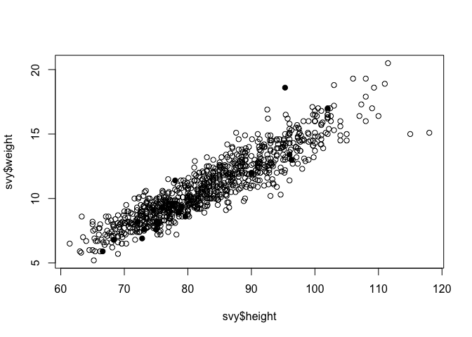
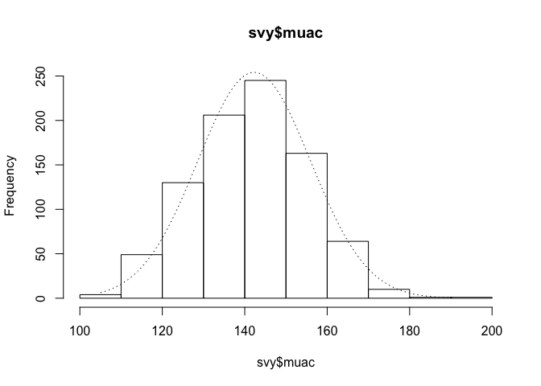
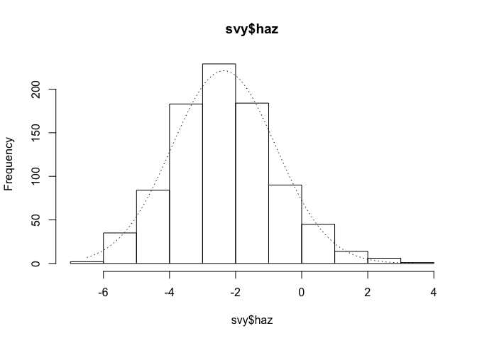
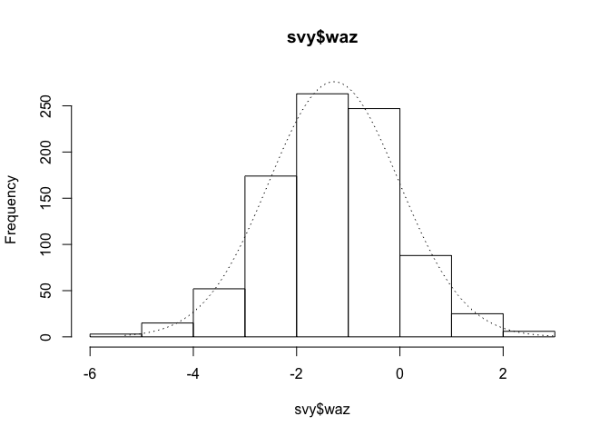
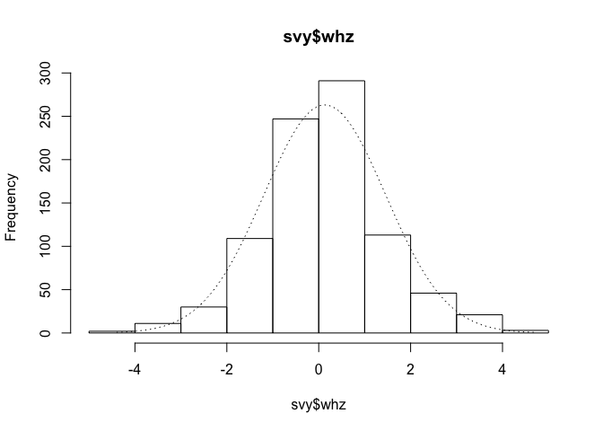
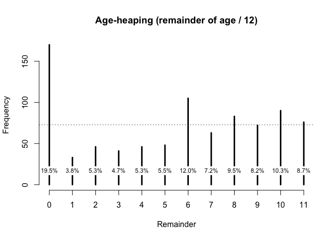

<!-- README.md is generated from README.Rmd. Please edit that file -->

# nipnTK: National Information Platforms for Nutrition (NiPN) data quality toolkit

[](https://cran.r-project.org/package=nipnTK)
[](https://CRAN.R-project.org/package=nipnTK)
[](https://cran.r-project.org/package=nipnTK)
[](https://travis-ci.org/nutriverse/nipnTK)
[](https://ci.appveyor.com/project/nutriverse/nipnTK)
[](https://codecov.io/gh/nutriverse/nipnTK)

[National Information Platforms for Nutrition
(NIPN)](http://www.nipn-nutrition-platforms.org) is an initiative of the
European Commission to provide support to countries to strengthen their
information systems for nutrition and to improve the analysis of data so
as to better inform the strategic decisions they are faced with to
prevent malnutrition and its consequences.

As part of this mandate, NiPN has commissioned work on the development
of a toolkit to assess the quality of various nutrition-specific and
nutrition-related data. This is a companion R package to the toolkit of
practical analytical methods that can be applied to variables in
datasets to assess their quality.

The focus of the toolkit is on data required to assess anthropometric
status such as measurements of weight, height or length, MUAC, sex and
age. The focus is on anthropometric status but many of presented methods
could be applied to other types of data. NiPN may commission additional
toolkits to examine other variables or other types of variables.

## Requirements

  - R version 3.4 or higher

Extensive use is made of the R language and environment for statistical
computing. This is a free and powerful data analysis system. R provides
a very extensive language for working with data. This companion package
has been written using only a small subset of the R language. Many of
the data quality activities described in the toolkit are supported by R
functions included in this package that have been written specifically
for this purpose. These simplify the assessment of the quality of data
related to anthropometry and anthropometric indices.

## Installation

You can install the development version of nipnTK from github with:

``` r
# install.packages("devtools")
devtools::install_github("validmeasures/nipnTK")
```

## Usage

### 1\. Range checks and value checks to identify univariate outliers.

Checking that data are within an acceptable or plausible range is an
important basic check to apply to quantitative data. Checking that data
are recorded with appropriate legal values or codes is an important
basic check to apply to categorical data.

``` r
# Load nipnTK package
library(nipnTK)

# Assign dataset rl.ex01 to svy
svy <- rl.ex01

# Summarise MUAC variable
summary(svy$muac)
#>    Min. 1st Qu.  Median    Mean 3rd Qu.    Max. 
#>    11.1   128.0   139.0   140.3   148.0   999.0
```

``` r
# Boxplot of MUAC values
boxplot(svy$muac, horizontal = TRUE, xlab = "MUAC (mm)", frame.plot = FALSE)
```

<!-- -->

``` r
# Use outliersUV() function to identify outliers
svy[outliersUV(svy$muac), ]
#> 
#> Univariate outliers : Lower fence = 98, Upper fence = 178
#>     age sex weight height  muac oedema
#> 33   24   1    9.8   74.5 180.0      2
#> 93   12   2    6.7   67.0  96.0      1
#> 126  16   2    9.0   74.6 999.0      2
#> 135  18   2    8.5   74.5 999.0      2
#> 194  24   M    7.0   75.0  95.0      2
#> 227   8   M    6.2   66.0  11.1      2
#> 253  35   2    7.6   75.6  97.0      2
#> 381  24   1   10.8   82.8  12.4      2
#> 501  36   2   15.5   93.4 185.0      2
#> 594  21   2    9.8   76.5  13.2      2
#> 714  59   2   18.9   98.5 180.0      2
#> 752  48   2   15.6  102.2 999.0      2
#> 756  59   1   19.4  101.1 180.0      2
#> 873  59   1   20.6  109.4 179.0      2
```

### 2\. Scatterplots and statistical methods to identify bivariate outliers.

``` r
# Retrieve sp.ex01 data and assign to svy
svy <- sp.ex01
```

``` r
# Look at the relationship between height and weight
plot(svy$height, svy$weight)
```

<!-- -->

``` r
# Assess the strength of relationship using the Pearson correlation coefficient:
cor(svy$height, svy$weight, method = "pearson", use = "complete.obs")
#> [1] 0.9204116
```

This is very close to one, which indicates a perfect positive
association. There are, however a few points that lie outside of the
bulk of the plotted points. These outliers may be due to errors in the
data. The presence of oedema can be associated with increased weight.
This is a particular issue with severe oedema. An outlier with a high
value of weight for a given height could be due to oedema. We can check
this:

``` r
plot(svy$height, svy$weight, pch = ifelse(svy$oedema == 1, 19, 1))
```

<!-- -->

A more formal method of identifying outliers is to use a measure of the
statistical distance. A common measure of statistical distance that is
applied to scatterplot data is the Mahalanobis distance. This treats the
bivariate probability distribution as an ellipsoid. The Mahalanobis
distance is the distance of a point from the centre of mass of the
distribution divided by width of the ellipsoid in the direction of the
point:

The NiPN data quality toolkit provides an R language function
`outliersMD()` that uses the Mahalanobis distance to identify outliers
in the same dataset:

``` r
svy[outliersMD(svy$height,svy$weight), ]
#>    age sex weight height muac oedema
#> 1   54   1   20.5  111.5  180      2
#> 6   48   2   18.6   95.3  171      1
#> 16  30   1   16.9   92.5  188      2
#> 62  55   1   15.1  118.0  156      2
#> 66  56   1   15.0  115.0  148      2
```

We can use the `outliersMD()` to identify and display outliers on a
scatterplot:

``` r
plot(svy$height, svy$weight, pch = ifelse(outliersMD(svy$height, svy$weight), 19, 1))
```

<!-- -->

### 3\. Use of flags to identify outliers in anthropometric indices.

``` r
library(nipnTK)
svy <- flag.ex01

# Set flag variable to 0
svy$flag <- 0

# Apply WHO flagging criteria to survey data
svy$flag <- ifelse(!is.na(svy$haz) & (svy$haz < -6 | svy$haz > 6), svy$flag + 1, svy$flag)
svy$flag <- ifelse(!is.na(svy$whz) & (svy$whz < -5 | svy$whz > 5), svy$flag + 2, svy$flag)
svy$flag <- ifelse(!is.na(svy$waz) & (svy$waz < -6 | svy$waz > 5), svy$flag + 4, svy$flag)
```

Note that each time we apply a flagging criteria we increase the value
of the flagging variable by the next power of two when a problem is
detected:

We started with zero

Then we added 2<sup>0</sup> (i.e. 1) if HAZ was out of range. Then we
added 2<sup>1</sup> (i.e. 2) if WHZ was out of range. Then we added
2<sup>2</sup> (i.e. 4) if WAZ was out of range.

If we had another index then we would use 2<sup>3</sup> (i.e. 8) to flag
a problem in that index.

The advantage of using this coding scheme is that it compactly codes all
possible combinations of problems in a single
variable

### 4\. Examining the distribution and the statistics of the distribution of measurements and anthropometric indices.

We will examine the distribution of anthropometric variables
(e.g. weight, height, and MUAC), anthropometric indices (e.g. WHZ, HAZ,
and WHZ), and anthropometric indicators (e.g. wasted, stunted, and
underweight).

``` r
svy <- dist.ex01

summary(svy$weight)
#>    Min. 1st Qu.  Median    Mean 3rd Qu.    Max. 
#>    4.90    9.00   11.00   11.13   13.10   20.70

sd(svy$weight)
#> [1] 2.802065
```

The NipN data quality toolkit provides an R language function called
`histNormal()` that can help with *“by-eye”* assessments by
superimposing a normal curve on a histogram of the variable of
interest:

``` r
histNormal(svy$muac) 
```

<!-- -->

``` r
histNormal(svy$haz) 
```

<!-- -->

``` r
histNormal(svy$waz) 
```

<!-- -->

``` r
histNormal(svy$whz)
```

<!-- -->

### 5\. Assessing the extent of digit preference in recorded measurements.

Measurements in nutritional anthropometry surveys are usually taken and
recorded to one decimal place.

Digit preference is the observation that the final number in a
measurement occurs with a greater frequency that is expected by chance.
This can occur because of rounding, the practice of increasing or
decreasing the value in a measurement to the nearest whole or half unit,
or because data are made up.

The NiPN data quality toolkit provides an R language function called
`digitPreference()` that uses a summary measure that takes into account
the effect of sample size. A widely used method is the digit preference
score (DPS) developed by WHO for the
[MONICA](http://www.thl.fi/publications/monica/bp/bpqa.htm) project.

First we will work with some artificial data:

``` r
set.seed(0)
finalDigits <- sample(x = 0:9, size = 1000, replace = TRUE)
table(finalDigits)
#> finalDigits
#>   0   1   2   3   4   5   6   7   8   9 
#>  96 104  91 113 115  85  90 107  89 110
```

We can now calculate the DPS using `digitPreference()`:

``` r
digitPreference(finalDigits, digits = 0)
#> 
#>  Digit Preference Score
#> 
#> data:    finalDigits
#> Digit Preference Score (DPS) = 3.5 (Excellent)
```

### Assessing the extent of age heaping in recorded ages.

Age heaping is the tendency to report children’s ages to the nearest
year or adults’ ages to the nearest multiple of five or ten years. Age
heaping is very common. This is a major reason why data from nutritional
anthropometry surveys is often analysed and reported using broad age
groups.

The NiPN data quality toolkit provides an R language function called
`ageHeaping()` that performs age-heaping analysis.

Using data from a SMART survey in Kabul, Afghanistan, we can apply this
function as follows:

``` r
library(nipnTK)
svy <- dp.ex02

# Apply ageHeaping() function
ah12 <- ageHeaping(svy$age)
```

The saved results may also be plotted:

``` r
plot(ah12, main = "Age-heaping (remainder of age / 12)")
```

<!-- -->

### 6\. Examining the sex ratio.

The male to female sex ratio test checks whether the ratio of the number
of males to the number of females in a survey sample is similar to an
expected ratio. The expected male to female sex ratio can be calculated
from census or similar data. If there is no expected value then it is
usually assumed that there should be equal numbers of males and females
in the survey sample. This is usually true for children and young adults
but may not be true for older adults.

The NiPN data quality toolkit provides an R language function called
`sexRatioTest()` that performs a sex ratio test.

Using data from a SMART survey in Kabul, Afghanistan, we can apply this
function as follows:

``` r
library(nipnTK)
svy <- dp.ex02

# Apply sexRatioTest() function
sexRatioTest(svy$sex, codes = c(1, 2), pop = c(2.658, 2.508))
#> 
#>  Sex Ratio Test
#> 
#> Expected proportion male = 0.5145
#> Observed proportion male = 0.5017
#> X-squared = 0.5225, p = 0.4698
```

### 7\. Examining age distributions and age by sex distributions.

The NiPN data quality toolkit provides an R function called
`ageChildren()` that performs the model- based Chi-Squared test to check
whether there is a difference between the number of males and females at
different age groups. This function can be applied as follows:

``` r
ageChildren(svy$age, u5mr = 1)
#> 
#>  Age Test (Children)
#> 
#> X-squared = 21.4366, df = 4, p = 0.0003
```
