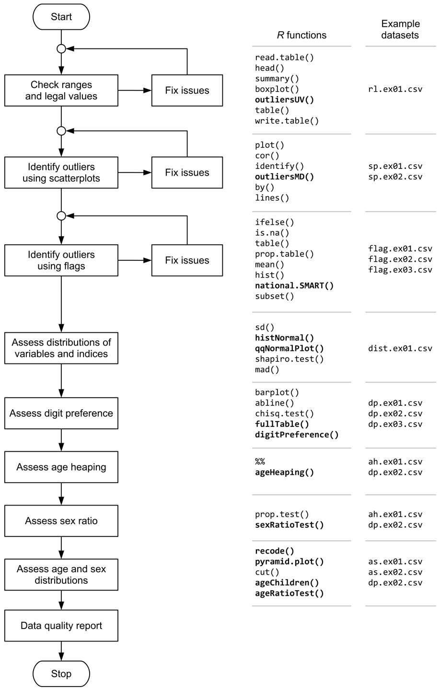

<!-- README.md is generated from README.Rmd. Please edit that file -->

# nipnTK: National Information Platforms for Nutrition (NiPN) Data Quality Toolkit 

<!-- Badges start here -->

[](https://www.repostatus.org/#active)
[](https://www.tidyverse.org/lifecycle/#maturing)
[](https://cran.r-project.org/package=nipnTK)
[](https://CRAN.R-project.org/package=nipnTK)
[](https://cran.r-project.org/package=nipnTK)
[](https://github.com/nutriverse/nipnTK/actions)
[](https://ci.appveyor.com/project/nutriverse/nipnTK)
[](https://github.com/nutriverse/nipnTK/actions)
[](https://codecov.io/gh/nutriverse/nipnTK)
<!-- Badges end here -->

[National Information Platforms for Nutrition
(NiPN)](http://www.nipn-nutrition-platforms.org) is an initiative of the
European Commission to provide support to countries to strengthen their
information systems for nutrition and to improve the analysis of data so
as to better inform the strategic decisions they are faced with to
prevent malnutrition and its consequences.

As part of this mandate, [NiPN](http://www.nipn-nutrition-platforms.org)
has commissioned work on the development of a toolkit to assess the
quality of various nutrition-specific and nutrition-related data. This
is a companion R package to the toolkit of practical analytical methods
that can be applied to variables in datasets to assess their quality.

The focus of the toolkit is on data required to assess anthropometric
status such as measurements of weight, height or length, MUAC, sex and
age. The focus is on anthropometric status but many of presented methods
could be applied to other types of data.
[NiPN](http://www.nipn-nutrition-platforms.org) may commission
additional toolkits to examine other variables or other types of
variables.

## Requirements

  - [R](https://cran.r-project.org) version 3.4 or higher

Extensive use is made of the [R](https://cran.r-project.org) language
and environment for statistical computing. This is a free and powerful
data analysis system. [R](https://cran.r-project.org) provides a very
extensive language for working with data. This companion package has
been written using only a small subset of the
[R](https://cran.r-project.org) language. Many of the data quality
activities described in the toolkit are supported by
[R](https://cran.r-project.org) functions included in this package that
have been written specifically for this purpose. These simplify the
assessment of the quality of data related to anthropometry and
anthropometric indices.

## Installation

You can install `nipnTK` from [CRAN](https://cran.r-project.org):

``` r
install.packages("nipnTK")
```

You can install the development version of `nipnTK` from
[GitHub](https://github.com/nutriverse/nipnTK) with:

``` r
if(!require(remotes)) install.packages("remotes")
remotes::install_github("nutriverse/nipnTK")
```

## Usage

Data quality is assessed by:

1.  Range checks and value checks to identify *univariate* outliers -
    [guide](https://nutriverse.io/nipnTK/articles/rl.html)

2.  Scatterplots and statistical methods to identify *bivariate*
    outliers - [guide](https://nutriverse.io/nipnTK/articles/sp.html)

3.  Use of flags to identify outliers in anthropometric indices -
    [guide](https://nutriverse.io/nipnTK/articles/flagging.html)

4.  Examining the distribution and the statistics of the distribution of
    measurements and anthropometric indices -
    [guide](https://nutriverse.io/nipnTK/articles/ad.html)

5.  Assessing the extent of digit preference in recorded measurements -
    [guide](https://nutriverse.io/nipnTK/articles/dp.html)

6.  Assessing the extent of age heaping in recorded ages -
    [guide](https://nutriverse.io/nipnTK/articles/ah.html)

7.  Examining the sex ratio -
    [guide](https://nutriverse.io/nipnTK/articles/sr.html)

8.  Examining age distributions and age by sex distributions -
    [guide](https://nutriverse.io/nipnTK/articles/as.html)

These activities and a proposed order in which they should be performed
are shown below:



## Community guidelines

Feedback, bug reports and feature requests are welcome; file issues or
seek support [here](https://github.com/nutriverse/nipnTK/issues). If you
would like to contribute to the package, please see our [contributing
guidelines](https://nutriverse.io/nipnTK/CONTRIBUTING.html).

This project is released with a [Contributor Code of
Conduct](https://nutriverse.io/nipnTK/CODE_OF_CONDUCT.html). By
participating in this project you agree to abide by its terms.
