# Distributions of variables and indices

## Assessing the distribution of anthropometric variables, indices, and indicators

In this section we will examine the distribution of anthropometric
variables (e.g. weight, height, and MUAC), anthropometric indices
(e.g. WHZ, HAZ, and WHZ), and anthropometric indicators (e.g. wasted,
stunted, and underweight).

Topics such as the distribution of age, age by sex, age-heaping, and
digit preference are covered in other sections of this toolkit.

We will retrieve a survey dataset:

``` r
svy <- read.table("dist.ex01.csv", header = TRUE, sep = ",") head(svy)
```

The file **dist.ex01.csv** is a comma-separated-value (CSV) file
containing anthropometric data from a SMART survey in Kabul,
Afghanistan.

## Numerical summaries

The [`summary()`](https://rdrr.io/r/base/summary.html) function in R
provides a six-figure summary (i.e. minimum, first quartile, median,
means, third quartile, and maximum) of a numeric variable. For example:

``` r
summary(svy$weight)
```

returns:

    #>    Min. 1st Qu.  Median    Mean 3rd Qu.    Max. 
    #>    4.90    9.00   11.00   11.13   13.10   20.70

The six-figure summary does not report the standard deviation.

The [`sd()`](https://rdrr.io/r/stats/sd.html) function in R calculates
the standard deviation. For example:

``` r
sd(svy$weight)
```

returns:

    #> [1] 2.802065

The [`sd()`](https://rdrr.io/r/stats/sd.html) function may return
**NA**. This will happen if there are missing values in the specified
variable.

If this happens you can instruct the function to ignore missing values:

``` r
sd(svy$weight, na.rm = TRUE)
```

returns the same value:

    #> [1] 2.802065

Using the `na.rm` parameter in this way (i.e. specifying `na.rm = TRUE`)
works with many descriptive functions in R (see table below).

[TABLE]

Some descriptive functions in R

## Graphical and numerical summaries

Numerical summaries are useful for checking that data are within an
expected range.

Graphical methods are often more informative than numerical summaries.

A key graphical method for examining the distribution of a variable is
the histogram. For example:

``` r
hist(svy$weight)
```

displays a histogram of the weight variable in the example dataset (see
figure below).

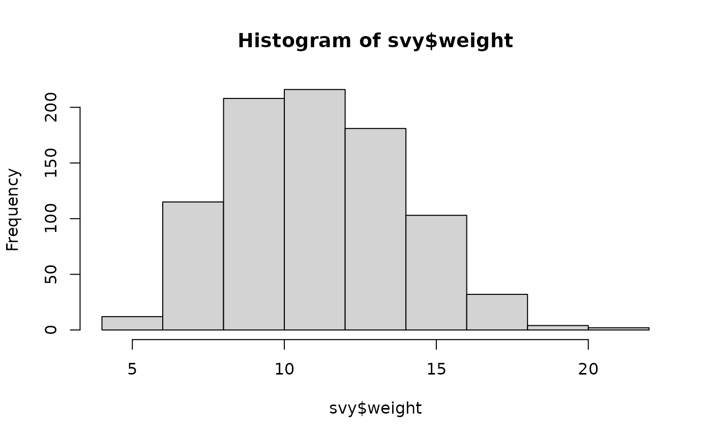

We need to be careful when examining the distribution of measurements,
as they may vary by sex. For example:

``` r
hist(svy$height)
```

will display the heights of both males and females. That is, it will
display two separate distributions as if they were a single
distribution.

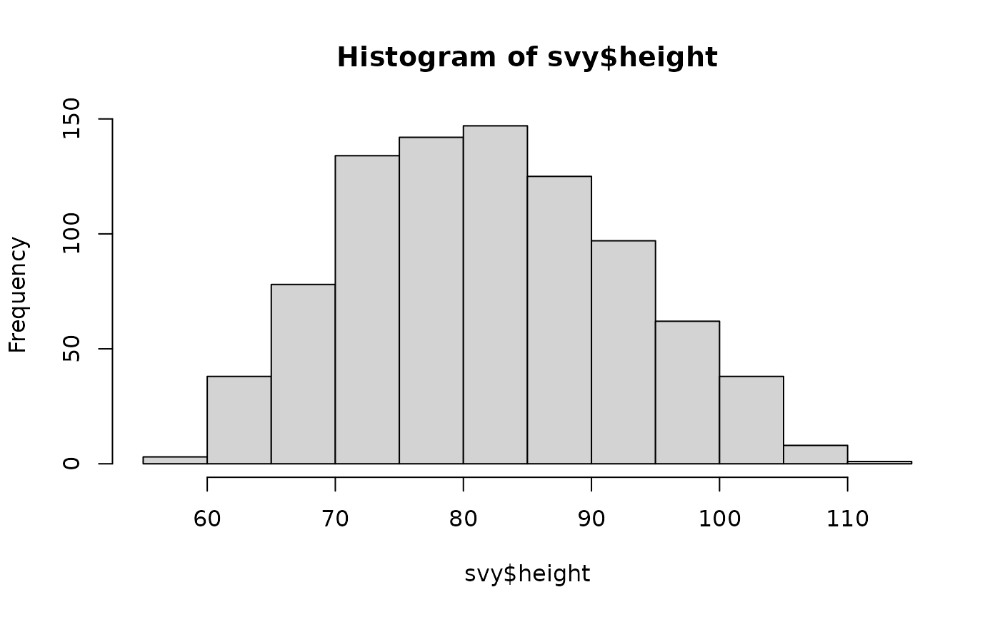

In this case it is sensible to look at the data for males and the data
for females using separate histograms:

``` r
hist(svy$height[svy$sex == 1]) 
hist(svy$height[svy$sex == 2])
```

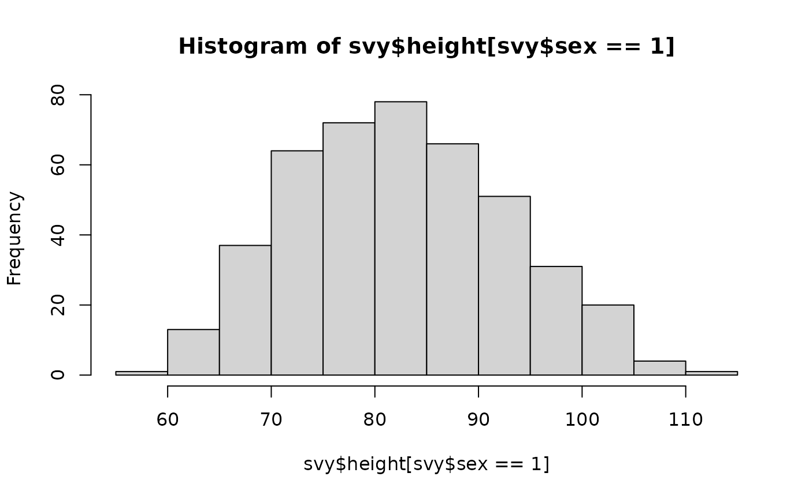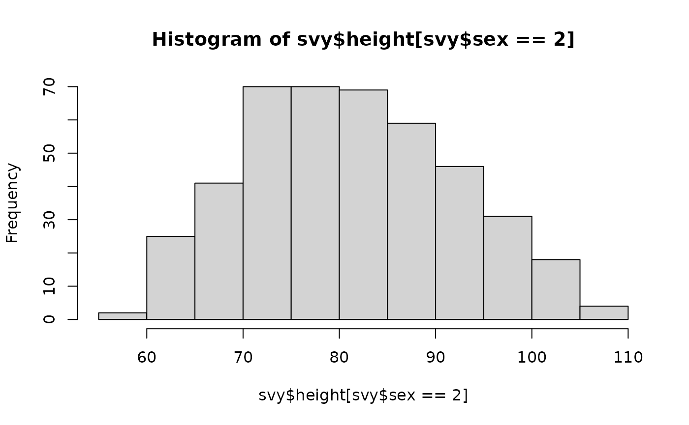

or using a box-plot:

``` r
boxplot(svy$height ~ svy$sex, names = c("M", "F"), 
        xlab = "Sex", ylab = "Height (cm)", main = "Height by sex")
```

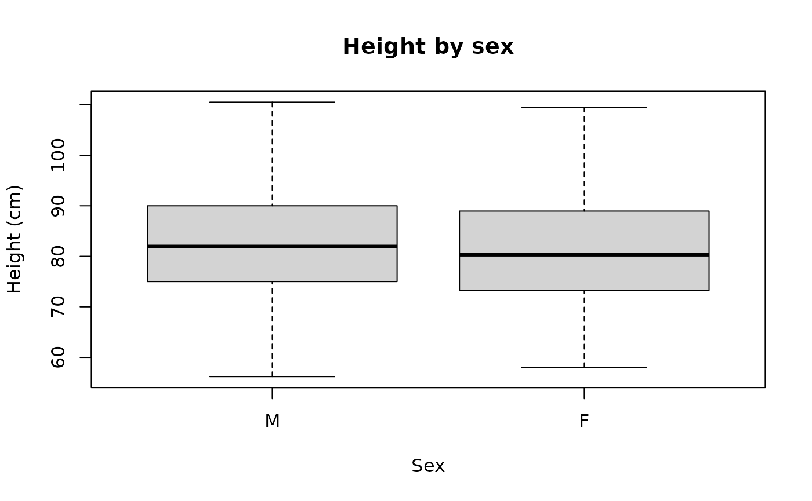

Numerical summaries can also be used:

``` r
by(svy$height, svy$sex, summary)
```

This returns:

    #> svy$sex: 1
    #>    Min. 1st Qu.  Median    Mean 3rd Qu.    Max. 
    #>   56.20   75.00   81.95   82.49   90.00  110.50 
    #> ------------------------------------------------------------ 
    #> svy$sex: 2
    #>    Min. 1st Qu.  Median    Mean 3rd Qu.    Max. 
    #>   58.00   73.25   80.30   81.30   88.95  109.50

## Normal distributions

With anthropometric variables and indices we usually expect a
symmetrical (or nearly symmetrical) “bell-shaped” distribution. The
variables and indices of interest are usually:

``` r
hist(svy$muac) 
hist(svy$haz) 
hist(svy$waz) 
hist(svy$whz)
```

These plots are shown below.

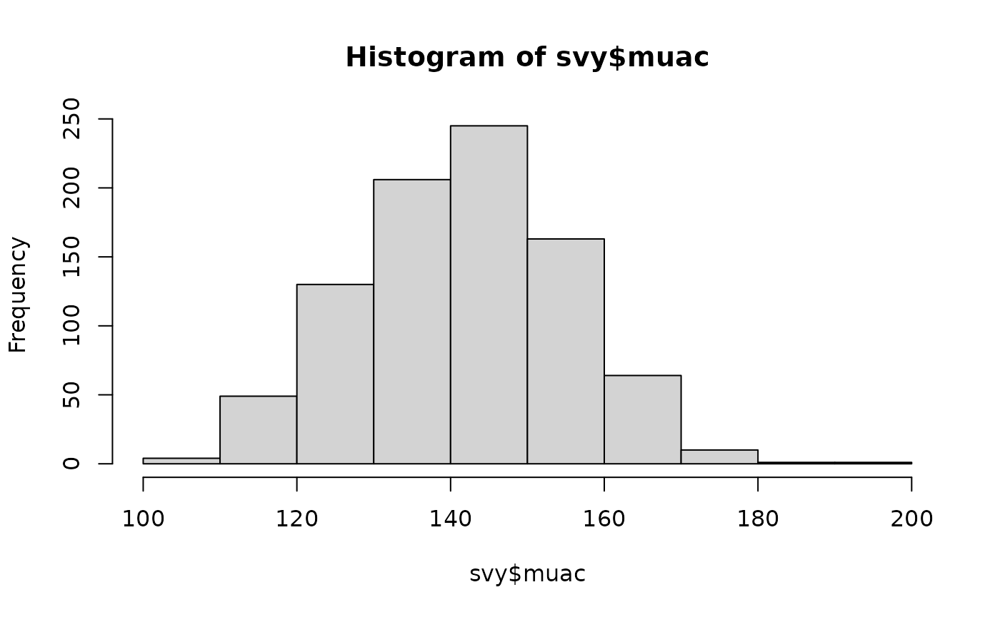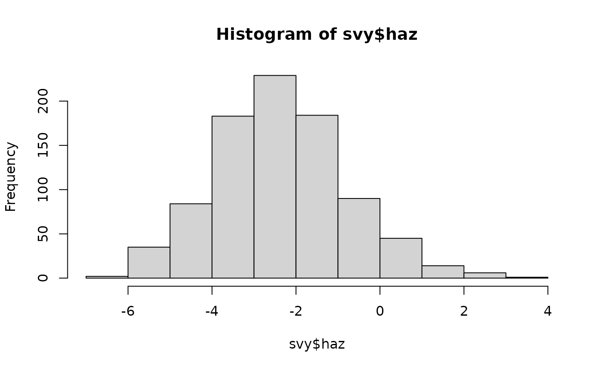


Histograms showing the distribution of anthropometric indices in the
example dataset

The number and size of the “intervals” (`breaks`) used when plotting a
histogram is calculated to produce a useful plot. The intervals used are
based on the range of the data.

You can specify a different set of `breaks` for the
[`hist()`](https://rdrr.io/r/graphics/hist.html) function to use. For
example:

``` r
hist(svy$haz, breaks = "scott")
```

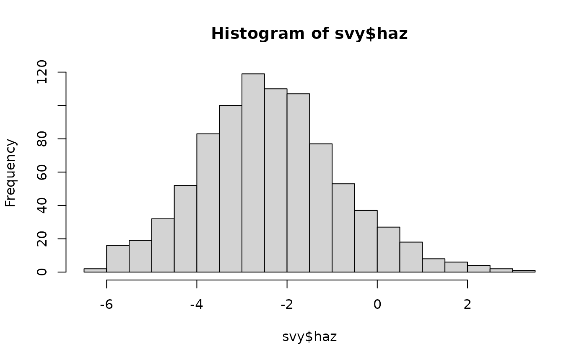

calculates intervals using the standard deviation and the sample size.
This:

``` r
hist(svy$haz, breaks = "FD")
```


calculates intervals using the inter-quartile range. This:

``` r
hist(svy$haz, breaks = 40)
```

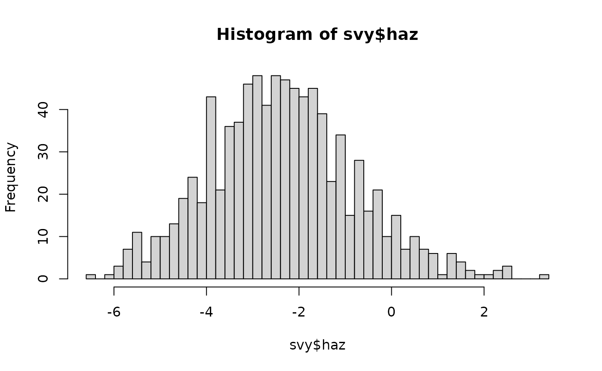

will use about **40** intervals. This:

``` r
hist(svy$haz, 
     breaks = seq(from = floor(min(svy$haz)), to = ceiling(max(svy$haz)), by = 0.5))
```

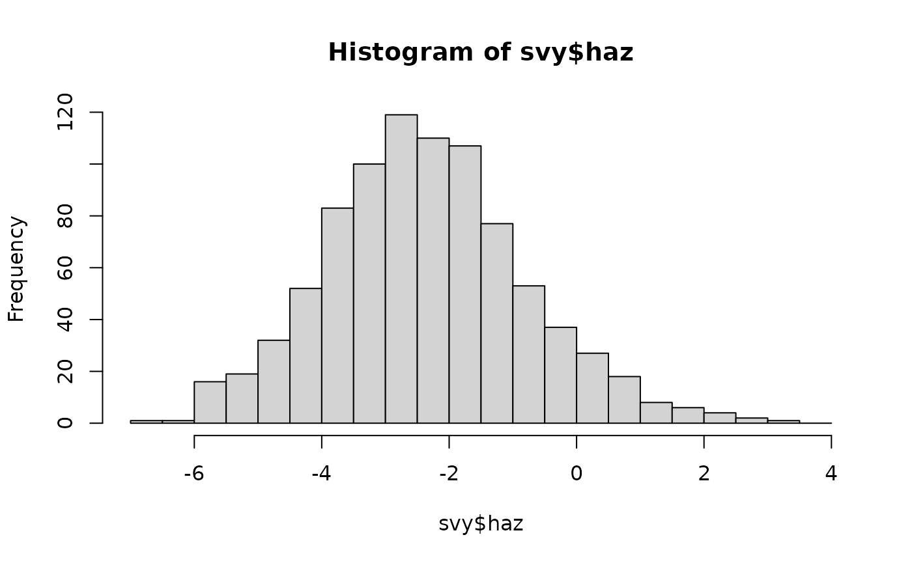

uses intervals that are **0.5** z-scores wide over the full range of
**haz**.

All of these plots show nearly symmetrical “bell-shaped” distributions.

The ideal symmetrical “bell-shaped” distribution is the normal
distribution.

There are a number of ways of assessing whether a variable is normally
distributed.

The first way of assessing whether a variable is normally distributed is
a simple “by-eye” assessment as we have already done using histograms.

The NiPN data quality toolkit provides an R language function called
[`histNormal()`](https://nutriverse.io/nipnTK/reference/histNormal.md)
that can help with “by-eye” assessments by superimposing a normal curve
on a histogram of the variable of interest:

``` r
histNormal(svy$muac)
histNormal(svy$haz)
histNormal(svy$waz)
histNormal(svy$whz)
```

These plots are shown below. All variables appear to be approximately
normally distributed.

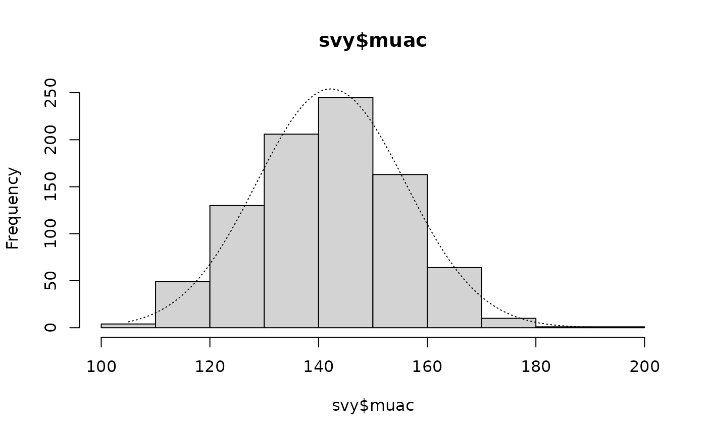


Histograms of anthropometric indices with normal curves superimposed

Changing the `breaks` parameter may make a histogram easier to “read”.
For example:

``` r
histNormal(svy$haz, breaks = 15)
```

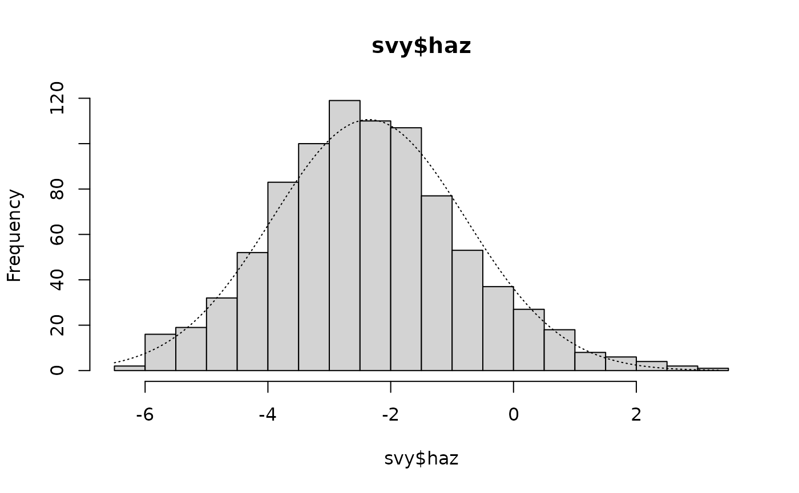

Another graphical method for assessing whether a variable is normally
distributed is the *normal quantile-quantile plot*. These are easy to
produce using *R*.

The NiPN data quality toolkit provided a helper function called
[`qqNormalPlot()`](https://nutriverse.io/nipnTK/reference/qqNormalPlot.md)
that produces a slightly enhanced normal quantile-quantile plot:

``` r
qqNormalPlot(svy$whz)
```


This plot is shown below (with annotations). In this example the tails
of the distribution contain more cases than would be expected in a
perfectly normally distributed variable.


Annotated normal quantile-quantile plot of the whz variable in the
example dataset

We should examine all of the relevant variables:

``` r
qqNormalPlot(svy$muac) 
qqNormalPlot(svy$haz) 
qqNormalPlot(svy$waz) 
qqNormalPlot(svy$whz)
```

These plots are shown below. There is evidence of small deviations from
normality in **muac**, **haz**, and **whz**.


Normal quantile-quantile plots of anthropometric indices in the example
dataset

A final way of assessing normality is to use a formal statistical
significance test. The preferred test is the *Shapiro-Wilk test of
normality*:

``` r
shapiro.test(svy$muac) 
#> 
#>  Shapiro-Wilk normality test
#> 
#> data:  svy$muac
#> W = 0.99496, p-value = 0.005495
shapiro.test(svy$haz) 
#> 
#>  Shapiro-Wilk normality test
#> 
#> data:  svy$haz
#> W = 0.99348, p-value = 0.0007455
shapiro.test(svy$waz) 
#> 
#>  Shapiro-Wilk normality test
#> 
#> data:  svy$waz
#> W = 0.99827, p-value = 0.5358
shapiro.test(svy$whz)
#> 
#>  Shapiro-Wilk normality test
#> 
#> data:  svy$whz
#> W = 0.99078, p-value = 2.777e-05
```

These tests indicate that **muac**, **haz**, and **whz** are
significantly non-normal. Examination of the histograms and the normal
quantile-quantile plots show that the deviation from normality in these
indices are not particular marked. All indices have symmetrical, or
nearly symmetrical, “bell-shaped” distributions.

We need to be careful when using significance tests such as the
Shapiro-Wilk test of normality because the results can be strongly
influenced by the sample size.

Small sample sizes can lead to tests missing large effects and large
sample sizes can lead to tests identifying small effects as highly
significant.

The analysis above found some highly significant but small deviations
from normality that would probably not have been detected by a
significance test if a smaller sample size had been used.

We can simulate a considerably smaller sample size by taking, for
example, every fourth **muac** value:

``` r
length(svy$muac)
#> [1] 873
oneQuarter <- svy$muac[seq(from = 1, to = length(svy$muac), by = 4)] 
length(oneQuarter)
#> [1] 219
```

Inspecting this smaller sample graphically:

``` r
histNormal(oneQuarter) 
qqNormalPlot(oneQuarter)
```

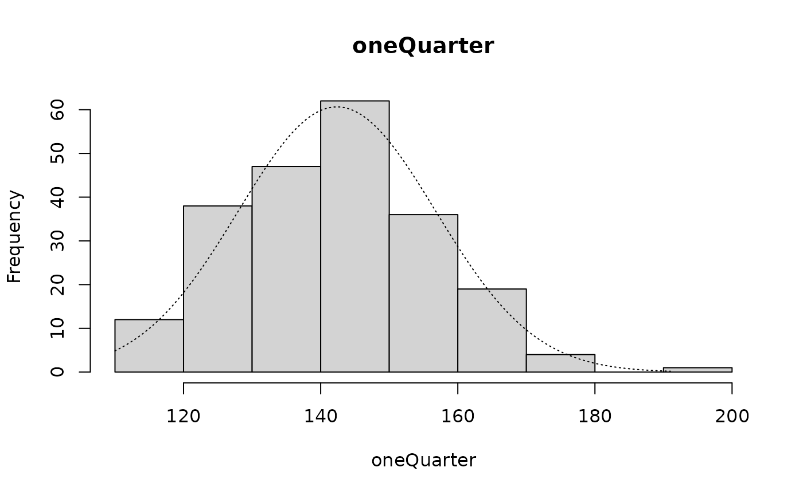

yields results similar to those found when the complete sample was used,
but the formal test:

``` r
shapiro.test(oneQuarter)
#> 
#>  Shapiro-Wilk normality test
#> 
#> data:  oneQuarter
#> W = 0.98836, p-value = 0.0724
```

is no longer significant at *p \< 0.05*.

If a distribution appears to be normal (i.e. has a symmetrical, or
nearly symmetrical, “bell-shaped” distribution) then it is usually safe
to assume normality and to use statistical procedures that assume
normality. Formal tests for normality can be misleading when sample
sizes of more than a few hundred cases are used. Graphical methods are
not very useful when sample sizes are small. Formal test are not very
useful when sample sizes are large. The sample sizes of most
anthropometry surveys will be large enough to cause formal tests for
normality to identify small deviations from normality as highly
significant.

## Skew and kurtosis

Skew is a measure of the asymmetry of a distribution about its mean.
Skew can be zero, positive, or negative. Zero skew is found when the
distribution is perfectly symmetrical. Positive skew is found when there
is a long right tail to the distribution and the mass of the
distribution is concentrated to the left. Negative skew is found when
there is a long left tail to the distribution and the mass of the
distribution is concentrated to the right. We can usually see skew in
histograms. We can also calculate a skewness statistic and test if this
is significantly different from zero.

Kurtosis is a measure of how much a distribution is concentrated about
the mean. Kurtosis can be zero, positive, or negative. Zero kurtosis is
found when a variable is normally distributed. Positive kurtosis is
found when the mass of the distribution is concentrated about the mean
and there are very few values far from the mean. Negative kurtosis is
found when the mass of the distribution is concentrated in the tails of
the distribution. We can usually see kurtosis in histograms. We can also
calculate a kurtosis statistic and test if this is significantly
different from zero.

The NiPN data quality toolkit provides an R language function called
[`skewKurt()`](https://nutriverse.io/nipnTK/reference/skewKurt.md) that
calculates skewness and kurtosis statistics and tests whether they
differ significantly from zero. Here we apply the
[`skewKurt()`](https://nutriverse.io/nipnTK/reference/skewKurt.md)
function to the muac variable in the example dataset:

``` r
skewKurt(svy$muac)
```

This returns:

    #> 
    #>  Skewness and kurtosis
    #> 
    #> Skewness = +0.0525   SE = 0.0828 z = 0.6348  p = 0.5256
    #> Kurtosis = -0.2412   SE = 0.1653 z = 1.4586  p = 0.1447

There is positive skew and negative kurtosis. Neither is significantly
different from zero.

Applying the
[`skewKurt()`](https://nutriverse.io/nipnTK/reference/skewKurt.md)
function to the **haz** variable in the example dataset:

``` r
skewKurt(svy$haz)
```

returns:

    #> 
    #>  Skewness and kurtosis
    #> 
    #> Skewness = +0.3074   SE = 0.0828 z = 3.7149  p = 0.0002
    #> Kurtosis = +0.2074   SE = 0.1653 z = 1.2545  p = 0.2097

There is a positive skew and a positive kurtosis. The skew is
significantly different from zero. The skew can be seen in the
histogram:

``` r
histNormal(svy$haz, breaks = "scott")
```


Applying the
[`skewKurt()`](https://nutriverse.io/nipnTK/reference/skewKurt.md)
function to the **waz** variable in the example dataset:

``` r
skewKurt(svy$waz)
```

returns:

    #> 
    #>  Skewness and kurtosis
    #> 
    #> Skewness = -0.0128   SE = 0.0828 z = 0.1541  p = 0.8775
    #> Kurtosis = +0.1805   SE = 0.1653 z = 1.0919  p = 0.2749

There is negative skew and positive kurtosis. Neither is significantly
different from zero.

Applying the
[`skewKurt()`](https://nutriverse.io/nipnTK/reference/skewKurt.md)
function to the **whz** variable in the example dataset:

``` r
skewKurt(svy$whz)
```

returns:

    #> 
    #>  Skewness and kurtosis
    #> 
    #> Skewness = +0.0823   SE = 0.0828 z = 0.9946  p = 0.3199
    #> Kurtosis = +0.7528   SE = 0.1653 z = 4.5530  p = 0.0000

There is a positive skew and a positive kurtosis. The kurtosis is
significantly different from zero. The kurtosis can be seen on the
histogram:

``` r
histNormal(svy$whz, breaks = "scott")
```

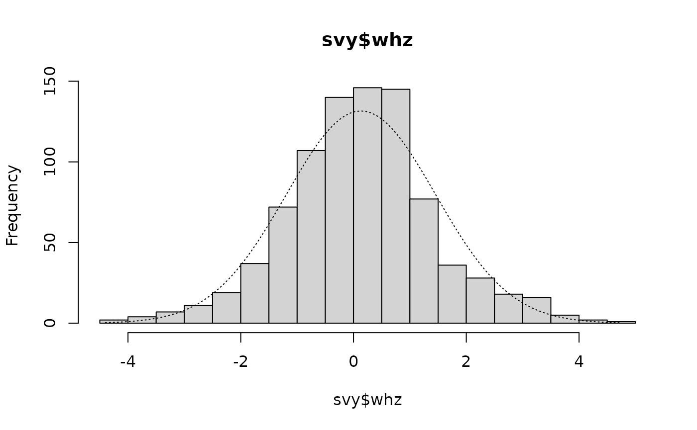

as the tall central columns that exceed the expected values shown by the
overlaid normal distribution.

Skew and kurtosis are both used in SMART plausibility checks. Table
below shows how skew and kurtosis statistics are applied by SMART.

[TABLE]

The range of absolute values of skewness and kurtosis statistics that
are applied by SMART (2015)

The **whz** variable in the example dataset is considered “problematic”
according to this scheme because kurtosis is above 0.6.

Care should be exercised when using statistical significance tests to
classify data as “problematic”. The use of thresholds and ranges for
skew and kurtosis statistics is usually a better approach than relying
on tests of statistical significance. Significance tests can be strongly
affected by sample size. Small sample sizes can lead to tests missing
large effects and large sample sizes can lead to tests identifying small
effects as highly significant. If a distribution appears to be normal
(i.e. has a symmetrical, or nearly symmetrical, “bell-shaped”
distribution) then it is usually safe to assume normality and to use
statistical procedures that assume normality.

It is important to remember that the normal distribution is a
mathematical abstraction. There is nothing compelling the real world to
conform to the normal distribution. The normal distribution has become
reified:

> Everyone is sure of this \[the normal distribution\] …
> experimentalists believe that it is a mathematical theorem, and the
> mathematicians that it is an experimentally determined fact.
>
> — Henri Poincaré (1912), Calcul des Probabilités

The data we see may be representative of reality even when it fails
tests for normality.

Tests for normality are useful when selecting statistical methods that
rely on normality. They are less useful for determining data quality. If
data follows a symmetrical, or nearly symmetrical, “bell-shaped”
distribution then it will usually safe to use.

## Deviation from normality

Some anthropometric survey methods (e.g. SMART) use deviations from
perfect normality as an indicator of poor data quality. This is not a
sensible approach because deviations from normality are not necessarily
due to poor quality data; they can be due to sampling a mixed
population. This is easy to demonstrate with some simulated data.

We will assume that we have a population consisting of two groups:

**Group 1 :** 75% of the population, mean = -0.48, sd = 0.87

**Group 2 :** 25% of the population, mean = -1.04, sd = 1.10

and that we take a sample size = 1000 from the whole population. We can
simulate this:

``` r
set.seed(0)
g1 <- rnorm(n = 750, mean = -0.48, sd = 0.87) 
g2 <- rnorm(n = 250, mean = -1.04, sd = 1.11) 
g1g2 <- c(g1, g2)
```

The distributions in the two subgroups (**g1** and **g2**) are both
normally distributed:

``` r
histNormal(g1) 
qqNormalPlot(g1)
shapiro.test(g1) 
skewKurt(g1)
```

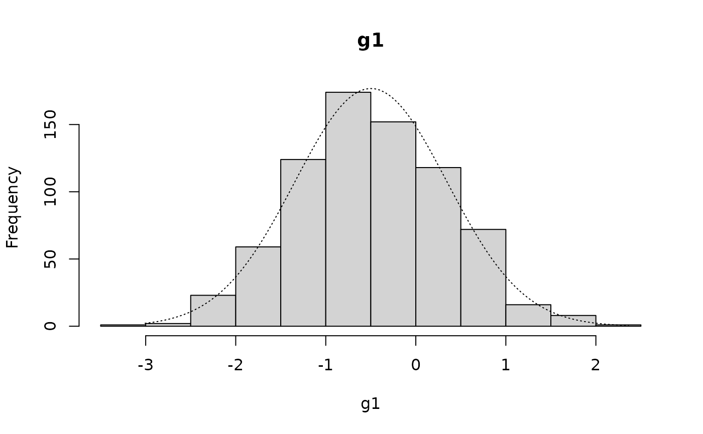

    #> 
    #>  Shapiro-Wilk normality test
    #> 
    #> data:  g1
    #> W = 0.99725, p-value = 0.2411
    #> 
    #>  Skewness and kurtosis
    #> 
    #> Skewness = +0.1149   SE = 0.0893 z = 1.2867  p = 0.1982
    #> Kurtosis = -0.1869   SE = 0.1783 z = 1.0483  p = 0.2945

``` r
histNormal(g2) 
qqNormalPlot(g2) 
shapiro.test(g2) 
skewKurt(g2)
```

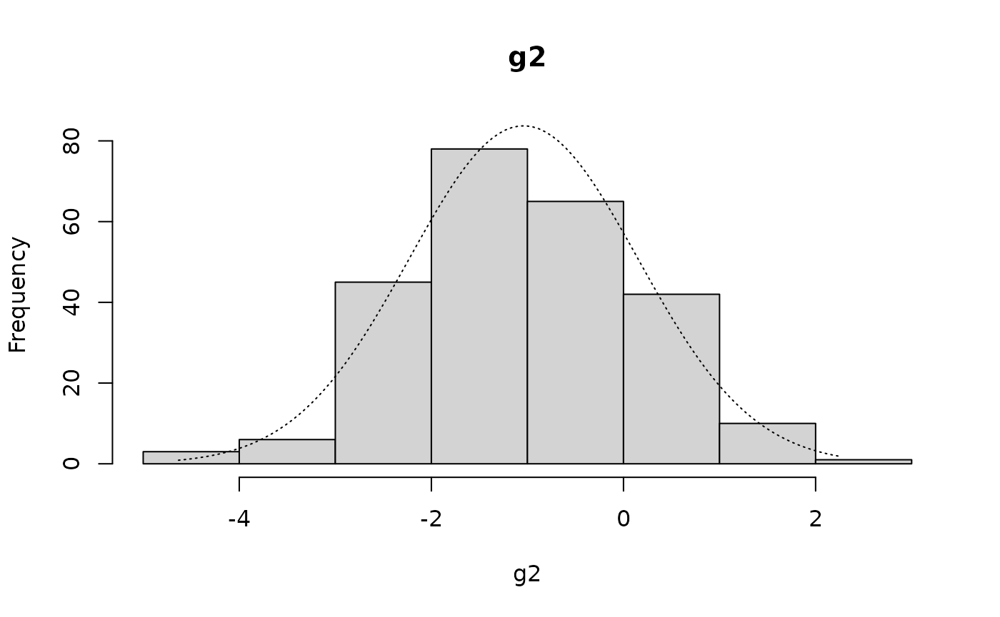

    #> 
    #>  Shapiro-Wilk normality test
    #> 
    #> data:  g2
    #> W = 0.9947, p-value = 0.5363
    #> 
    #>  Skewness and kurtosis
    #> 
    #> Skewness = +0.0317   SE = 0.1540 z = 0.2058  p = 0.8369
    #> Kurtosis = -0.1282   SE = 0.3068 z = 0.4178  p = 0.6761

but the distribution in the entire sample (**g1g2**) is not normal:

``` r
histNormal(g1g2) 
qqNormalPlot(g1g2) 
shapiro.test(g1g2) 
skewKurt(g1g2)
```

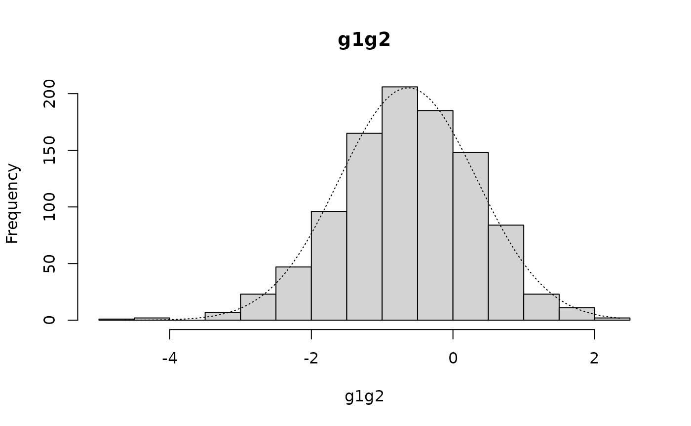

The *Shapiro-Wilk test of normality* returns:

    #> 
    #>  Shapiro-Wilk normality test
    #> 
    #> data:  g1g2
    #> W = 0.99671, p-value = 0.03514

There is statistically significant negative skew:

    #> 
    #>  Skewness and kurtosis
    #> 
    #> Skewness = -0.1767   SE = 0.0773 z = 2.2851  p = 0.0223
    #> Kurtosis = +0.2894   SE = 0.1545 z = 1.8728  p = 0.0611

There is, however, nothing wrong with the sample or with the data

The distribution in the entire sample (**g1g2**) is called a “mixture of
Gaussians” (the term “Gaussian” refers to the normal distribution in
this context).

We can see this mixture of Gaussians with:

``` r
hist(g1, col=rgb(0.2, 0.2, 0.2, 0.5),
     breaks = seq(-5, 3, 0.5), xlab = "", main = "")
hist(g2, col=rgb(0.8, 0.8, 0.8, 0.5), breaks = seq(-5, 3, 0.5), add = TRUE) 
title(main = "Histogram of g1 and g2", xlab = "z-score")
```

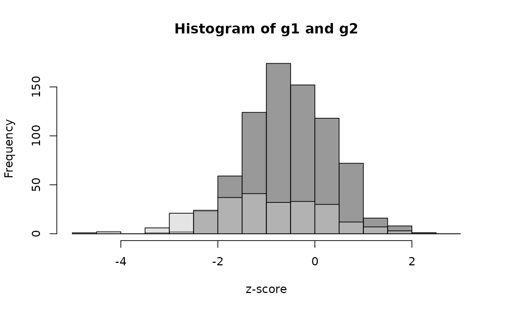

In this case the mixture was already known. There are a number of
methods for revealing the underlying mixture when the components of the
mixture are unknown. These techniques are not covered in this toolkit.
We will, however, continue with an example in which the components of
the mixture are suspected.

We expect to see small deviations from normality in most survey
datasets. This will often be the case when a survey samples subjects
over a wide area covering, for example, several agro-ecological zones,
socio-economic groups, or ethnic groups. This will almost always be the
case, particularly with large surveys such as DHS, MICS, and national
SMART surveys.

Another reason for non-normality is that one (or more) of the survey
teams has a systematic bias in making a measurement. Identifying the
“offending” survey team by examining and testing for normality
separately in all combinations of data from $n\ –\ 1$ survey teams can
be attempted. If (e.g.) there were three teams then we would need to
separately test data from:

Team 1 and Team 2 (Team 3 excluded)

Team 1 and Team 3 (Team 2 excluded)

Team 2 and Team 3 (Team 1 excluded)

to see if the deviation from normality disappears when a particular
team’s data are excluded. There is, however, a problem with this type of
analysis. In cluster-sampled surveys, teams often sample adjacent
primary sampling units (clusters). When this occurs the “exclude one
team” analysis cannot distinguish between differences due to spatial
heterogeneity (i.e. patchiness) and differences due to a team having a
systematic measurement bias.

## The standard deviation and alternatives

The standard deviation is sometimes considered to be useful measure of
data quality when applied to z-scores.

We can use the **sd()** function to find the standard deviation. For
example:

``` r
sd(svy$whz)
```

returns:

    #> [1] 1.323469

1.323469

This may produce misleading values if applied to raw data. This
procedure should only be applied to cleaned data from which erroneous
data and flagged records have been censored.

SMART guidelines state that the acceptable range for the standard
deviation of the weight-for-height z-scores (**whz**) is 0.8 to 1.2 when
flagging criteria have been applied and flagged records have been
censored. Standard deviations outside this range are considered to
indicate poor survey quality. Note that SMART does not define threshold
for anthropometric indices other than weight-for-height z-scores. It is
important to note that a standard deviation above 1.2 may be due to
sampling from a mixed population rather than due to poor data quality.

The **flag** column in the example dataset contains a flagging code in
which the codes **2**, **3**, **6**, or **7** indicate potential
problems with weight and / or height. We should calculate the standard
deviation of the **whz** variable using only the data in which records
with these flagging codes are censored and there is no oedema recorded:

``` r
sd(svy$whz[!(svy$flag %in% c(2, 3, 6, 7) | svy$oedema == 1)])
```

The `!` character specifies a logical “not”. The standard deviation is,
therefore, calculated using records in which the **flag** variable does
**not** contain **2**, **3**, **6**, or **7** or oedema is **not**
recorded as being present.

The standard deviation for **whz** when flagged records and oedema cases
are censored is:

    #> [1] 1.141944

This is within the SMART acceptable range of 0.8 to 1.2.

The problem with using the standard deviation with raw data is that it
is a non-robust statistic. This means that it can be strongly influenced
by outliers. For example:

``` r
sd(c(4.55, 5.93, 2.68, 5.61, 3.53, 4.78, 3.60, 5.82, 4.41, 5.42))
```

returns:

    #> [1] 1.097533

Adding a single outlier (e.g. data entered as **7.84** rather than as
**4.78**):

``` r
sd(c(4.55, 5.93, 2.68, 5.61, 3.53, 7.84, 3.60, 5.82, 4.41, 5.42))
```

returns:

    #> [1] 1.496963

In this example a single outlier has strongly influenced the standard
deviation.

There are a number of robust estimators for the standard deviation. R
provides the [`mad()`](https://rdrr.io/r/stats/mad.html) function to
calculate an adjusted *median absolute deviation* (MAD).

The median absolute deviation (MAD) is defined as the median of the
absolute deviations from the median. It is the median of the absolute
values of the differences between the individual data points and the
median of the data:

$$MAD\  = \ \left( \left| x_{i}\  - \ median(x) \right| \right)$$

The calculated MAD is adjusted to make it consistent with the standard
deviation:

$$\widehat{\sigma}\  = \ k\  \times \ MAD$$

where *k* is a constant scaling factor, which depends upon the
distribution. For the normal distribution:

$$k\  = \ 1.4826$$

The [`mad()`](https://rdrr.io/r/stats/mad.html) function in R function
returns the adjusted MAD:

$$\widehat{\sigma}\  = \ 1.4826\  \times \ MAD$$

This is a robust estimate of the standard deviation.

This estimator is preferred when a sample is taken from a mixed
population (this is almost always the case) and when the distribution
has “fat” or “heavy” tails, as is the case with the **whz** variable in
the example dataset.

Using the [`mad()`](https://rdrr.io/r/stats/mad.html) function with the
raw WHZ data:

``` r
mad(svy$whz)
```

This returns:

    #> [1] 1.156428

We would usually want to calculate the adjusted MAD of the whz variable
using only the data in which records with flagging codes relevant to whz
and cases of oedema are censored:

``` r
mad(svy$whz[!(svy$flag %in% c(2, 3, 6, 7) | svy$oedema == 1)])
```

This returns:

    #> [1] 1.097124

The use of the standard deviation and robust equivalents such as the
adjusted MAD with simple thresholds is problematic. Data that is a
mixture of Gaussians distributions will tend to have large standard
deviations even when there is no systematic error and nothing is wrong
with the sample. Checks on the standard deviation in large surveys
should, therefore, be performed on the smallest spatial strata above the
PSU or cluster level. This reduces but does not eliminate the problem of
sampling from mixed populations.

We will retrieve a dataset and examine within-strata MADs:

``` r
svy <- read.table("flag.ex03.csv", header = TRUE, sep = ",")
head(svy)
```

    #>   psu region state age sex weight height   haz   waz   whz
    #> 1   1     SE  Abia  12   2    7.4   72.1 -0.74 -1.58 -1.69
    #> 2   1     SE  Abia  33   1   13.3   94.2  0.04 -0.33 -0.52
    #> 3   1     SE  Abia  44   2   14.1   98.6 -0.41 -0.63 -0.57
    #> 4   1     SE  Abia  40   2   15.8   99.3  0.39  0.59  0.55
    #> 5   1     SE  Abia  23   2   10.1   83.9 -0.51 -0.90 -0.92
    #> 6   1     SE  Abia  24   1   13.9   88.7  0.52  1.18  1.22

The file **flag.ex03.csv** is a comma-separated-value (CSV) file
containing anthropometric data from a national SMART survey in Nigeria.

The data stored in the file flag.ex03.csv were collected using methods
similar to MICS and DHS surveys. The only difference is that the survey
concentrated on anthropometric data in children aged between 6 and 59
months. In this exercise we will concentrate on WHZ.

Data are stratified by **region** and by **state** within **region**. We
will create a new variable that combines **region** and **state**:

``` r
svy$regionState <- paste(svy$region, svy$state, sep = ":")
head(svy)
#>   psu region state age sex weight height   haz   waz   whz regionState
#> 1   1     SE  Abia  12   2    7.4   72.1 -0.74 -1.58 -1.69     SE:Abia
#> 2   1     SE  Abia  33   1   13.3   94.2  0.04 -0.33 -0.52     SE:Abia
#> 3   1     SE  Abia  44   2   14.1   98.6 -0.41 -0.63 -0.57     SE:Abia
#> 4   1     SE  Abia  40   2   15.8   99.3  0.39  0.59  0.55     SE:Abia
#> 5   1     SE  Abia  23   2   10.1   83.9 -0.51 -0.90 -0.92     SE:Abia
#> 6   1     SE  Abia  24   1   13.9   88.7  0.52  1.18  1.22     SE:Abia
table(svy$regionState)
#> 
#>       NC:Benue NC:FCT (Abuja)        NC:Kogi       NC:Kwara    NC:Nasarawa 
#>            386            363            326            392            430 
#>       NC:Niger     NC:Plateau     NE:Adamawa      NE:Bauchi       NE:Borno 
#>            589            503            410            804            558 
#>       NE:Gombe      NE:Taraba        NE:Yobe      NW:Jigawa      NW:Kaduna 
#>            643            421            689            711            536 
#>        NW:Kano     NW:Katsina       NW:Kebbi      NW:Sokoto     NW:Zamfara 
#>            671            657            728            646            668 
#>        SE:Abia     SE:Anambra      SE:Ebonyi       SE:Enugu         SE:Imo 
#>            334            390            455            418            371 
#>   SS:Akwa-Ibom     SS:Bayelsa SS:Cross River       SS:Delta         SS:Edo 
#>            331            330            376            346            480 
#>      SS:Rivers       SW:Ekiti       SW:Lagos        SW:Ogun        SW:Ondo 
#>            315            376            640            566            426 
#>        SW:Osun         SW:Oyo 
#>            435            610
```

We can examine the adjusted MAD for **whz** for each combination of
**region** and **state** in the survey dataset using:

``` r
by(svy$whz, svy$regionState, mad, na.rm = TRUE)
#> svy$regionState: NC:Benue
#> [1] 0.941451
#> ------------------------------------------------------------ 
#> svy$regionState: NC:FCT (Abuja)
#> [1] 0.96369
#> ------------------------------------------------------------ 
#> svy$regionState: NC:Kogi
#> [1] 0.993342
#> ------------------------------------------------------------ 
#> svy$regionState: NC:Kwara
#> [1] 0.993342
#> ------------------------------------------------------------ 
#> svy$regionState: NC:Nasarawa
#> [1] 0.926625
#> ------------------------------------------------------------ 
#> svy$regionState: NC:Niger
#> [1] 0.978516
#> ------------------------------------------------------------ 
#> svy$regionState: NC:Plateau
#> [1] 1.022994
#> ------------------------------------------------------------ 
#> svy$regionState: NE:Adamawa
#> [1] 1.045233
#> ------------------------------------------------------------ 
#> svy$regionState: NE:Bauchi
#> [1] 1.18608
#> ------------------------------------------------------------ 
#> svy$regionState: NE:Borno
#> [1] 1.030407
#> ------------------------------------------------------------ 
#> svy$regionState: NE:Gombe
#> [1] 1.082298
#> ------------------------------------------------------------ 
#> svy$regionState: NE:Taraba
#> [1] 1.008168
#> ------------------------------------------------------------ 
#> svy$regionState: NE:Yobe
#> [1] 1.022994
#> ------------------------------------------------------------ 
#> svy$regionState: NW:Jigawa
#> [1] 1.200906
#> ------------------------------------------------------------ 
#> svy$regionState: NW:Kaduna
#> [1] 0.985929
#> ------------------------------------------------------------ 
#> svy$regionState: NW:Kano
#> [1] 1.156428
#> ------------------------------------------------------------ 
#> svy$regionState: NW:Katsina
#> [1] 1.022994
#> ------------------------------------------------------------ 
#> svy$regionState: NW:Kebbi
#> [1] 0.926625
#> ------------------------------------------------------------ 
#> svy$regionState: NW:Sokoto
#> [1] 0.926625
#> ------------------------------------------------------------ 
#> svy$regionState: NW:Zamfara
#> [1] 1.052646
#> ------------------------------------------------------------ 
#> svy$regionState: SE:Abia
#> [1] 0.904386
#> ------------------------------------------------------------ 
#> svy$regionState: SE:Anambra
#> [1] 0.926625
#> ------------------------------------------------------------ 
#> svy$regionState: SE:Ebonyi
#> [1] 0.904386
#> ------------------------------------------------------------ 
#> svy$regionState: SE:Enugu
#> [1] 0.919212
#> ------------------------------------------------------------ 
#> svy$regionState: SE:Imo
#> [1] 0.88956
#> ------------------------------------------------------------ 
#> svy$regionState: SS:Akwa-Ibom
#> [1] 0.904386
#> ------------------------------------------------------------ 
#> svy$regionState: SS:Bayelsa
#> [1] 1.11195
#> ------------------------------------------------------------ 
#> svy$regionState: SS:Cross River
#> [1] 0.971103
#> ------------------------------------------------------------ 
#> svy$regionState: SS:Delta
#> [1] 0.971103
#> ------------------------------------------------------------ 
#> svy$regionState: SS:Edo
#> [1] 0.971103
#> ------------------------------------------------------------ 
#> svy$regionState: SS:Rivers
#> [1] 1.052646
#> ------------------------------------------------------------ 
#> svy$regionState: SW:Ekiti
#> [1] 1.030407
#> ------------------------------------------------------------ 
#> svy$regionState: SW:Lagos
#> [1] 0.837669
#> ------------------------------------------------------------ 
#> svy$regionState: SW:Ogun
#> [1] 0.911799
#> ------------------------------------------------------------ 
#> svy$regionState: SW:Ondo
#> [1] 0.978516
#> ------------------------------------------------------------ 
#> svy$regionState: SW:Osun
#> [1] 0.904386
#> ------------------------------------------------------------ 
#> svy$regionState: SW:Oyo
#> [1] 0.956277
```

The long output can be made more compact, easier to read, and easier to
work with:

``` r
mads <- by(svy$whz, svy$regionState, mad, na.rm = TRUE)
mads <- round(mads[1:length(mads)], 2)
mads
#> svy$regionState
#>       NC:Benue NC:FCT (Abuja)        NC:Kogi       NC:Kwara    NC:Nasarawa 
#>           0.94           0.96           0.99           0.99           0.93 
#>       NC:Niger     NC:Plateau     NE:Adamawa      NE:Bauchi       NE:Borno 
#>           0.98           1.02           1.05           1.19           1.03 
#>       NE:Gombe      NE:Taraba        NE:Yobe      NW:Jigawa      NW:Kaduna 
#>           1.08           1.01           1.02           1.20           0.99 
#>        NW:Kano     NW:Katsina       NW:Kebbi      NW:Sokoto     NW:Zamfara 
#>           1.16           1.02           0.93           0.93           1.05 
#>        SE:Abia     SE:Anambra      SE:Ebonyi       SE:Enugu         SE:Imo 
#>           0.90           0.93           0.90           0.92           0.89 
#>   SS:Akwa-Ibom     SS:Bayelsa SS:Cross River       SS:Delta         SS:Edo 
#>           0.90           1.11           0.97           0.97           0.97 
#>      SS:Rivers       SW:Ekiti       SW:Lagos        SW:Ogun        SW:Ondo 
#>           1.05           1.03           0.84           0.91           0.98 
#>        SW:Osun         SW:Oyo 
#>           0.90           0.96
```

The saved **mads** object can be summarised:

``` r
summary(mads)
```

This returns:

    #>    Min. 1st Qu.  Median    Mean 3rd Qu.    Max. 
    #>  0.8400  0.9300  0.9800  0.9892  1.0300  1.2000

A table can also be useful:

``` r
table(mads)
#> mads
#> 0.84 0.89  0.9 0.91 0.92 0.93 0.94 0.96 0.97 0.98 0.99 1.01 1.02 1.03 1.05 1.08 
#>    1    1    4    1    1    4    1    2    3    2    3    1    3    2    3    1 
#> 1.11 1.16 1.19  1.2 
#>    1    1    1    1
```

In this example the adjusted MAD of the **whz** variable is within the
limits 0.8 to 1.2 for all combinations of **region** and **state**.

Note that we combined **region** and **state**. We did this to avoid
potential problems with duplicate **state** names (i.e. the same
**state** name used in more than one **region**).

In the previous exercise we used the raw (i.e. without flagging) data.
It is better to use only the data in which records with flagging codes
relevant to **whz** and cases of oedema are censored.

This is a national SMART survey so we will use SMART flagging criteria.
We will use the
[`national.SMART()`](https://nutriverse.io/nipnTK/reference/national.SMART.md)
function to add SMART flags to the survey dataset:

``` r
svyFlagged <- national.SMART(x = svy, strata = "regionState")
```

We need to exclude records with flagging codes relevant to whz:

``` r
svyFlagged <- svyFlagged[!(svyFlagged$flagSMART %in% c(2, 3, 6, 7)), ]
```

Note that oedema is not recorded in the dataset so we cannot exclude
oedema cases.

We can now calculate the MAD for **whz** in each stratum:

``` r
mads <- by(svyFlagged$whz, svyFlagged$regionState, mad, na.rm = TRUE)
mads <- round(mads[1:length(mads)], 2)
mads
#> svyFlagged$regionState
#>       NC:Benue NC:FCT (Abuja)        NC:Kogi       NC:Kwara    NC:Nasarawa 
#>           0.92           0.95           0.99           0.96           0.92 
#>       NC:Niger     NC:Plateau     NE:Adamawa      NE:Bauchi       NE:Borno 
#>           0.93           1.02           1.02           1.17           1.02 
#>       NE:Gombe      NE:Taraba        NE:Yobe      NW:Jigawa      NW:Kaduna 
#>           1.06           0.98           0.99           1.17           0.96 
#>        NW:Kano     NW:Katsina       NW:Kebbi      NW:Sokoto     NW:Zamfara 
#>           1.10           1.01           0.90           0.90           1.02 
#>        SE:Abia     SE:Anambra      SE:Ebonyi       SE:Enugu         SE:Imo 
#>           0.87           0.91           0.90           0.90           0.87 
#>   SS:Akwa-Ibom     SS:Bayelsa SS:Cross River       SS:Delta         SS:Edo 
#>           0.87           1.05           0.92           0.95           0.96 
#>      SS:Rivers       SW:Ekiti       SW:Lagos        SW:Ogun        SW:Ondo 
#>           1.01           1.01           0.85           0.90           0.96 
#>        SW:Osun         SW:Oyo 
#>           0.89           0.95
```

The saved **mads** object can be summarised:

``` r
summary(mads)
```

This returns:

    #>    Min. 1st Qu.  Median    Mean 3rd Qu.    Max. 
    #>  0.8500  0.9000  0.9600  0.9665  1.0100  1.1700

In this analysis the adjusted MAD of the **whz** variable is within the
limits 0.8 to 1.2 for all combinations of **region** and **state**.

## Measures of dispersion

Measures of dispersion summarise how cases (e.g. children classified as
wasted, stunted, or underweight) are distributed across a survey’s
primary sampling units (e.g. clusters).

We will retrieve a survey dataset:

``` r
svy <- read.table("flag.ex01.csv", header = TRUE, sep = ",") 
head(svy)
```

    #>   psu child age sex weight height muac oedema   haz   waz   whz
    #> 1   1     1  20   2    6.1   82.5  127      2 -0.07 -4.54 -6.03
    #> 2   1     2  13   2    6.4   70.4  116      2 -1.83 -3.04 -2.93
    #> 3   1     3  15   1    7.1   67.5  124      2 -4.60 -3.34 -1.25
    #> 4   1     4  15   1    7.2   75.4  130      2 -1.48 -3.22 -3.57
    #> 5   1     5  15   1    7.4   70.0  124      2 -3.61 -2.99 -1.61
    #> 6   1     6  18   2    7.7   70.6  130      2 -3.48 -2.40 -0.82

The file **flag.ex01.csv** is a comma-separated-value (CSV) file
containing anthropometric data from a recent SMART survey in Sudan.

We will apply WHO flagging criteria to the data:

``` r
svy$flag <- 0
svy$flag <- ifelse(!is.na(svy$haz) & (svy$haz < -6 | svy$haz > 6), svy$flag + 1, svy$flag)
svy$flag <- ifelse(!is.na(svy$whz) & (svy$whz < -5 | svy$whz > 5), svy$flag + 2, svy$flag)
svy$flag <- ifelse(!is.na(svy$waz) & (svy$waz < -6 | svy$waz > 5), svy$flag + 4, svy$flag)
```

We should exclude flagged records:

``` r
svy <- svy[svy$flag == 0, ]
```

We will apply a case-definition for being stunted:

``` r
svy$stunted <- ifelse(svy$haz < -2, 1, 2)
```

We can examine the distribution of stunted cases across the primary
sampling units in this survey:

``` r
table(svy$psu, svy$stunted)
#>     
#>       1  2
#>   1   8 20
#>   2  11 14
#>   3   7 22
#>   4   6 23
#>   5   7 15
#>   6  11 20
#>   7  11 14
#>   8  14 12
#>   9  12 18
#>   10 10  9
#>   11 12 16
#>   12  9 13
#>   13  9 13
#>   14  5 21
#>   15 12  9
#>   16  8 17
#>   17  6 23
#>   18  8 21
#>   19 10 12
#>   20  6 20
#>   21 11 18
#>   22 11 14
#>   23 12  6
#>   24  8 15
#>   25 10 19
#>   26 10  8
#>   27 12  9
#>   28  6 14
#>   29 14 10
#>   30 11 18
```

We only need the counts of cases in each primary sampling unit:

``` r
table(svy$psu, svy$stunted)[,1]
#>  1  2  3  4  5  6  7  8  9 10 11 12 13 14 15 16 17 18 19 20 21 22 23 24 25 26 
#>  8 11  7  6  7 11 11 14 12 10 12  9  9  5 12  8  6  8 10  6 11 11 12  8 10 10 
#> 27 28 29 30 
#> 12  6 14 11
barplot(table(svy$psu, svy$stunted)[,1], xlab = "PSU", ylab = "Cases", cex.names = 0.5)
```


It will be useful to keep this for later use:

``` r
casesPerPSU <- table(svy$psu, svy$stunted)[,1] 
casesPerPSU
#>  1  2  3  4  5  6  7  8  9 10 11 12 13 14 15 16 17 18 19 20 21 22 23 24 25 26 
#>  8 11  7  6  7 11 11 14 12 10 12  9  9  5 12  8  6  8 10  6 11 11 12  8 10 10 
#> 27 28 29 30 
#> 12  6 14 11
```

We are interested in how cases are distributed across the primary
sampling units.

There are three general patterns. These are *random*, *clumped*, and
*uniform*.

We can identify the pattern to which the example data most likely
belongs using an *index of dispersion*.

The simplest index of dispersion, and the one used by SMART, is the
*variance to mean ratio*:

$$\text{Variance to mean ratio}\  = \ \frac{s^{2}}{\overline{\chi}}$$

The interpretation of the variance to mean ratio is straightforward:

Variance to mean ratio ≈ 1 Random

Variance to mean ratio \> 1 Clumped (i.e. more clumped than random)

Variance to mean ratio \< 1 Uniform (i.e. more uniform than random)

The value of the variance to mean ratio can range between zero (maximum
uniformity) and the total number of cases in the data (maximum
clumping). Maximum uniformity is found when the same number of cases are
found in every primary sampling unit. Maximum clumping is found when all
cases are found in one primary sampling unit.

With the example data:

``` r
varianceCasesPerPSU <- var(casesPerPSU)
meanCasesPerPSU <- sum(casesPerPSU) / length(casesPerPSU) 
V2M <- varianceCasesPerPSU / meanCasesPerPSU
V2M
#> [1] 0.6393127
```

The observed variance to mean ratio (**0.6393127**) suggests that the
distribution of cases across primary sampling units is not completely
uniform, but neither is it random.

A formal (*Chi-squared*) test can be performed. The Chi-squared test
statistic can be calculated using:

``` r
sum((casesPerPSU - meanCasesPerPSU)^2) / meanCasesPerPSU
```

This returns:

    #> [1] 18.54007

18.54007

The critical values for this test statistic can be found using:

``` r
qchisq(p = c(0.025, 0.975), df = length(casesPerPSU) - 1)
```

This returns:

``` r
qchisq(p = c(0.025, 0.975), df = length(casesPerPSU) - 1)
```

16.04707 45.72229

If the Chi-squared test statistic was below **16.04707** then we would
conclude that the pattern of cases across primary sampling units in the
example data is uniform. This is not the case in the example data.

If the Chi-squared test statistic was above **45.72229** then we would
conclude that the pattern of cases across primary sampling units in the
example data is clumped. This is not the case in the example data.

Since the Chi-squared test statistic falls between **16.04707** and
**45.72229** we conclude that the pattern of cases across primary
sampling units in the example data is random.

There are problems with the variance to mean ratio. Some clearly
non-random patterns can produce variance to mean ratios of one. The
variance to mean ratio is also strongly influenced by the total number
of cases present in the data when clumping is present.

A better measure is *Green’s Index of Dispersion*:

$$\text{Green’s Index}\  = \ \frac{\left( \frac{s^{2}}{\overline{\chi}} \right)\  - \ 1}{n\  - \ 1}$$

Green’s Index corrects the variance to mean ratio for the total number
of cases present in the data.

The value of Green’s Index can range between \$ -1 / (n - 1) \$ for
maximum uniformity (specific to the dataset) and one for maximum
clumping. The interpretation of Green’s Index is straightforward:

Green’s Index ≈ 0 Random

Green’s Index \> 0 Clumped (i.e. more clumped than random)

Green’s Index \< 0 Uniform (i.e. more uniform than random)

The sampling distribution of Green’s Index is not well described. The
NiPN data quality toolkit provides the `greenIndex()` function that
overcomes this problem. This R language function uses the bootstrap
technique to estimate Green’s Index and test whether the distribution of
cases across primary sampling units is random.

The `greenIndex()` function requires you to specify the name of the
survey dataset, the name of the variable specifying the primary sampling
unit, and the name of the variable specifying case status. With the
example data:

``` r
greensIndex(data = svy, psu = "psu", case = "stunted")
```

this returns:

    #> 
    #>  Green's Index of Dispersion
    #> 
    #> Green's Index (GI) of Dispersion  = -0.0013, 95% CI = (-0.0022, -0.0004)
    #> Maximum uniformity for this data  = -0.0035
    #>                          p-value  =  0.0000

The point estimate of Green’s Index (**-0.0013**) is below zero and the
p-value of the test for a random distribution of cases across primary
sampling units (**0.0040**) is below 0.05. The distribution of cases
across primary sampling units in the example data is significantly more
uniform than it is random. We can see this graphically using:

``` r
table(svy$psu, svy$stunted)[,1]
#>  1  2  3  4  5  6  7  8  9 10 11 12 13 14 15 16 17 18 19 20 21 22 23 24 25 26 
#>  8 11  7  6  7 11 11 14 12 10 12  9  9  5 12  8  6  8 10  6 11 11 12  8 10 10 
#> 27 28 29 30 
#> 12  6 14 11
barplot(table(svy$psu, svy$stunted)[,1], xlab = "PSU", ylab = "Cases", cex.names = 0.5)
abline(h = sum(casesPerPSU) / length(casesPerPSU), lty = 2)
```

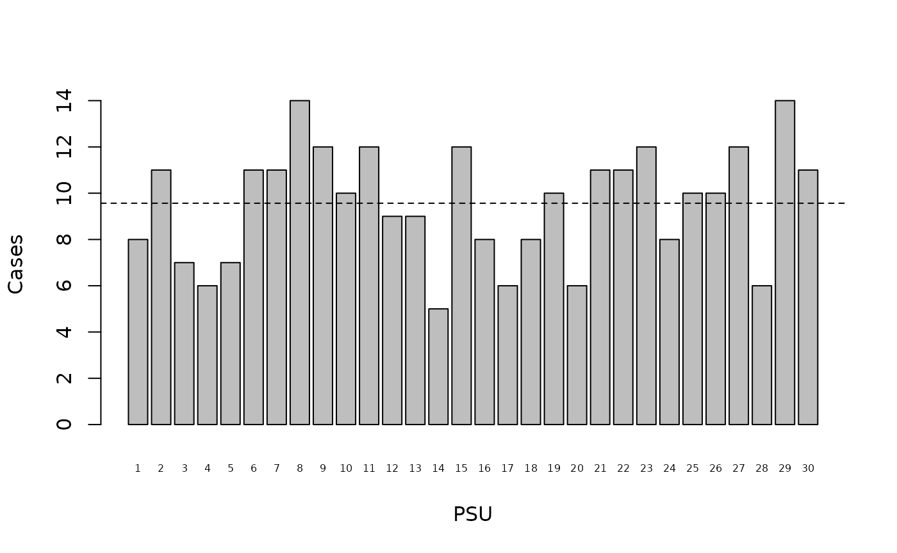

The dashed line on the plot marks the mean number of cases found in each
primary sampling unit. A uniform distribution would show all bars ending
close to this line (see figure above).

SMART uses the variance to mean ratio as a test of data quality. Green’s
Index is a more robust choice because it can be used to compare samples
that vary in overall sample size and the number of sampling units used.

The idea behind using a measure of dispersion to judge data quality is a
belief that the distribution of cases of malnutrition across primary
sampling units should always be random. If this is not the case then the
data are considered to be suspect. The problem with this approach is
that deviations from random can reflect the true distribution of cases
in the survey area. This may occur when the survey area comprises, for
example, more than one livelihood zone. It is also less likely to be the
case for conditions, such as wasting and oedema, that are associated
with infectious disease and so may be more clumped than randomly
distributed across primary sampling units. This may become a particular
problem when proximity sampling is used to collect the within-cluster
samples.

Measures of dispersion are problematic when used as measures of data
quality and should be interpreted with caution. The exception to this
rule is finding maximum, or almost maximum, uniformity or maximum, or
almost maximum, clumping. A finding of maximum uniformity is likely only
when data have been fabricated. A finding of maximum clumping may
indicate poor data collection and / or poor data management.
