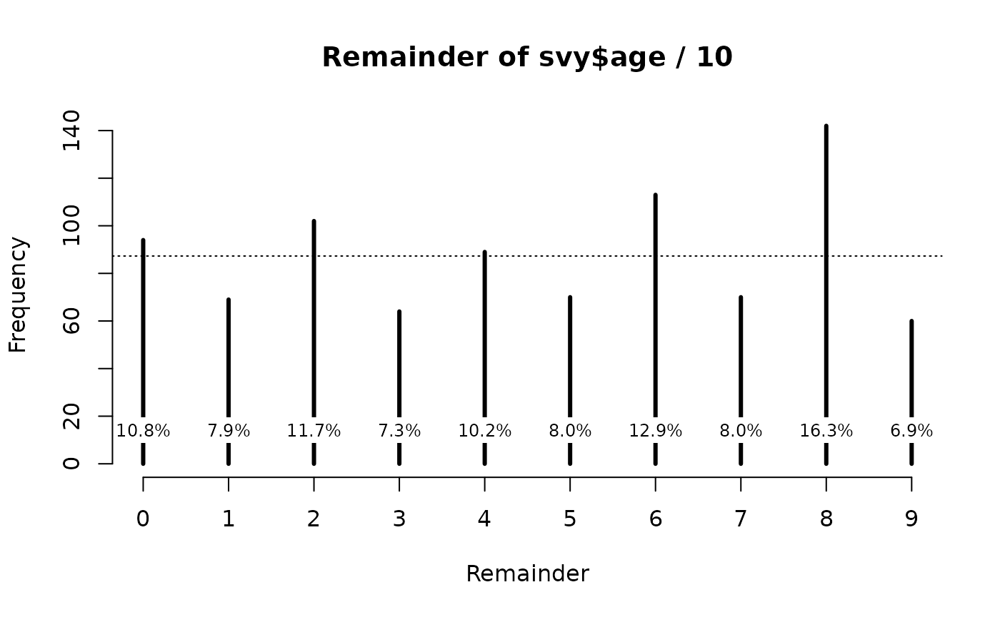

# Age heaping

This section depends on some of the material presented in the section
relating to digit preference.

Age heaping is the tendency to report children’s ages to the nearest
year or adults’ ages to the nearest multiple of five or ten years. Age
heaping is very common. This is a major reason why data from nutritional
anthropometry surveys is often analysed and reported using broad age
groups.

We will retrieve a survey dataset:

``` r
svy <- read.table("dp.ex02.csv", header = TRUE, sep = ",")
```

The file **dp.ex02.csv** is a comma-separated-value (CSV) file
containing anthropometric data from a SMART survey in Kabul,
Afghanistan.

The first few records in this dataset can be seen using:

``` r
head(svy)
```

This returns:

    #>   psu age sex weight height muac oedema
    #> 1   1   6   1    7.3   65.0  146      2
    #> 2   1  42   2   12.5   89.5  156      2
    #> 3   1  23   1   10.6   78.1  149      2
    #> 4   1  18   1   12.8   81.5  160      2
    #> 5   1  52   1   12.1   87.3  152      2
    #> 6   1  36   2   16.9   93.0  190      2

## Summarising, tabulating, and visualising age data

The variable of interest is **age** (age in months):

``` r
summary(svy$age)
#>    Min. 1st Qu.  Median    Mean 3rd Qu.    Max. 
#>     6.0    18.0    30.0    30.4    42.0    59.0
```

Tables can be difficult to use with ungrouped age data because there are
usually many different values:

``` r
table(svy$age)
#> 
#>  6  7  8  9 10 11 12 13 14 15 16 17 18 19 20 21 22 23 24 25 26 27 28 29 30 31 
#> 10 17 25 13 19 23 38 11 11 17  9 14 26  9 17 14 24 12 31  8 13  9 21 14 38 14 
#> 32 33 34 35 36 37 38 39 40 41 42 43 44 45 46 47 48 49 50 51 52 53 54 55 56 57 
#> 16 23 22 18 57  8 13  9 11 12 19 10 13 14 12 14 44  6  9  6  5  8 12 13 12  8 
#> 58 59 
#> 13  9
```

The [`fullTable()`](https://nutriverse.io/nipnTK/reference/fullTable.md)
function from the NiPN data-quality toolkit is preferred as this will
include values with zero counts:

``` r
fullTable(svy$age, values = 6:59)
#>  6  7  8  9 10 11 12 13 14 15 16 17 18 19 20 21 22 23 24 25 26 27 28 29 30 31 
#> 10 17 25 13 19 23 38 11 11 17  9 14 26  9 17 14 24 12 31  8 13  9 21 14 38 14 
#> 32 33 34 35 36 37 38 39 40 41 42 43 44 45 46 47 48 49 50 51 52 53 54 55 56 57 
#> 16 23 22 18 57  8 13  9 11 12 19 10 13 14 12 14 44  6  9  6  5  8 12 13 12  8 
#> 58 59 
#> 13  9
```

We used the
[`fullTable()`](https://nutriverse.io/nipnTK/reference/fullTable.md)
function here because it returns a table containing cells for every
value specified by the **values** parameter. The returned table will
also only contain cells for the **values** specified by the values
parameter. The default for the **values** parameter is the range of the
variable being tabulated. This means that the values parameter can be
sometimes be omitted:

``` r
fullTable(svy$age)
#>  6  7  8  9 10 11 12 13 14 15 16 17 18 19 20 21 22 23 24 25 26 27 28 29 30 31 
#> 10 17 25 13 19 23 38 11 11 17  9 14 26  9 17 14 24 12 31  8 13  9 21 14 38 14 
#> 32 33 34 35 36 37 38 39 40 41 42 43 44 45 46 47 48 49 50 51 52 53 54 55 56 57 
#> 16 23 22 18 57  8 13  9 11 12 19 10 13 14 12 14 44  6  9  6  5  8 12 13 12  8 
#> 58 59 
#> 13  9
```

Omitting the **values** parameter only works reliably for numeric
variables containing whole numbers. If the variable being tabulated is a
character variable or is a numeric variable containing one or more
numbers with decimal places then you should specify the **values**
parameter.

A graphical analysis is usually more informative than a tabular
analysis:

``` r
barplot(fullTable(svy$age, values = 6:59), 
        xlab = "Age (months)", ylab = "Frequency", las = 3, cex.names = 0.6)
```


We expect all ages to be present in roughly equal frequency or with
frequency reducing slowly with age due to mortality. We can see that
there is marked age-heaping at 12, 18, 24, 30, 36, and 48 months (see
figure above). This is very common when age is reported by mothers. This
is because of a tendency for mothers and other carers to round ages to
whole years or half years.

Note that we used `values = 6:59` with the
[`fullTable()`](https://nutriverse.io/nipnTK/reference/fullTable.md)
function from the NiPN data quality toolkit. We did this because it is
the range of values that should be present in the age variable.

## Age heaping in children

Age heaping can seriously affect survey results for indices that include
an age component (e.g. height- for-age and weight-for age). The effect
is important when there is systematic rounding up or systematic rounding
down. Systematic rounding can lead to bias. If rounding is
systematically down then indices will be biased upwards and prevalence
biased downwards. If rounding is systematically up then indices will be
biased downwards and prevalence biased upwards.

A useful way of looking at age heaping when age is recorded in months is
to examine the remainders when the ages are divided by 12.

The R language provides a special operator (%%) to help with this:

``` r
rem <- svy$age %% 12
remTable <- fullTable(rem, values = 0:11)
remTable
#>   0   1   2   3   4   5   6   7   8   9  10  11 
#> 170  33  46  41  46  48 105  63  83  72  90  76
prop.table(remTable) * 100
#>         0         1         2         3         4         5         6         7 
#> 19.473081  3.780069  5.269187  4.696449  5.269187  5.498282 12.027491  7.216495 
#>         8         9        10        11 
#>  9.507446  8.247423 10.309278  8.705613
barplot(remTable, xlab = "Age (months) %% 12", ylab = "Frequency") 
abline(h = sum(remTable / 12), lty = 3)
```


``` r
chisq.test(remTable)
#> 
#>  Chi-squared test for given probabilities
#> 
#> data:  remTable
#> X-squared = 214.96, df = 11, p-value < 2.2e-16
```

The NiPN data quality toolkit provides an R language function called
[`ageHeaping()`](https://nutriverse.io/nipnTK/reference/ageHeaping.md)
that performs this age-heaping analysis. Applying this function to the
example data:

``` r
ageHeaping(svy$age)
```

This returns:

    #> 
    #>  Age-heaping Analysis
    #> 
    #> data:    Remainder of svy$age / 12
    #> X-squared = 214.9588, df = 11, p-value = 0.0000

The output of the
[`ageHeaping()`](https://nutriverse.io/nipnTK/reference/ageHeaping.md)
function can be saved for later use:

``` r
ah12 <- ageHeaping(svy$age)
```

The saved output contains the Chi-squared test and frequency tables of
the final digits (counts and percentages). These can be accessed using:

``` r
ah12
#> 
#>  Age-heaping Analysis
#> 
#> data:    Remainder of svy$age / 12
#> X-squared = 214.9588, df = 11, p-value = 0.0000
ah12$X2
#> X-squared 
#>  214.9588
ah12$df
#> df 
#> 11
ah12$p
#> [1] 5.791598e-40
ah12$tab
#> Remainder of svy$age / 12
#>   0   1   2   3   4   5   6   7   8   9  10  11 
#> 170  33  46  41  46  48 105  63  83  72  90  76
ah12$pct
#> Remainder of svy$age / 12
#>    0    1    2    3    4    5    6    7    8    9   10   11 
#> 19.5  3.8  5.3  4.7  5.3  5.5 12.0  7.2  9.5  8.2 10.3  8.7
```

The saved results may also be plotted:

``` r
plot(ah12, main = "Age-heaping (remainder of age / 12)")
```

The resulting plot is shown below.


The
[`ageHeaping()`](https://nutriverse.io/nipnTK/reference/ageHeaping.md)
function assumes that you want to examine the remainder after dividing
by twelve. This is useful when working with ages that are recorded in
months. It may also be useful to use other divisors, such as examining
the remainder after dividing by six:

``` r
ah6 <- ageHeaping(svy$age, divisor = 6) 
print(ah6)
#> 
#>  Age-heaping Analysis
#> 
#> data:    Remainder of svy$age / 6
#> X-squared = 145.0275, df = 5, p-value = 0.0000
plot(ah6)
```


This shows the extent of age heaping at whole and half-years (see figure
above).

## Age heaping in adults

Using ten and five as divisors can be useful when dealing with data for
adults in which ages are recorded in whole years. For example:

``` r
svy <- read.table("ah.ex01.csv", header = TRUE, sep = ",") 
head(svy)
```

``` r
svy <- ah.ex01 
head(svy)
```

The file **ah.ex01.csv** is a comma-separated-value (CSV) file
containing anthropometric data from a Rapid Assessment Method for Older
People (RAM-OP) survey in the Dadaab refugee camp in Garissa, Kenya.
This is a survey of people aged sixty years and older.

The variable of interest is age (age in years):

``` r
summary(svy$age)
#>    Min. 1st Qu.  Median    Mean 3rd Qu.    Max. 
#>     6.0    18.0    30.0    30.4    42.0    59.0
```

Care should be exercised when specifying the **divisor** to use in the
analysis of age heaping. Not all calendars use base ten. Amongst Han
Chinese, for example, age heaping may occur with a twelve-year cycle
corresponding to preferred animal years in the Chinese calendar. An
analysis of age heaping that concentrates on specific digits (e.g. zero
and five) or on decimal intervals will not be appropriate in all
populations. It is advisable, therefore to use simple tabulation and
visualisation techniques to heap decide an appropriate **divisor**.

With the example data:

``` r
summary(svy$age)
#>    Min. 1st Qu.  Median    Mean 3rd Qu.    Max. 
#>     6.0    18.0    30.0    30.4    42.0    59.0
fullTable(svy$age)
#>  6  7  8  9 10 11 12 13 14 15 16 17 18 19 20 21 22 23 24 25 26 27 28 29 30 31 
#> 10 17 25 13 19 23 38 11 11 17  9 14 26  9 17 14 24 12 31  8 13  9 21 14 38 14 
#> 32 33 34 35 36 37 38 39 40 41 42 43 44 45 46 47 48 49 50 51 52 53 54 55 56 57 
#> 16 23 22 18 57  8 13  9 11 12 19 10 13 14 12 14 44  6  9  6  5  8 12 13 12  8 
#> 58 59 
#> 13  9
barplot(fullTable(svy$age), 
        xlab = "Age (years)", ylab = "Frequency", las = 3, cex.names = 0.6)
```


shows age-heaping at decades and half-decades (see figure above). In
this survey using a **divisor** of 10 would be appropriate:

``` r
ah10 <- ageHeaping(svy$age, divisor = 10) 
print(ah10)
#> 
#>  Age-heaping Analysis
#> 
#> data:    Remainder of svy$age / 10
#> X-squared = 70.31042, df = 9, p-value = 0.0000
plot(ah10)
```



There is pronounced age heaping at decades and, to a lesser extent,
half-decades in these data (see figure above).

It may also be useful to use other divisors, such as examining the
remainder after dividing by five:

``` r
ah5 <- ageHeaping(svy$age, divisor = 5) 
print(ah5)
#> 
#>  Age-heaping Analysis
#> 
#> data:    Remainder of svy$age / 5
#> X-squared = 10.39633, df = 4, p-value = 0.0343
plot(ah5)
```


This shows the extent of age heaping at whole and half decades (see
figure above).
