# Age and sex distributions

## Age and sex distributions (children’s data)

Age heaping is the tendency to report children’s ages to the nearest
year or adult ages to the nearest multiple of 5 or 10 years. Age heaping
is very common. It is a major reason why data from nutritional
anthropometry surveys are often analysed and reported using broad
age-groups. The commonest age-groups used with children’s data are 6 to
17 months, 18 to 29 months, 30 to 41 months, 42 to 53 months, and 54 to
59 months (see figure below). These are known as year-centred
age-groups. Note that the last age-group covers only six months but is
nominally centred at five years. Other age-groups may be used for
specific analyses. The techniques presented here can be adapted to work
with other age- groups.

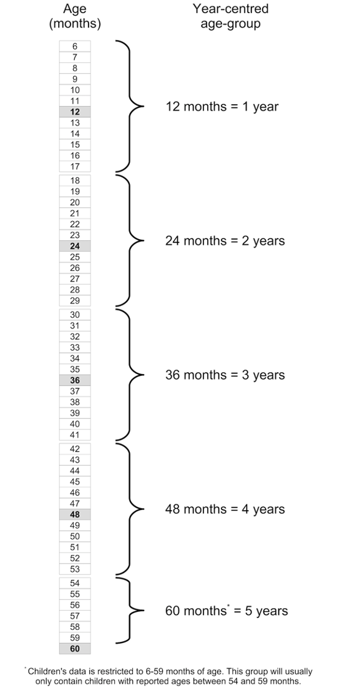

We will retrieve a survey dataset:

``` r
svy <- read.table("dp.ex02.csv", header = TRUE, sep = ",") 
head(svy)
```

    #>   psu age sex weight height muac oedema
    #> 1   1   6   1    7.3   65.0  146      2
    #> 2   1  42   2   12.5   89.5  156      2
    #> 3   1  23   1   10.6   78.1  149      2
    #> 4   1  18   1   12.8   81.5  160      2
    #> 5   1  52   1   12.1   87.3  152      2
    #> 6   1  36   2   16.9   93.0  190      2

The dataset `dp.ex02` is a comma-separated-value (CSV) file containing
anthropometric data from a SMART survey in Kabul, Afghanistan.

### Tabulation and visualisation

We will use the base R function
[`cut()`](https://rdrr.io/r/base/cut.html) to group the data in the age
variable (age in months) into year-centred age-groups.

``` r
svy$ycag <- cut(
  svy$age, 
  breaks = c(6, 18, 30, 42, 54, 60), 
  labels = 1:5,
  include.lowest = TRUE, right = FALSE
)
head(svy)
#>   psu age sex weight height muac oedema ycag
#> 1   1   6   1    7.3   65.0  146      2    1
#> 2   1  42   2   12.5   89.5  156      2    4
#> 3   1  23   1   10.6   78.1  149      2    2
#> 4   1  18   1   12.8   81.5  160      2    2
#> 5   1  52   1   12.1   87.3  152      2    4
#> 6   1  36   2   16.9   93.0  190      2    3
```

A tabular analysis can be performed:

``` r
table(svy$ycag, svy$sex) 
#>    
#>       1   2
#>   1 101 106
#>   2 102  96
#>   3 126 115
#>   4  78  82
#>   5  31  36
prop.table(table(svy$ycag, svy$sex)) * 100
#>    
#>             1         2
#>   1 11.569301 12.142039
#>   2 11.683849 10.996564
#>   3 14.432990 13.172967
#>   4  8.934708  9.392898
#>   5  3.550974  4.123711
```

The [`table()`](https://rdrr.io/r/base/table.html) function performs a
cross-tabulation. The first variable specified (`svy$ycag` in this
example) is the row variable. The second variable specified (`svy$sex`
in this example) is the column variable.

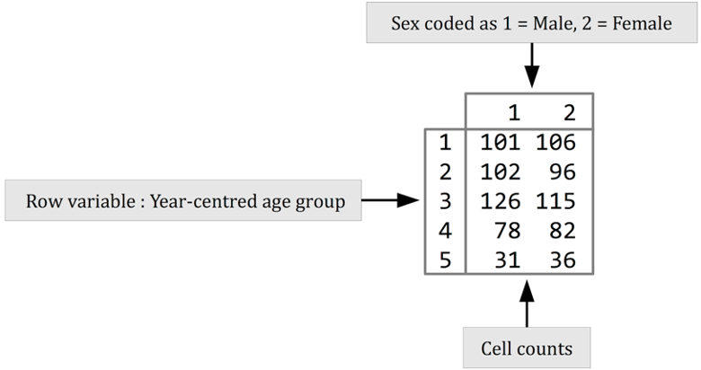

It is useful to examine row percentages and column percentages in tables
of age-group by sex. We should look at row percentages:

``` r
prop.table(table(svy$ycag, svy$sex), margin = 1) * 100
```

This returns:

    #>    
    #>            1        2
    #>   1 48.79227 51.20773
    #>   2 51.51515 48.48485
    #>   3 52.28216 47.71784
    #>   4 48.75000 51.25000
    #>   5 46.26866 53.73134

Which shows approximately equal proportions of males and females in each
year-centred age-group. We specified `margin = 1` with the
[`prop.table()`](https://rdrr.io/r/base/proportions.html) function
because we wanted row percentages.

We should also look at column percentages:

``` r
prop.table(table(svy$ycag, svy$sex), margin = 2) * 100 
```

This returns:

    #>    
    #>             1         2
    #>   1 23.059361 24.367816
    #>   2 23.287671 22.068966
    #>   3 28.767123 26.436782
    #>   4 17.808219 18.850575
    #>   5  7.077626  8.275862

We expect there to be approximately equal proportions of children in the
age-groups centred at 1, 2, 3, and 4 years and a smaller proportion
(i.e. about half that in the other age-groups) in the age-group centred
at 5 years. We specified `margin = 2` with the
[`prop.table()`](https://rdrr.io/r/base/proportions.html) function
because we wanted column percentages.

A graphical analysis using a population pyramid can be useful. The NiPN
data quality toolkit provides an *R* language function called
[`pyramid.plot()`](https://nutriverse.io/nipnTK/reference/pyramid.plot.md)
for plotting population pyramids:

``` r
pyramid.plot(svy$ycag, svy$sex)
```


We can make a more informative plot by specifying a title and axis
labels:

``` r
pyramid.plot(svy$ycag, svy$sex, 
             main = "Distribution of age by sex",
             xlab = "Frequency (Males | Females)", 
             ylab = "Year-centred age-group")
```


and applying shading:

``` r
pyramid.plot(svy$ycag, svy$sex, 
             main = "Distribution of age by sex",
             xlab = "Frequency (Males | Females)", 
             ylab = "Year-centred age-group",
             col = c("grey80", "white"))
```

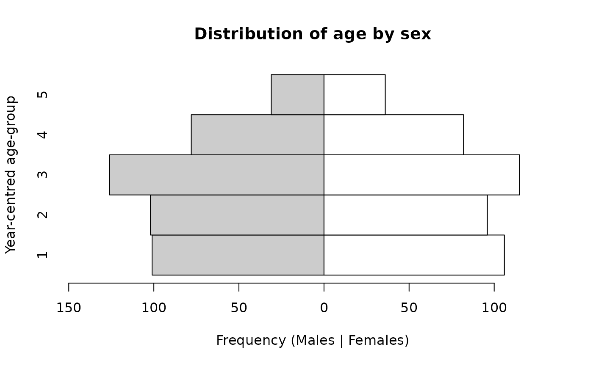

or colours:

``` r
pyramid.plot(svy$ycag, svy$sex, 
             main = "Distribution of age by sex",
             xlab = "Frequency (Males | Females)", 
             ylab = "Year-centred age-group",
             col = c("lightblue", "pink"))
```

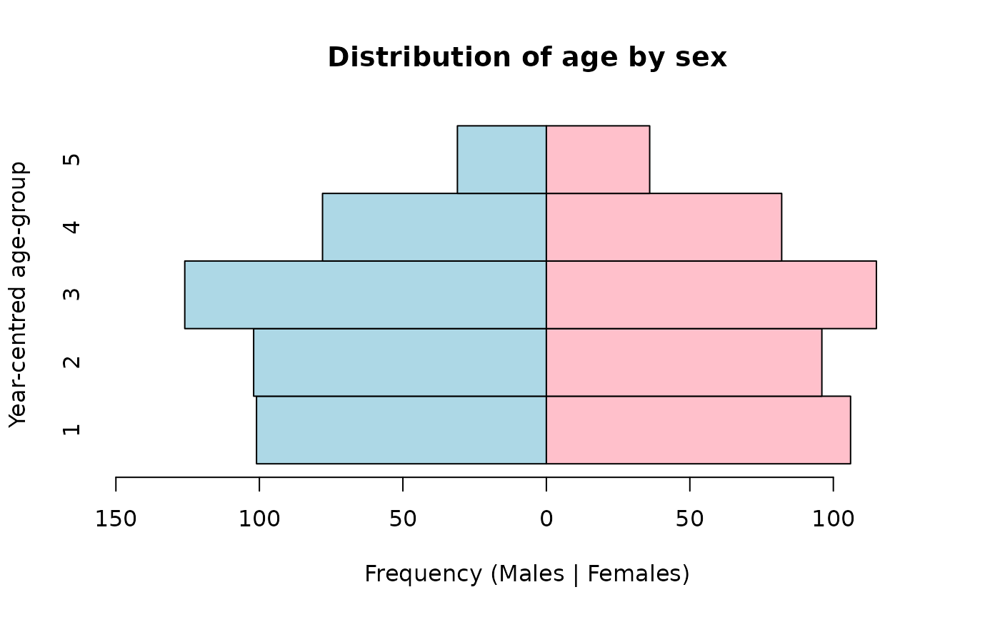

We expect there to be approximately equal numbers of children in the
age-groups centred at 1, 2, 3, and 4 years and a smaller number
(i.e. about half the number in the other age-groups) in the age-group
centred at 5 years. There should also be approximately equal numbers of
males and females. This is what we see in the population pyramid below.

``` r
pyramid.plot(svy$ycag, svy$sex, 
             main = "Distribution of age by sex",
             xlab = "Frequency (Males | Females)", 
             ylab = "Year-centred age-group")
```


The
[`pyramid.plot()`](https://nutriverse.io/nipnTK/reference/pyramid.plot.md)
function uses the values of the grouped age variable as y-axis value
labels.

We can use a factor type variable. This type of variable allows labels
to be specified:

``` r
svy$ageLabel <- factor(svy$ycag,
                       labels = c("6:17", "18:29", "30:41", "42:53", "54:59"))

pyramid.plot(svy$ageLabel, 
             svy$sex, 
             main = "Distribution of age by sex", 
             xlab = "Frequency (Males | Females)", 
             ylab = "Year-centred age-group")
```


The [`cut()`](https://rdrr.io/r/base/cut.html) function may also be
used:

``` r
svy$ageCuts <- cut(svy$age, breaks = c(0, 17, 29, 41, 53, 59))

pyramid.plot(svy$ageCuts, 
             svy$sex, 
             main = "Age-group (months) ",
             xlab = "Frequency (Males | Females)", 
             ylab = "Year-centred age-group",
             cex.names = 0.9)
```

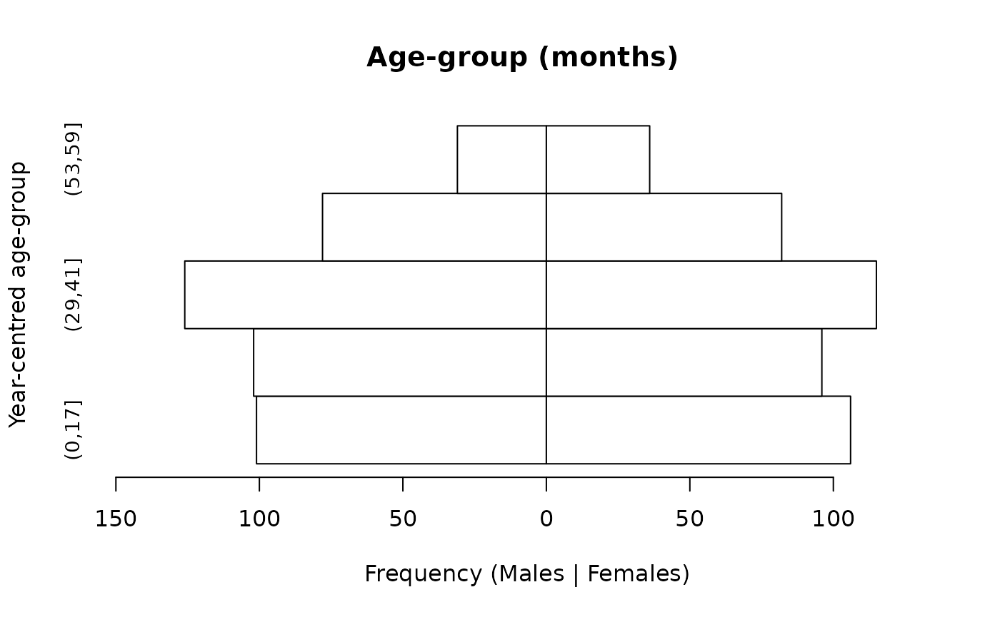

The [`cut()`](https://rdrr.io/r/base/cut.html) function is a versatile
grouping function. It is explained in more detail later in this section.

The `cex.names` parameter of the
[`pyramid.plot()`](https://nutriverse.io/nipnTK/reference/pyramid.plot.md)
function allows us to change the size of the value labels on the
`y-axis`. The value for cex.names is a magnification factor. Values
above one make the labels larger than the default. Values below one make
the labels smaller than the default.

## Simple testing

It is possible to perform a formal test on the distribution of
age-groups by sex. A simple test is:

``` r
chisq.test(table(svy$ycag, svy$sex))
```

This yields:

    #> 
    #>  Pearson's Chi-squared test
    #> 
    #> data:  table(svy$ycag, svy$sex)
    #> X-squared = 1.2675, df = 4, p-value = 0.8669

In this example the p-value is not below 0.05 so we accept the null
hypothesis that there is no significant association between age and sex.
This is an important test as it tests whether the distribution of ages
is similar for males and females. It does not, however, test whether the
age structure in the sample meets expectations. This requires a test
that compares observed numbers with expected numbers derived from an
external source (e.g. census data) or from a demographic model.

### A model of the expected age structure

A simple model-based method for calculating expected numbers is
exponential decay in a population in which births and deaths balance
each other and with a 1:1 male to female sex ratio. Under this model the
proportion surviving in each group at each year can be calculated as:

$$p\  = \ e^{- zt}$$

in which e is the base of the natural logarithm (approximately 2.7183),
z is the mortality rate associated with each time period, and t is time.
Time (t) starts at zero for the purposes of computation. Age can be used
as a measure of time since birth. We should use 0 for the first
year-centred age-group, 1 for the second year-centred age-group, and
so-on. This is the rationale for us using `t <- 0:4` below.

With five year-centred age-groups and a mortality rate of 1 / 10,000 /
day, the expected proportions surviving at each year can be calculated
as:

``` r
z <- (1 / 10000) * 365.25 

t <- 0:4

p <- exp(-z * t)

p
```

This yields the following survival probabilities:

    #> [1] 1.0000000 0.9641340 0.9295544 0.8962149 0.8640713

We need to specify the duration (i.e. the number of years) represented
by each age-group:

``` r
d <- c(1, 1, 1, 1, 0.5)
```

We can then calculate expected proportions of children in each
age-group:

``` r
ep <- d * p / sum(d * p) 

ep
```

This gives:

    #> [1] 0.2368580 0.2283628 0.2201724 0.2122757 0.1023311

We can now calculate expected numbers:

``` r
expected <- ep * sum(table(svy$ycag)) names(expected) <- 1:5

expected
```

giving:

    #>         1         2         3         4         5 
    #> 206.77703 199.36076 192.21049 185.31667  89.33505

A formal test would compare the observed numbers with the expected
numbers. The observed numbers can be found using:

``` r
observed <- table(svy$ycag) 

observed
```

This gives:

    #> 
    #>   1   2   3   4   5 
    #> 207 198 241 160  67

It can be useful to examine observed and expected numbers graphically:

``` r
par(mfcol = c(1, 2))
barplot(observed, main = "Observed", xlab = "Age group", ylab = "Frequency", ylim = c(0, 250))
barplot(expected, main = "Expected", xlab = "Age group", ylab = "Frequency", ylim = c(0, 250))
```

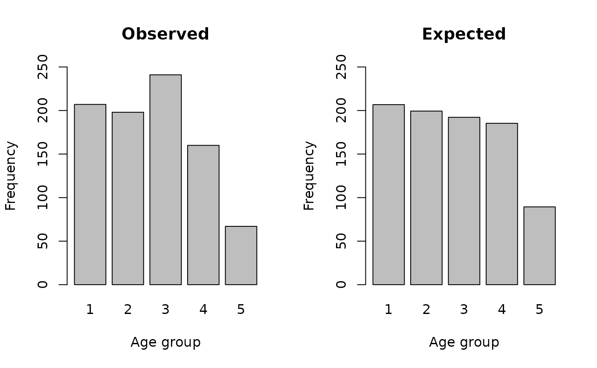

We will calculate a Chi-squared test statistic:

$$\chi^{2}\  = \ \sum\frac{\left( \text{observed} - \text{expected} \right)^{2}}{\text{expected}}$$

using:

``` r
X2 <- sum((observed - expected) ^ 2 / expected)
```

which yields a Chi-Squared test statistic of:

We can find the p-value using:

``` r
pchisq(X2, df = 4, lower.tail = FALSE)
```

This gives:

    #> [1] 0.000259395

In this example the age distribution is significantly different from
expected numbers calculated using a simple demographic model.

Note that we specify the degrees of freedom (`df`) for the Chi-Squared
test as the number of age-groups minus one. As we have five age-groups
we specify `df = 4`. The degrees of freedom (`df`) that we need to
specify will depend on the number of age-groups that we use. It is
always the number of age-groups minus one. If, for example, there are
ten age-groups we would need to specify `df = 9`.

The NiPN data quality toolkit provides an R function called
[`ageChildren()`](https://nutriverse.io/nipnTK/reference/ageChildren.md)
that performs the model-based Chi-Squared test specifically for a sample
of children aged 6-59 months:

``` r
ageChildren(svy$age, u5mr = 1)
```

which returns:

    #> 
    #>  Age Test (Children)
    #> 
    #> X-squared = 21.4366, df = 4, p = 0.0003

Note that we specified the under five years mortality rate as 1 / 10,000
/ day using `u5mr = 1`. Another, more appropriate, rate may be
specified.

The
[`ageChildren()`](https://nutriverse.io/nipnTK/reference/ageChildren.md)
function calculates year-centred age-groups for children aged between
six and fifty-nine months by default. This is a standard survey
population and is used in SMART and many other surveys. The use of
year-centred age-groups is also standard practice. The commands that are
given above can, however, be adapted for use with different age-groups.

The output of the
[`ageChildren()`](https://nutriverse.io/nipnTK/reference/ageChildren.md)
function can be saved for later use:

``` r
ac <- ageChildren(svy$age, u5mr = 1)
```

The saved output contains the Chi-squared test results and tables of
observed and expected values. These can be accessed using:

``` r
ac
#> 
#>  Age Test (Children)
#> 
#> X-squared = 21.4366, df = 4, p = 0.0003

ac$X2
#> [1] 21.43662

ac$df
#> [1] 4

ac$p 
#> [1] 0.000259395

ac$observed 
#>   1   2   3   4   5 
#> 207 198 241 160  67

ac$expected
#>         1         2         3         4         5 
#> 206.77703 199.36076 192.21049 185.31667  89.33505
```

The saved results may also be plotted:

``` r
plot(ac)
```

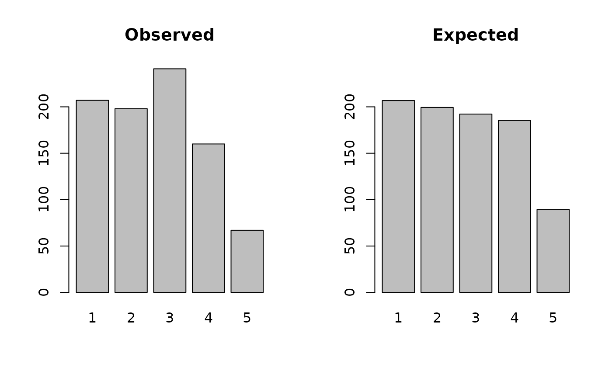

The
[`ageChildren()`](https://nutriverse.io/nipnTK/reference/ageChildren.md)
function can be applied to each sex separately. To males:

``` r
acM <- ageChildren(svy$age[svy$sex == 1], u5mr = 1) 

acM
#> 
#>  Age Test (Children)
#> 
#> X-squared = 15.8496, df = 4, p = 0.0032

plot(acM)
```

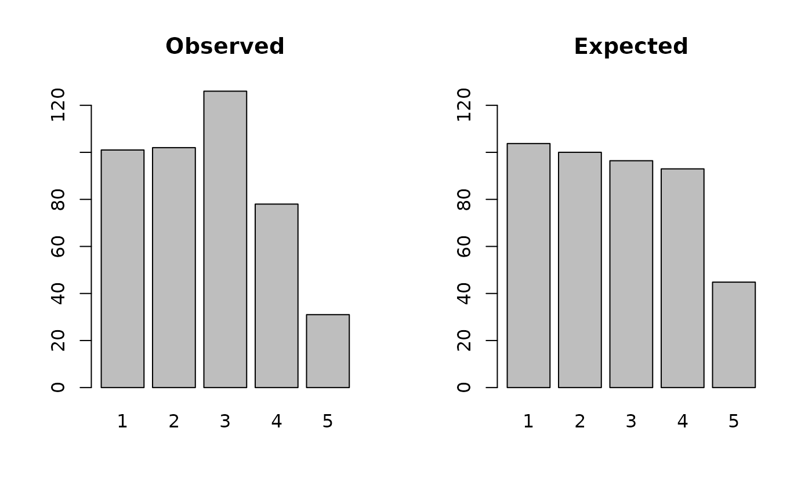

and to females:

``` r
acF <- ageChildren(svy$age[svy$sex == 2], u5mr = 1) 

acF
#> 
#>  Age Test (Children)
#> 
#> X-squared = 6.8429, df = 4, p = 0.1444

plot(acF)
```

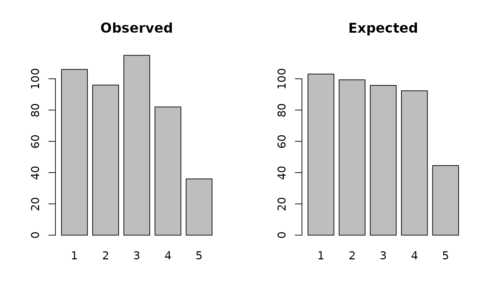

An easier way of doing this is:

``` r
by(svy$age, svy$sex, ageChildren, u5mr = 1)
#> svy$sex: 1
#> 
#>  Age Test (Children)
#> 
#> X-squared = 15.8496, df = 4, p = 0.0032
#> 
#> ------------------------------------------------------------ 
#> svy$sex: 2
#> 
#>  Age Test (Children)
#> 
#> X-squared = 6.8429, df = 4, p = 0.1444
```

The test statistics should be interpreted with caution. A significant
test result may, for example, be due to the use of an inappropriate
model to generate expected numbers.

A significant result in this particular test may be due to:

- **Specifying an inappropriate under five years mortality rate:** This
  is a particular problem because the specified under five years
  mortality rate is assumed to have applied for five years prior to data
  being collected.

- **The assumption of a 1:1 male to female sex ratio:** This is a
  particular problem in setting in which there is sex-selective abortion
  and sex-selective infanticide.

The model is crude. Mortality is related to age. Younger children have a
greater mortality risk than older children and only an average under
five years mortality rate is used. A more sophisticated model could be
used but, in many settings, we will not have the data required to use
such a model.

It should also be noted that the sample sizes used in most survey can
cause tests to yield statistically significant results for small
differences between observed and expected numbers.

## Use of census data

The use of simple demographic models is far from ideal. It is usually
better to calculate the expected proportions from census data. A useful
source of census data is the [United States Census Bureau’s
International Data
Base](https://www.census.gov/data-tools/demo/idb/informationGateway.php):

<https://www.census.gov/data-tools/demo/idb/informationGateway.php>

The population in single year age-groups for 0, 1, 2, 3, and 4 years for
Afghanistan in 2015 was:

| Age | Both Sexes |  Males | Females |
|----:|-----------:|-------:|--------:|
|   0 |    1148379 | 584276 |  564103 |
|   1 |    1062635 | 539589 |  523046 |
|   2 |    1015688 | 515793 |  499895 |
|   3 |     981288 | 498365 |  482923 |
|   4 |     950875 | 482926 |  467949 |

We can calculate expected values from these data:

``` r
pop <- c(1148379, 1062635, 1015688, 981288, 950875) 
ep <- pop / sum(pop)
```

With a sample size of $n = 900$ the expected number in each age-group
would be:

``` r
expected <- ep * 900
expected
#> [1] 200.3427 185.3841 177.1939 171.1925 165.8868
```

These expected values can be used in a Chi-squared test as is
illustrated above.

Census data may also be used to estimate the under five years’ mortality
rate (U5MR) which can then be used with the
[`ageChildren()`](https://nutriverse.io/nipnTK/reference/ageChildren.md)
function.

The model of exponential decay in a population in which births and
deaths balance each other with a 1:1 male to female sex ratio:

$$p\  = \ e^{- zt}$$

means that we can, given an age-distribution, estimate mortality by
fitting the model:

$$\log_{e}(n)\  = \ \alpha\  + \ \beta t$$

where $n$ is the count of children in each age-group.

The absolute value of the β coefficient is the point estimate of the
mortality rate (z). Using the 2015 population data for Afghanistan:

``` r
t <- 0:4 
lm(log(pop) ~ t)
```

This gives:

    #> 
    #> Call:
    #> lm(formula = log(pop) ~ t)
    #> 
    #> Coefficients:
    #> (Intercept)            t  
    #>    13.93601     -0.04571

The value reported under **t** is the $\beta$ coefficient
(**-0.04571**). The absolute value of the $\beta$ coefficient (i.e. the
value without the sign) is **0.04571**. This is the point estimate of
the mortality rate. Expressed as the number of deaths / 10,000 persons /
day:

``` r
(0.04571 / 365.25) * 10000
```

this is:

    #> [1] 1.251472

We can use this estimate with the
[`ageChildren()`](https://nutriverse.io/nipnTK/reference/ageChildren.md)
function:

``` r
ageChildren(svy$age, u5mr = 1.251472)
#> 
#>  Age Test (Children)
#> 
#> X-squared = 20.4744, df = 4, p = 0.0004
```

### The age ratio

A much simpler and less problematic age-related test of survey and data
quality is the *age ratio* test.

The age ratio is defined as:

$$\text{Age ratio}\  = \ \frac{\text{number of children aged between 6 and 29 months}}{\text{number of children aged between 30 and 59 months}}$$

We will use the base R [`cut()`](https://rdrr.io/r/base/cut.html)
function to create the relevant age-groups:

``` r
svy$ageGroup <- cut(
  svy$age, 
  breaks = c(6, 30, 60), 
  labels = 1:2, 
  include.lowest = TRUE, 
  right = FALSE
)
head(svy)
#>   psu age sex weight height muac oedema ycag ageLabel ageCuts ageGroup
#> 1   1   6   1    7.3   65.0  146      2    1     6:17  (0,17]        1
#> 2   1  42   2   12.5   89.5  156      2    4    42:53 (41,53]        2
#> 3   1  23   1   10.6   78.1  149      2    2    18:29 (17,29]        1
#> 4   1  18   1   12.8   81.5  160      2    2    18:29 (17,29]        1
#> 5   1  52   1   12.1   87.3  152      2    4    42:53 (41,53]        2
#> 6   1  36   2   16.9   93.0  190      2    3    30:41 (29,41]        2
```

The observed age ratio is:

``` r
sum(svy$ageGroup == 1) / sum(svy$ageGroup == 2)
```

which gives:

    #> [1] 0.8653846

It is often easier to work with proportions than with ratios so we only
need to calculate the proportion in the younger age-group:

``` r
sum(svy$ageGroup == 1) / sum(table(svy$ageGroup))
```

which gives:

    #> [1] 0.4639175

We can calculate an expected value using census data or a simple
demographic model. The simplest approach is to use a standard value.
SMART surveys often use the ratio 0.85:1.

We only need to calculate the expected proportion in the younger group.
For the ratio 0.85:1 this is:

``` r
p <- 0.85 / (0.85 + 1) 
```

This gives:

    #> [1] 0.4594595

The observed proportion (0.4639175) and expected proportion (0.4594595)
are so similar that a formal test of statistical significance is not
required in this case.

Formal testing can be done using a Chi-squared test:

``` r
prop.test(sum(svy$ageGroup == 1), sum(table(svy$ageGroup)), p = 0.4594595)
```

This returns:

    #> 
    #>  1-sample proportions test with continuity correction
    #> 
    #> data:  sum(svy$ageGroup == 1) out of sum(table(svy$ageGroup)), null probability 0.4594595
    #> X-squared = 0.053062, df = 1, p-value = 0.8178
    #> alternative hypothesis: true p is not equal to 0.4594595
    #> 95 percent confidence interval:
    #>  0.4304994 0.4976573
    #> sample estimates:
    #>         p 
    #> 0.4639175

The age ratio in the example data is not significantly different from
the expected age ratio.

The NiPN data quality toolkit provide an R function called
[`ageRatioTest()`](https://nutriverse.io/nipnTK/reference/ageRatioTest.md)
that performs the age ratio test:

``` r
ageRatioTest(svy$age, ratio = 0.85)
```

This returns:

    #> 
    #>      Age Ratio Test (children's data)
    #> 
    #>                     Expected age ratio = 0.8500
    #> Expected proportion aged 6 - 29 months = 0.4595
    #> 
    #>                     Observed age ratio = 0.8654
    #> Observed proportion aged 6 - 29 months = 0.4639
    #> 
    #> X-squared = 0.0531, p = 0.8178

The `ratio` parameter of the
[`ageRatioTest()`](https://nutriverse.io/nipnTK/reference/ageRatioTest.md)
function allows you to specify an expected age ratio other than 0.85:1.

Note that the
[`ageRatioTest()`](https://nutriverse.io/nipnTK/reference/ageRatioTest.md)
function applies the test to data from children aged between 6 and 59
months only (all other ages are ignored).

The age ratio test might be applied to data from both sexes (as above)
and to each sex separately:

``` r
by(svy$age, svy$sex, ageRatioTest, ratio = 0.85)
#> svy$sex: 1
#> 
#>      Age Ratio Test (children's data)
#> 
#>                     Expected age ratio = 0.8500
#> Expected proportion aged 6 - 29 months = 0.4595
#> 
#>                     Observed age ratio = 0.8638
#> Observed proportion aged 6 - 29 months = 0.4635
#> 
#> X-squared = 0.0145, p = 0.9041
#> 
#> ------------------------------------------------------------ 
#> svy$sex: 2
#> 
#>      Age Ratio Test (children's data)
#> 
#>                     Expected age ratio = 0.8500
#> Expected proportion aged 6 - 29 months = 0.4595
#> 
#>                     Observed age ratio = 0.8670
#> Observed proportion aged 6 - 29 months = 0.4644
#> 
#> X-squared = 0.0247, p = 0.8750
```

The example data meets expectations regarding the age ratio for all
children and for male and female children separately.

## Age and sex distributions : Adults and general population surveys

A key test of survey quality is whether the survey data represents the
population in terms of the age and sex distribution. We can test this by
comparison with census data.

We will retrieve some example data:

``` r
svy <- read.table("as.ex01.csv", header = TRUE, sep = ",") 
head(svy)
```

    #>   age sex
    #> 1  44   2
    #> 2   1   2
    #> 3  15   2
    #> 4   7   1
    #> 5  14   1
    #> 6  14   1

These data are taken from household rosters collected as part of a
household survey in Tanzania. We will use census data taken from the
Wolfram\|Alpha knowledge engine:

<http://www.wolframalpha.com/input/?i=Tanzania+age+distribution>

Another useful source of census data is the United States Census
Bureau’s International Data Base:

<https://www.census.gov/data-tools/demo/idb/informationGateway.php>

The pyramid plot produced by Wolfram\|Alpha is shown in the figure
below.

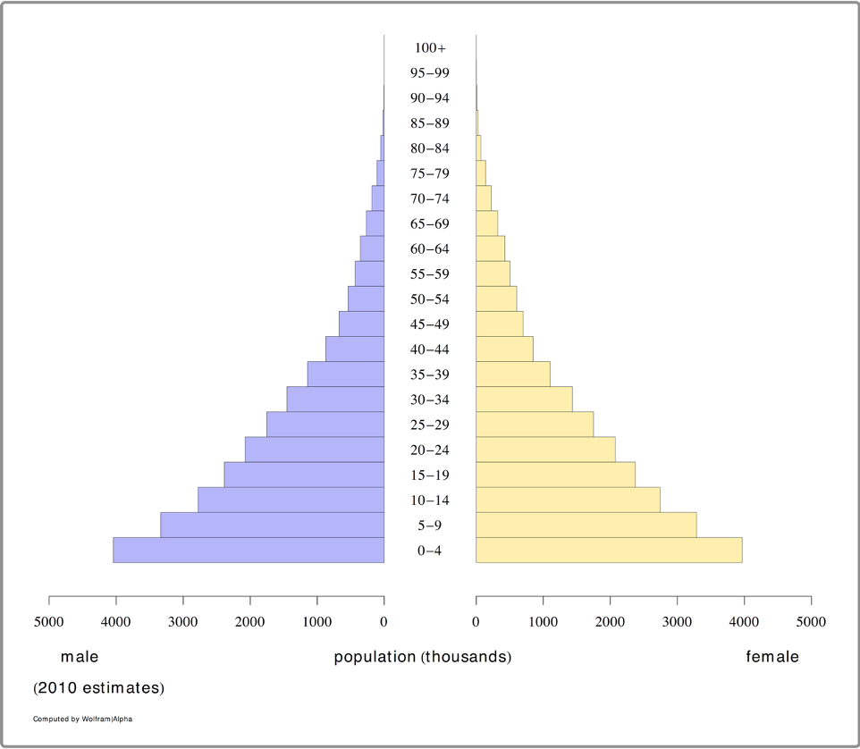

The table produced by Wolfram\|Alpha was downloaded and stored in a CSV
file:

``` r
ref <- read.table("as.ex02.csv", header = TRUE, sep = ",")
ref
```

    #>         age   Males Females     All
    #> 1     [0,5) 4043000 3969000 8012000
    #> 2    [5,10) 3336000 3284000 6620000
    #> 3   [10,15) 2775000 2742000 5517000
    #> 4   [15,20) 2386000 2372000 4758000
    #> 5   [20,25) 2076000 2073000 4149000
    #> 6   [25,30) 1753000 1750000 3503000
    #> 7   [30,35) 1453000 1432000 2885000
    #> 8   [35,40) 1142000 1099000 2241000
    #> 9   [40,45)  873000  846000 1719000
    #> 10  [45,50)  673000  699000 1372000
    #> 11  [50,55)  538000  601000 1139000
    #> 12  [55,60)  433000  503000  936000
    #> 13  [60,65)  357000  426000  783000
    #> 14  [65,70)  266000  319000  585000
    #> 15  [70,75)  182000  222000  404000
    #> 16  [75,80)  108000  137000  245000
    #> 17  [80,85)   51000   68000  119000
    #> 18  [85,90)   17000   25000   42000
    #> 19  [90,95)    3000    6000    9000
    #> 20 [95,100)       0    1000    1000

The age-groups are expressed using the form specified in ISO 31-11, an
international standard that applies to mathematical symbols. The form
\[a,b) expresses the interval $a \leq x < b$. For example, \[30,35) is
used to indicate the set {30, 31, 32, 33, 34} of ages in years. The form
\[a,b) is said to be *closed* on the left and *open* on the right.

The reference data (`ref`) uses five-year age-groups. We will create the
same age-groups in the example dataset.

We should first check the range of ages in the example data:

``` r
range(svy$age)
```

which returns:

    #> [1]  0 93

The R language provides a function that makes it easy to create ISO
31-11 groupings from raw data:

``` r
svy$ageGroup <-cut(svy$age, 
                   breaks = seq(from = 0, to = 95, by = 5),
                   include.lowest = TRUE, right = FALSE)
```

Using `include.lowest = TRUE` tells the
[`cut()`](https://rdrr.io/r/base/cut.html) function to include the
lowest breaks value (zero in this case). Using `right = FALSE` tells the
[`cut()`](https://rdrr.io/r/base/cut.html) function to use groupings
that are closed on the left. This combination of parameters creates the
same “closed on the left” and “open on the right” age-groups as are used
in the reference (**ref**) data:

``` r
table(svy$ageGroup)
#> 
#>   [0,5)  [5,10) [10,15) [15,20) [20,25) [25,30) [30,35) [35,40) [40,45) [45,50) 
#>    1598    1268    1072     808     870     575     580     385     424     258 
#> [50,55) [55,60) [60,65) [65,70) [70,75) [75,80) [80,85) [85,90) [90,95] 
#>     284     128     165      82      98      51      60      18      12
```

A tabular analysis of age-group by sex can be produced using:

``` r
table(svy$ageGroup, svy$sex)
#>          
#>             1   2
#>   [0,5)   821 777
#>   [5,10)  637 631
#>   [10,15) 547 525
#>   [15,20) 389 419
#>   [20,25) 342 528
#>   [25,30) 343 232
#>   [30,35) 250 330
#>   [35,40) 177 208
#>   [40,45) 206 218
#>   [45,50) 125 133
#>   [50,55) 162 122
#>   [55,60)  70  58
#>   [60,65)  87  78
#>   [65,70)  33  49
#>   [70,75)  47  51
#>   [75,80)  22  29
#>   [80,85)  24  36
#>   [85,90)  10   8
#>   [90,95]   1  11
```

A visual inspection is useful:

``` r
pyramid.plot(svy$ageGroup, svy$sex)
```


We can make this easier to read:

``` r
pyramid.plot(svy$ageGroup, 
             svy$sex, 
             main = "Age-group by sex",
             xlab = "Number (Males | Females)", 
             ylab = "", 
             las = 1, 
             cex.names = 0.9)
```

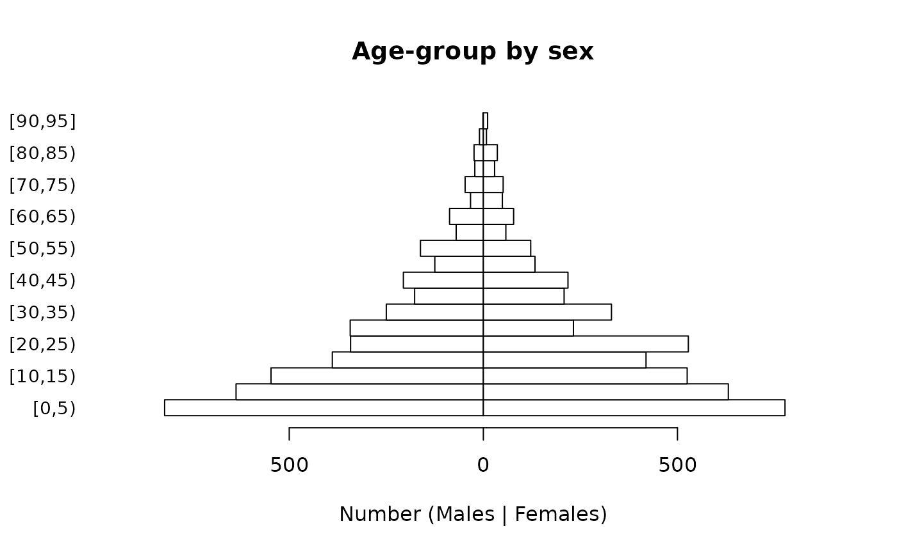

Note that we specified `ylab = ""` because it is clear that the category
labels represent age-groups and to prevent the y-axis label from
obscuring the category labels, which happens with:

``` r
pyramid.plot(svy$ageGroup, 
             svy$sex, 
             main = "Age-group by sex",
             xlab = "Number (Males | Females)", 
             ylab = "Age-group", 
             las = 1,
             cex.names = 0.9)
```


It is possible to alter the number of lines of text in margins of the
plot, reduce the size of the age-group labels, and place the y-axis
label on a specific line in the left margin of the plot in order to make
a clearer plot:

``` r
par(mar = c(5, 5, 4, 2))

pyramid.plot(svy$ageGroup, 
             svy$sex, 
             main = "Age-group by sex",
             xlab = "Number (Males | Females)", 
             ylab = "", 
             las = 1, 
             cex.names = 0.8)

title(ylab = "Age-group", line = 4)
```


The easiest way of checking whether the survey data represents the
general population in terms of the age and sex distribution is to
compare the observed (figure on right) and expected (figure on left)
distributions.

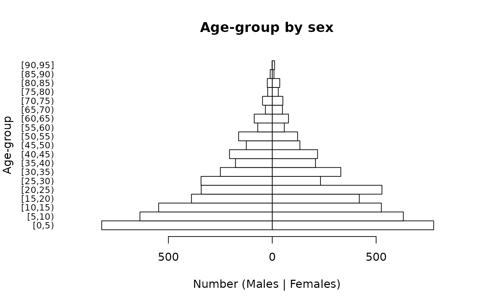

The general shapes of the two distributions are similar. Some of the
lumpiness in figure on the right is due to age heaping in the adult ages
at decades and half-decades:

``` r
ah <- ageHeaping(svy$age, divisor = 10) 
plot(ah, main = "Remainder of age / 10")
```

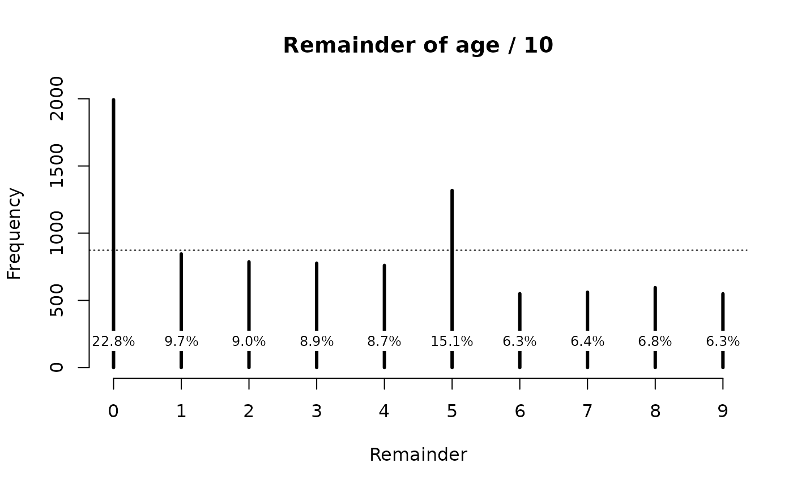

A more formal test of the age structure can be made by comparing
observed and expected numbers. We can do this graphically:

``` r
ref <- ref[1:19, ]

expectedProportions <- ref$All / sum(ref$All)
expectedNumbers <- expectedProportions * sum(table(svy$ageGroup))

mp <- barplot(table(svy$ageGroup), 
              main = "Observed and expected numbers", 
              ylim = c(0, max(expectedNumbers)), 
              las = 2)

lines(mp, expectedNumbers, lty = 2, lwd = 2)
```

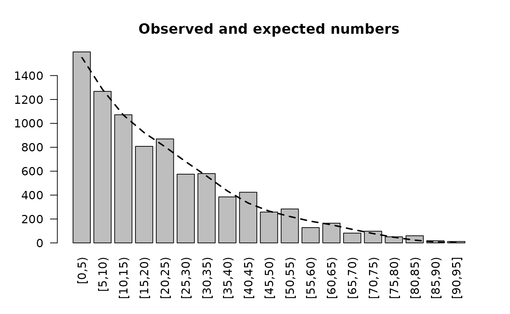

The observed and expected numbers are similar to each other. The
lumpiness in the observed numbers is due to age heaping. See Figure
ASA04.

Formal testing can be performed:

``` r
chisq.test(table(svy$ageGroup), 
           p = expectedProportions)
```

This gives:

    #> Warning in chisq.test(table(svy$ageGroup), p = expectedProportions):
    #> Chi-squared approximation may be incorrect
    #> 
    #>  Chi-squared test for given probabilities
    #> 
    #> data:  table(svy$ageGroup)
    #> X-squared = 248.41, df = 18, p-value < 2.2e-16

The warning is due to small expected numbers (i.e. n \< 5) in the older
age-groups. R provides a more robust “Monte Carlo” test:

``` r
chisq.test(table(svy$ageGroup), 
           p = expectedProportions, 
           simulate.p.value = TRUE)
```

This may take a few seconds to compute and yields:

    #> 
    #>  Chi-squared test for given probabilities with simulated p-value (based
    #>  on 2000 replicates)
    #> 
    #> data:  table(svy$ageGroup)
    #> X-squared = 248.41, df = NA, p-value = 0.0004998

The test results need to be interpreted with caution. The sample size
($n = 8736$) is large in this example. This means that small
differences, which may be due to age heaping, become statistically
significant. This test cannot be considered to be good evidence that the
age-structure of the sample differs from the expected age-structure of
the population. We also need to examine the sex ratio of the sample. A
sex ratio test can be performed using the
[`sexRatioTest()`](https://nutriverse.io/nipnTK/reference/sexRatioTest.md)
function from the NiPN data quality toolkit and the sex ratio observed
in the census data:

``` r
censusM <- sum(ref$Males)
censusF <- sum(ref$Females)

sexRatioTest(svy$sex, 
             codes = c(1, 2), 
             pop = c(censusM, censusF))
```

This yields:

    #> 
    #>  Sex Ratio Test
    #> 
    #> Expected proportion male = 0.4988
    #> Observed proportion male = 0.4914
    #> X-squared = 1.8770, p = 0.1707

There is no evidence that the sex ratio in the sample differs much from
the expected sex ratio in the population.

The techniques outlined in this section are illustrative. This is
because many surveys, other than nutritional anthropometry surveys in
young children, are not standardised. A survey may sample only women of
child-bearing age. The sample may be restricted to women aged between 15
and 45 years.

In this case the age-structure can be examined using the techniques
outlined above but it would make no sense to examine the sex ratio. Care
should be taken when examining data from surveys that may have
deliberately oversampled specific age-groups.
