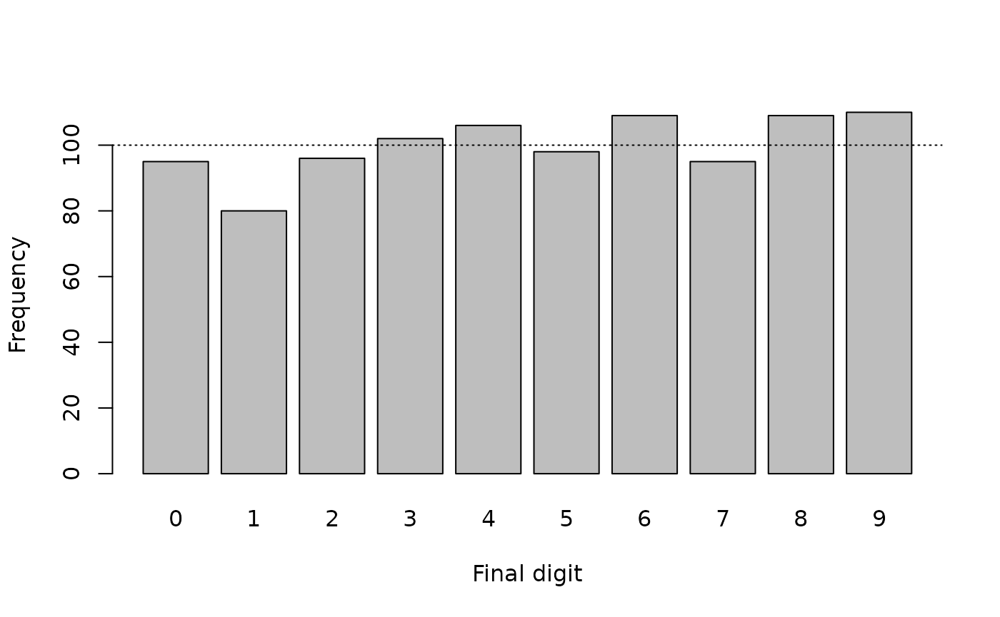
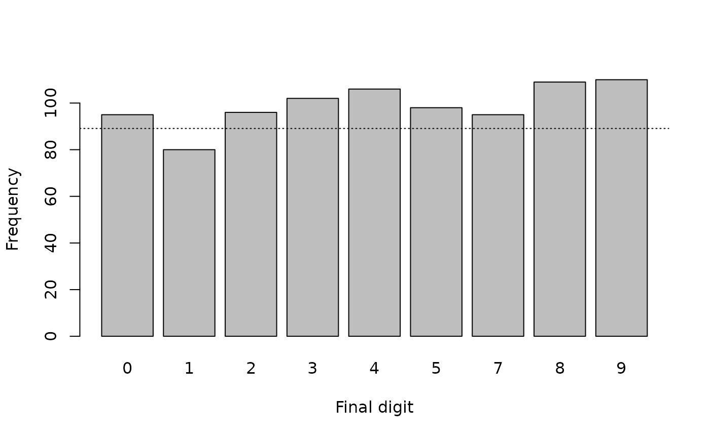
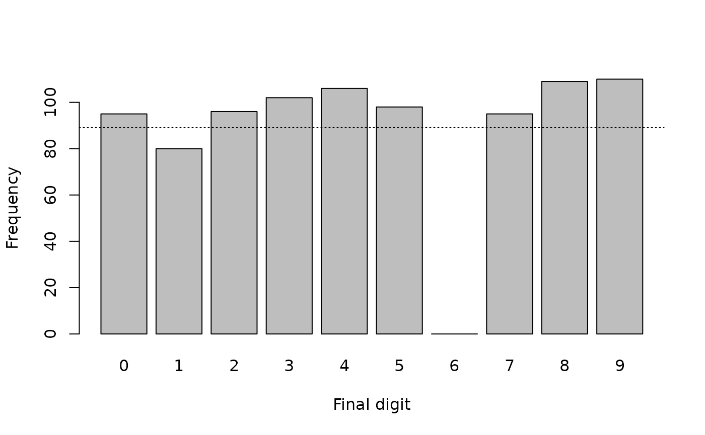
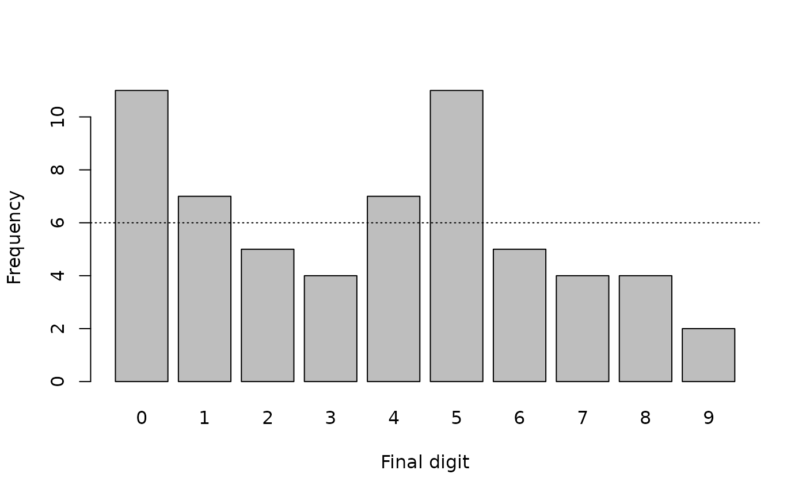
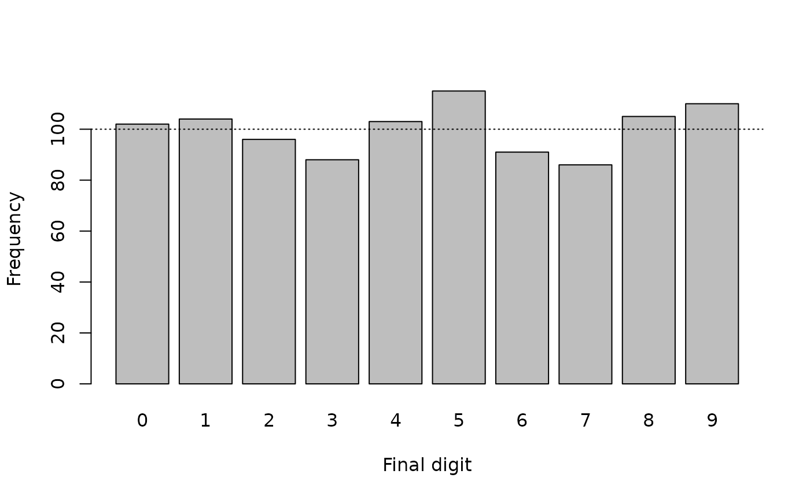
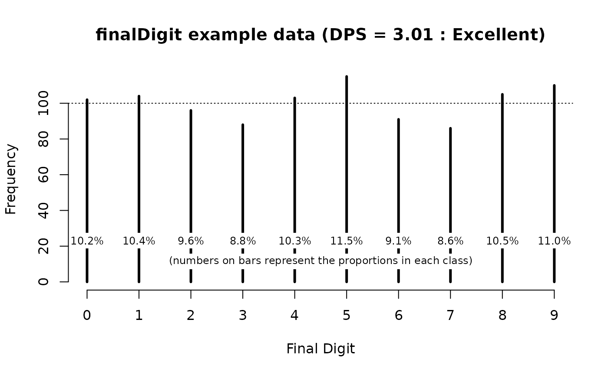
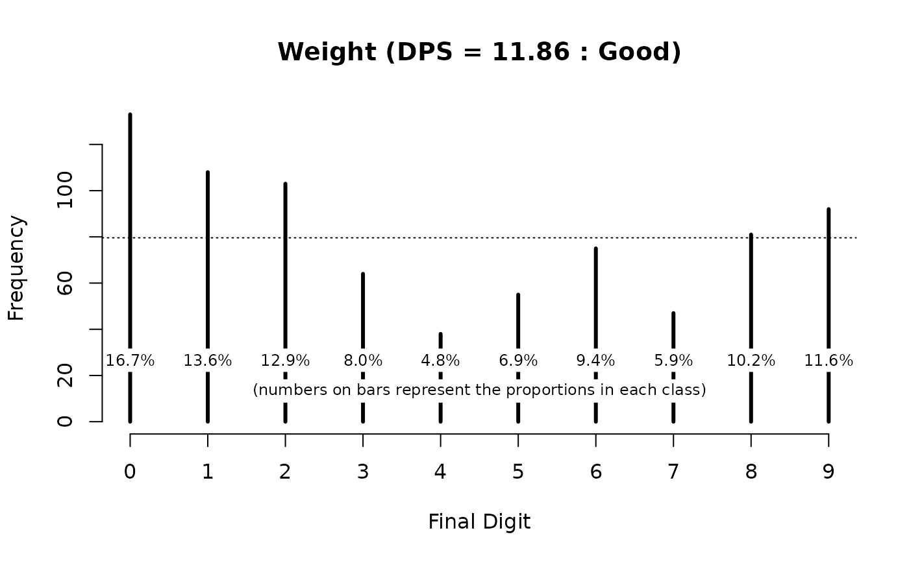
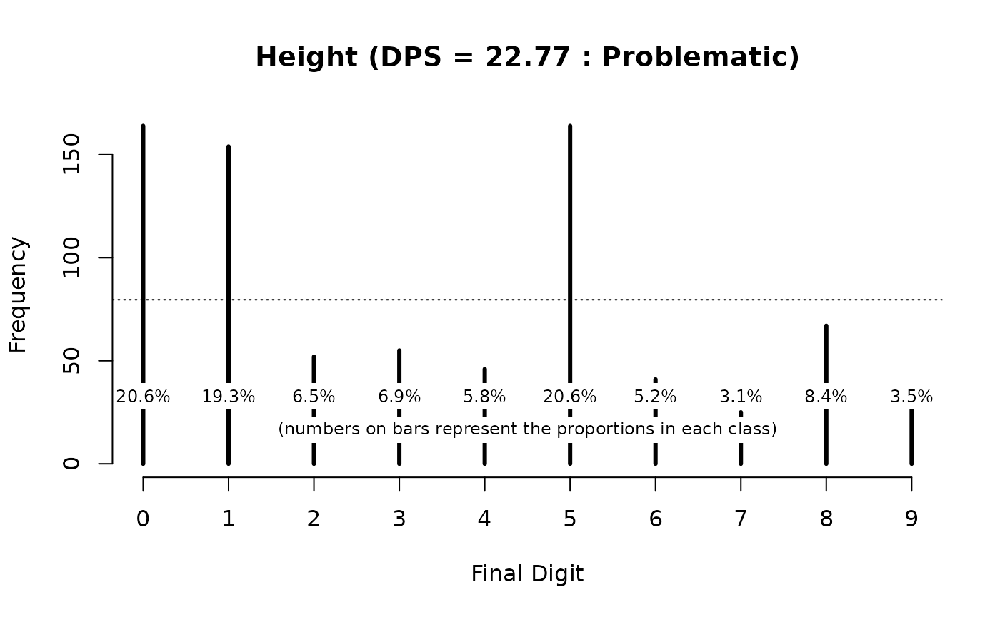
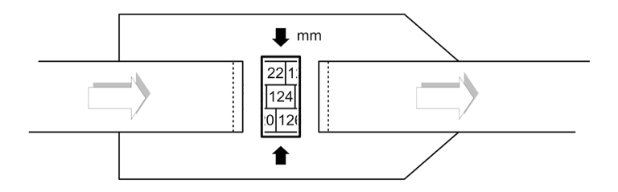
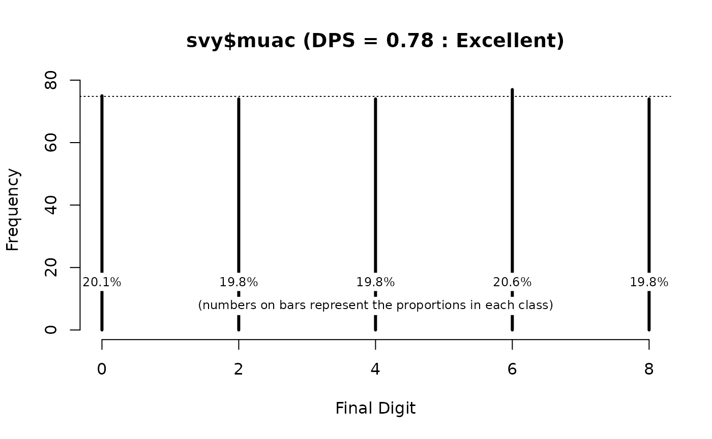

# Digit preference

## Digit preference in anthropometric measurements

Measurements in nutritional anthropometry surveys are usually taken and
recorded to one decimal place. Examples are given in table below.

| Variable      | Unit | Precision      | Example | Notes                                                                                                                                                       |
|:--------------|:-----|:---------------|:--------|:------------------------------------------------------------------------------------------------------------------------------------------------------------|
| Weight        | kg   | Nearest 0.1 kg | 8.7 kg  | Most surveys use scales with a 0.1 kg precision                                                                                                             |
| Height/length | cm   | Nearest 0.1 cm | 85.3 kg | Height boards tend to have a 0.1 cm pesion                                                                                                                  |
| MUAC          | cm   | Nearest 0.1 cm | 13.7 cm | MUAC may be measured and recorded in centimetres or millimetres. Sometimes both may be used in the same survey. You will need to check this and recode data |
|               | mm   | Nearest 0.1 mm | 137 mm  |                                                                                                                                                             |

Common measurements used in anthropometric surveys

Digit preference is the observation that the final number in a
measurement occurs with a greater frequency that is expected by chance.
This can occur because of rounding, the practice of increasing or
decreasing the value in a measurement to the nearest whole or half unit,
or because data are made up.

When taking and recording measurements in the field it is common for
field staff to round the first value after the decimal point to zero or
five. Measurements in whole numbers may also be rounded to the nearest
decade (e.g. 137 mm may be rounded to 140 mm) or half-decade (e.g. 137
mm may be rounded to 135 mm). A small number of rounded measurements is
unlikely to affect survey results. A large number of rounded
measurements can affect survey results particularly if measurements have
been systematically rounded in one direction. This is a form of bias.

Fictitious data often shows digit preference with (e.g.) ”2” and “6”
appearing as final digits much more frequently than expected. This
happens because, without using a computer, a large quantity of random
data is very much harder to fake than merely random-looking data.

If there were little or no digit preference in anthropometric data then
we would expect the final recorded digit of each measurement to occur
with approximately equal frequency. We can check if digit preference is
absent in data by testing whether this is the case.

We will use the R Language for Data Analysis and Graphics to illustrate
how this can be done.

## Tabulation and visualisation

First we will work with some artificial data:

``` r
set.seed(0)
finalDigits <- sample(x = 0:9, size = 1000, replace = TRUE)
```

The use of [`set.seed()`](https://rdrr.io/r/base/Random.html) resets the
pseudorandom number generator. This ensures that the results shown here
are the same as you will get when you follow the example analyses.

You should always examine data before performing any formal tests. A
table can be useful:

``` r
table(finalDigits)
```

This returns:

    #> finalDigits
    #>   0   1   2   3   4   5   6   7   8   9 
    #>  95  80  96 102 106  98 109  95 109 110

We can look at proportions instead of counts:

``` r
prop.table(table(finalDigits))
```

This returns:

    #> finalDigits
    #>     0     1     2     3     4     5     6     7     8     9 
    #> 0.095 0.080 0.096 0.102 0.106 0.098 0.109 0.095 0.109 0.110

If you prefer working with percentages then:

``` r
prop.table(table(finalDigits)) * 100
```

returns:

    #> finalDigits
    #>    0    1    2    3    4    5    6    7    8    9 
    #>  9.5  8.0  9.6 10.2 10.6  9.8 10.9  9.5 10.9 11.0

Examining data graphically is very useful:

``` r
barplot(table(finalDigits), xlab = "Final digit", ylab = "Frequency")
```

We can add a line showing our expectation that each final digit should
occur about 10% of the time:

``` r
abline(h = sum(table(finalDigits)) / 10, lty = 3)
```

The resulting plot is shown below.



The tabular and graphical analyses are consistent with there being
little or no digit preference in the generated data.

Both analyses agree with the expectation that each final digit should
occur about 10% of the time.

All we are seeing is random variation.

We can use a formal test to confirm this:

``` r
chisq.test(table(finalDigits))
```

This returns:

    #> 
    #>  Chi-squared test for given probabilities
    #> 
    #> data:  table(finalDigits)
    #> X-squared = 7.72, df = 9, p-value = 0.5626

In this example the *p-value* is not below 0.05 so we accept the *null
hypothesis* that there is no digit preference.

It is important to check that each digit between zero and nine is
represented in tables and plots.

Missing digits can indicate strong digit preference.

The NiPN data quality toolkit provides the
[`fullTable()`](https://nutriverse.io/nipnTK/reference/fullTable.md)
function. This R language function produces a table that includes cells
with zero counts.

As an example we will remove all the values with a final digit equal to
6 from our generated data:

``` r
finalDigits[finalDigits == 6] <- NA
```

and see the effect:

``` r
table(finalDigits)
#> finalDigits
#>   0   1   2   3   4   5   7   8   9 
#>  95  80  96 102 106  98  95 109 110
prop.table(table(finalDigits)) * 100
#> finalDigits
#>         0         1         2         3         4         5         7         8 
#> 10.662177  8.978676 10.774411 11.447811 11.896745 10.998878 10.662177 12.233446 
#>         9 
#> 12.345679
barplot(table(finalDigits), xlab = "Final digit", ylab = "Frequency") 
abline(h = sum(table(finalDigits)) / 10, lty = 3) 
```



``` r
chisq.test(table(finalDigits))
#> 
#>  Chi-squared test for given probabilities
#> 
#> data:  table(finalDigits)
#> X-squared = 6.8889, df = 8, p-value = 0.5487
```

This is a misleading analysis. It is very easy to miss that there are no
final digits equal to **6** in the data. The plot is misleading because
the final digit **6** is not represented and we assumed that there were
ten rather than nine final digits when we calculated the expected
frequencies. The Chi-squared test is not correct because it does not
account for there being zero cases in which the final digit is equal to
**6**.

The [`fullTable()`](https://nutriverse.io/nipnTK/reference/fullTable.md)
function avoids these issues:

``` r
fullTable(finalDigits)
#>   0   1   2   3   4   5   6   7   8   9 
#>  95  80  96 102 106  98   0  95 109 110
prop.table(fullTable(finalDigits)) * 100
#>         0         1         2         3         4         5         6         7 
#> 10.662177  8.978676 10.774411 11.447811 11.896745 10.998878  0.000000 10.662177 
#>         8         9 
#> 12.233446 12.345679
barplot(fullTable(finalDigits), xlab = "Final digit", ylab = "Frequency") 
abline(h = sum(fullTable(finalDigits)) / 10, lty = 3)
```



``` r
chisq.test(fullTable(finalDigits))
#> 
#>  Chi-squared test for given probabilities
#> 
#> data:  fullTable(finalDigits)
#> X-squared = 106.65, df = 9, p-value < 2.2e-16
```

The Chi-squared test (incorrectly) calculated without the zero cell:

    #> 
    #>  Chi-squared test for given probabilities
    #> 
    #> data:  table(finalDigits)
    #> X-squared = 6.8889, df = 8, p-value = 0.5487

indicates that there is no problem with the data.

The chi-square test (correctly) calculated with the zero cell:

    #> 
    #>  Chi-squared test for given probabilities
    #> 
    #> data:  fullTable(finalDigits)
    #> X-squared = 106.65, df = 9, p-value < 2.2e-16

indicates that there is a problem with the data.

Note that we use `sum(fullTable(finalDigits)) / 10` (i.e. we divide by
ten) because we know that there should be ten final digits (i.e. **0, 1,
2, 3, 4, 5, 6, 7, 8, 9**).

There is an issue with using hypothesis test such as the chi-squared
test. Test values are strongly influenced by sample size yielding
*false-negative* results when used with small sample sizes and
*false-positive* results when used with large sample sizes.

We can illustrate this by generating some new artificial data with
marked digit preference:

``` r
finalDigits <- as.table(x = c(11, 7, 5, 4, 7, 11, 5, 4, 4, 2)) 
names(finalDigits) <- 0:9
```

This creates a table object containing counts of imaginary final digits.

Looking at this data:

``` r
finalDigits
#>  0  1  2  3  4  5  6  7  8  9 
#> 11  7  5  4  7 11  5  4  4  2
prop.table(finalDigits) * 100
#>         0         1         2         3         4         5         6         7 
#> 18.333333 11.666667  8.333333  6.666667 11.666667 18.333333  8.333333  6.666667 
#>         8         9 
#>  6.666667  3.333333
barplot(finalDigits, xlab = "Final digit", ylab = "Frequency") 
abline(h = sum(finalDigits) / 10, lty = 3)
```



There is a marked digit preference for zero and five (see figure above).
The Chi-squared test:

``` r
chisq.test(finalDigits)
```

returns:

    #> 
    #>  Chi-squared test for given probabilities
    #> 
    #> data:  finalDigits
    #> X-squared = 13.667, df = 9, p-value = 0.1347

In this example the Chi-squared test has failed to detect marked digit
preference. This is a *false negative* test result. The failure of the
Chi-squared test in this example is due to the small number of
observations (i.e. n = 60) used in the analysis.

A tabular and graphical analysis was required to identify the digit
preference problem in this example.

We will usually be working with large sample sizes. This can bring the
problem of false positives.

We will generate some data:

``` r
set.seed(3)
finalDigits <- sample(x = 0:9, size = 1000, replace = TRUE)
```

These data will approximate the properties of a set of true uniformly
random numbers.

Any digit preference that we might observe in these data is due solely
to chance.

The generated data appear to exhibit some digit preference:

``` r
table(finalDigits)
#> finalDigits
#>   0   1   2   3   4   5   6   7   8   9 
#> 102 104  96  88 103 115  91  86 105 110
prop.table(fullTable(finalDigits)) * 100
#>    0    1    2    3    4    5    6    7    8    9 
#> 10.2 10.4  9.6  8.8 10.3 11.5  9.1  8.6 10.5 11.0
barplot(fullTable(finalDigits), xlab = "Final digit", ylab = "Frequency") 
abline(h = sum(fullTable(finalDigits)) / 10, lty = 3)
```



but this digit preference is not especially marked. The Chi-squared
test:

``` r
chisq.test(fullTable(finalDigits))
```

yields:

    #> 
    #>  Chi-squared test for given probabilities
    #> 
    #> data:  fullTable(finalDigits)
    #> X-squared = 8.16, df = 9, p-value = 0.5181

which suggests significant digit preference.

This is a *false positive* result because the generated data is
constrained to be uniformly random and any digit preference that we
observed is due solely to chance.

The failure of the Chi-squared test in this example is due to the test
mistaking random variation for digit preference is, in part, due to the
use of a large (i.e. $n\  = \ 1000$) number of observations.

It is also important to note that any test with a *p \< 0.05*
significance threshold will generate a positive result in 1 in 20 tests
with data exhibiting nothing but random variation. All tests with a *p
\< 0.05* significance threshold have a 5% false positive rate.

## Avoiding false positives using the digit preference score

The problem of false-positives can be addressed by using a summary
measure that takes the effect of sample size into account. A widely used
method is the *digit preference score* (DPS). The DPS was developed by
the WHO for the MONICA project:

<http://www.thl.fi/publications/monica/bp/bpqa.htm>

The DPS corrects the Chi-squared statistic ($\chi^{2}$) for the sample
size (*n*) and the degrees of freedom (*df*) of the test:

$$DPS\  = \ 100\  \times \ \sqrt{\frac{\chi^{2}}{n\  \times \ df}}$$

This has the effect of “desensitising” the Chi-squared test.

The DPS can be used with anthropometric data from all types surveys and
may also be applied to clinical data. A low DPS value indicates little
or no digit preference. A high DPS value indicates considerable digit
preference.

Guideline values for DPS are shown in table below.

|   DPS value   | Interpretation |
|:-------------:|:--------------:|
| 0 ≤ DPS \< 8  |   Excellent    |
| 8 ≤ DPS \< 12 |      Good      |
| 12 ≤ DPS ≤ 20 |   Acceptable   |
|   DPS ≥ 20    |  Problematic   |

Guideline thresholds for the DPS

The NiPN data quality toolkit provides the R language function
[`digitPreference()`](https://nutriverse.io/nipnTK/reference/digitPreference.md)
for calculating the DPS. Applying this function to the example data:

``` r
digitPreference(finalDigits, digits = 0)
```

yields:

    #> 
    #>  Digit Preference Score
    #> 
    #> data:    finalDigits
    #> Digit Preference Score (DPS) = 3.01 (Excellent)

which is consistent with there being little or no digit preference in
the example data.

The output of the
[`digitPreference()`](https://nutriverse.io/nipnTK/reference/digitPreference.md)
function can be saved for later use:

``` r
dpsResults <- digitPreference(finalDigits, digits = 0)
```

The saved output contains the DPS value and frequency tables of the
final digits (counts and percentages). These can be accessed using:

``` r
dpsResults$dps 
#> [1] 3.01
dpsResults$tab 
#> finalDigits
#>   0   1   2   3   4   5   6   7   8   9 
#> 102 104  96  88 103 115  91  86 105 110
dpsResults$pct 
#> finalDigits
#>    0    1    2    3    4    5    6    7    8    9 
#> 10.2 10.4  9.6  8.8 10.3 11.5  9.1  8.6 10.5 11.0
dpsResults$dpsClass
#> SMART DPS Class 
#>     "Excellent"
```

The saved results may also be plotted:

``` r
plot(dpsResults, main = "finalDigit example data")
```

The resulting plot is shown below.



We will now practice using the
[`digitPreference()`](https://nutriverse.io/nipnTK/reference/digitPreference.md)
function on survey data.

We will start by retrieving some survey data:

``` r
svy <- read.table("dp.ex01.csv", header = TRUE, sep = ",")
```

The file **dp.ex01.csv** is a comma-separated-value (CSV) file
containing anthropometric data for a single state from a DHS survey of a
West African country.

The first few records in this dataset can be seen using:

``` r
head(svy)
```

This returns:

    #>   psu age sex   wt   ht oedema
    #> 1 330  14   1  5.0 65.6      2
    #> 2 330  54   2 12.1 99.0      2
    #> 3 330  25   1  8.9 59.5      2
    #> 4 330  52   1 14.6 98.0      2
    #> 5 330  43   1 10.1 99.1      2
    #> 6 330   7   1  4.0 58.1      2

The two variables of interest are **wt** (weight) and **ht** (height).

We can examine digit preference in the variable for weight (**wt**)
using:

``` r
digitPreference(svy$wt, digits = 1)
```

which returns:

    #> 
    #>  Digit Preference Score
    #> 
    #> data:    svy$wt
    #> Digit Preference Score (DPS) = 11.86 (Good)

We can plot digit preference using:

``` r
plot(digitPreference(svy$wt, digits = 1), main = "Weight")
```

The resulting plot is shown below.



The weight data shows some digit preference and would be classified as
“Good” using the classifications shown in the table above.

We can examine digit preference in the variable for height (**ht**)
using:

``` r
digitPreference(svy$ht, digits = 1) 
#> 
#>  Digit Preference Score
#> 
#> data:    svy$ht
#> Digit Preference Score (DPS) = 22.77 (Problematic)
plot(digitPreference(svy$ht, digits = 1), main = "Height")
```



The DPS value (22.77) and the DPS plot (above) show considerable digit
preference in the height (**ht**) variable. This would be classified as
“Problematic” using the classifications shown in table above.

Note that we specified `digits = 1` when we used the
[`digitPreference()`](https://nutriverse.io/nipnTK/reference/digitPreference.md)
function for the weight and height data in the example DHS data. This is
because these variables are measured and recorded to one decimal place.

If we were using the
[`digitPreference()`](https://nutriverse.io/nipnTK/reference/digitPreference.md)
function with MUAC data that is measured and recorded as whole numbers
(i.e. with no decimal places) then we should specify `digits = 0`. For
example:

``` r
svy <- read.table("dp.ex02.csv", header = TRUE, sep = ",")
```

The file **dp.ex02.csv** is a comma-separated-value (CSV) file
containing anthropometric data from a SMART survey in Kabul,
Afghanistan.

The first few records in this dataset can be seen using:

``` r
head(svy)
```

which returns:

    #>   psu age sex weight height muac oedema
    #> 1   1   6   1    7.3   65.0  146      2
    #> 2   1  42   2   12.5   89.5  156      2
    #> 3   1  23   1   10.6   78.1  149      2
    #> 4   1  18   1   12.8   81.5  160      2
    #> 5   1  52   1   12.1   87.3  152      2
    #> 6   1  36   2   16.9   93.0  190      2

The variable of interest is **muac** (MUAC). This variable is measured
and recorded in whole millimetres.

We can examine digit preference in the MUAC variable using:

``` r
digitPreference(svy$muac, digits = 0) 
#> 
#>  Digit Preference Score
#> 
#> data:    svy$muac
#> Digit Preference Score (DPS) = 13.08 (Acceptable)
plot(digitPreference(svy$muac, digits = 0), main = "MUAC")
```


The DPS value (13.08) and the DPS plot (above) show considerable digit
preference and would be classified as “Acceptable” using the
classifications shown in the table above.

## Some warnings

The material presented here has assumed that data are recorded with a
fixed precision (e.g. one decimal place for weight and height, no
decimal places for MUAC). It may be the case that data are recorded with
mixed precision. For example, the weights of younger children may be
measured using “baby scales” and recorded to the nearest 10 g (i.e. to
two decimal places) and the weights of older children measured using
“hanging scales” and recorded to the nearest 100 g (i.e. to one decimal
place). These sorts of situations can be difficult to handle
automatically since (e.g.) 3.1 and 3.10 are the same number and both
will be stored in the same way. The easiest approach is to treat the
data as two separate datasets when examining digit preference.

Care should be taken to ensure that you do not mistake the limitations
of the measuring instrument for digit preference. For example, some
designs of MUAC tape can only return measurements with an even number
for the final digit. In this case you should never see MUAC measurements
with **1, 3, 5, 7,** or **9** as the final digit. This limitation of the
instrument would look like digit preference. The
[`digitPreference()`](https://nutriverse.io/nipnTK/reference/digitPreference.md)
function can handle this situation.

We will retrieve a dataset:

``` r
svy <- read.table("dp.ex03.csv", header = TRUE, sep = ",") 
head(svy)
```

    #>   age sex weight height muac oedema
    #> 1  36   2   12.4   86.9  150      2
    #> 2  39   2   10.9   83.5  146      2
    #> 3  29   1   11.6   90.6  138      2
    #> 4  47   2   14.6   95.5  170      2
    #> 5  16   1   10.4   78.9  154      2
    #> 6  23   1    8.9   80.8  146      2

The file **dp.ex03.csv** is a comma-separated-value (CSV) file
containing anthropometric data for a sample of children living in a
refugee camp in a West African country.

MUAC was measured using a “numbers in boxes” design MUAC tape:



There can only be even numbers in the final digit when this type of MUAC
tape is used.

We should check this:

``` r
table(svy$muac)
```

This returns:

    #> 
    #> 108 114 118 120 122 124 126 128 130 132 134 136 138 140 142 144 146 148 150 152 
    #>   1   1   3   3   2   6   5   5  21   8  16  23  20  16  32  26  24  22  16  25 
    #> 154 156 158 160 162 164 166 168 170 174 176 178 
    #>  16  14  19   8   7   7   9   3  11   2   2   1

There are only even numbers. Any odd number would be a recording error
or a data-entry error.

We can examine digit preference in these data using the
[`digitPreference()`](https://nutriverse.io/nipnTK/reference/digitPreference.md)
function:

``` r
digitPreference(svy$muac, digits = 0)
```

This returns:

    #> 
    #>  Digit Preference Score
    #> 
    #> data:    svy$muac
    #> Digit Preference Score (DPS) = 33.34 (Problematic)

This is misleading because the
[`digitPreference()`](https://nutriverse.io/nipnTK/reference/digitPreference.md)
function assumes that all possible final digits (i.e. **0, 1, 2, 3, 4,
5, 6, 7, 8, 9**) should be present. This is not the case in the example
data.

We can examine this using:

``` r
digitPreference(svy$muac, digits = 0)$tab
```

which returns:

    #> svy$muac
    #>  0  1  2  3  4  5  6  7  8  9 
    #> 75  0 74  0 74  0 77  0 74  0

We can use the **values** parameter of the
[`digitPreference()`](https://nutriverse.io/nipnTK/reference/digitPreference.md)
to specify the values that are allowed in the final digit:

``` r
digitPreference(svy$muac, digits = 0, values = c(0, 2, 4, 6, 8)) 
```

This returns:

    #> 
    #>  Digit Preference Score
    #> 
    #> data:    svy$muac
    #> Digit Preference Score (DPS) = 0.78 (Excellent)

The DPS has moved from 33.34 (“Problematic”) to 0.78 (“Excellent”).

We can tabulate and plot the frequency of final digits in the **muac**
variable:

``` r
dpsResults <- digitPreference (svy$muac, digits = 0, values = c(0, 2, 4, 6, 8)) 
dpsResults$tab
#> svy$muac
#>  0  2  4  6  8 
#> 75 74 74 77 74
dpsResults$pct
#> svy$muac
#>    0    2    4    6    8 
#> 20.1 19.8 19.8 20.6 19.8
plot(dpsResults)
```


