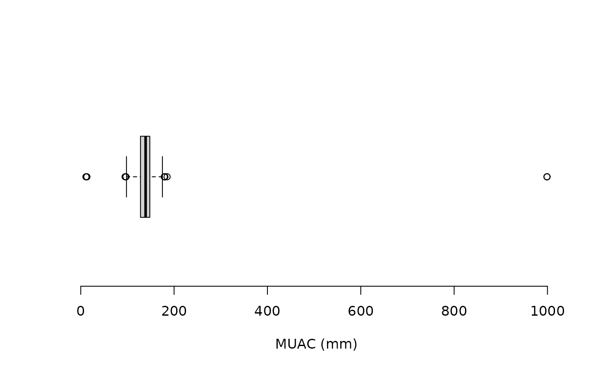
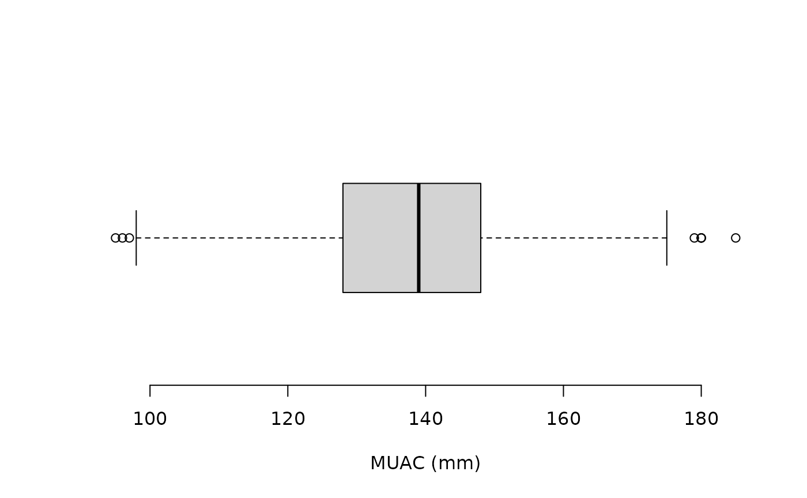

# Checking ranges and legal values

Checking that data are within an acceptable or plausible range is an
important basic check to apply to quantitative data. Checking that data
are recorded with appropriate legal values or codes is an important
basic check to apply to categorical data.

## Checking quantitative data

We will use the dataset `rl.ex01` that is included in the **nipnTK**
package.

``` r
svy <- rl.ex01
head(svy)
```

    #>   age sex weight height muac oedema
    #> 1  12   2    6.7   68.5  148      2
    #> 2   6   1    6.4   65.0  125      2
    #> 3   6   2    6.5   65.6  125      2
    #> 4   8   1    7.2   68.4  144      2
    #> 5  12   M    6.1   65.4  114      2
    #> 6   8   1    7.7   66.5  146      2

The `rl.ex01` dataset contains anthropometry data from a SMART survey
from Angola.

We can use the [`summary()`](https://rdrr.io/r/base/summary.html)
function to examine range (and other summary statistics) of a
quantitative variable:

``` r
summary(svy$muac)
```

This returns:

    #>    Min. 1st Qu.  Median    Mean 3rd Qu.    Max. 
    #>    11.1   128.0   139.0   140.3   148.0   999.0

A graphical examination can also be made:

``` r
boxplot(svy$muac, horizontal = TRUE, xlab = "MUAC (mm)", frame.plot = FALSE)
```



The “whiskers” on the boxplot extend to 1.5 times the interquartile
range from the ends of the box (i.e., the lower and upper quartiles).
This is known as the *inner fence*. Data points that are outside the
inner fence are considered to be *mild outliers*. The NiPN data quality
toolkit provides an R language function
[`outliersUV()`](https://nutriverse.io/nipnTK/dev/reference/outliersUV.md)
that uses the same method to identify outliers:

``` r
svy[outliersUV(svy$muac), ]
```

This returns:

    #> 
    #> Univariate outliers : Lower fence = 98, Upper fence = 178
    #>     age sex weight height  muac oedema
    #> 33   24   1    9.8   74.5 180.0      2
    #> 93   12   2    6.7   67.0  96.0      1
    #> 126  16   2    9.0   74.6 999.0      2
    #> 135  18   2    8.5   74.5 999.0      2
    #> 194  24   M    7.0   75.0  95.0      2
    #> 227   8   M    6.2   66.0  11.1      2
    #> 253  35   2    7.6   75.6  97.0      2
    #> 381  24   1   10.8   82.8  12.4      2
    #> 501  36   2   15.5   93.4 185.0      2
    #> 594  21   2    9.8   76.5  13.2      2
    #> 714  59   2   18.9   98.5 180.0      2
    #> 752  48   2   15.6  102.2 999.0      2
    #> 756  59   1   19.4  101.1 180.0      2
    #> 873  59   1   20.6  109.4 179.0      2

We can count the number of outliers or use:

``` r
table(outliersUV(svy$muac))
```

This returns:

    #> 
    #> Univariate outliers : Lower fence = 98, Upper fence = 178
    #> 
    #> FALSE  TRUE 
    #>   892    14

We can express this as a proportion:

``` r
prop.table(table(outliersUV(svy$muac)))
```

This returns:

    #> 
    #> Univariate outliers : Lower fence = 98, Upper fence = 178
    #> 
    #>      FALSE       TRUE 
    #> 0.98454746 0.01545254

You may find it easier to use percentages:

``` r
prop.table(table(outliersUV(svy$muac))) * 100
```

This returns:

    #> 
    #> Univariate outliers : Lower fence = 98, Upper fence = 178
    #> 
    #>     FALSE      TRUE 
    #> 98.454746  1.545254

Some of the **muac** values identified as potential outliers are
possible **muac** values:

    #> 
    #> Univariate outliers : Lower fence = 98, Upper fence = 178
    #>     age sex weight height  muac oedema
    #> 33   24   1    9.8   74.5 180.0      2
    #> 93   12   2    6.7   67.0  96.0      1
    #> 126  16   2    9.0   74.6 999.0      2
    #> 135  18   2    8.5   74.5 999.0      2
    #> 194  24   M    7.0   75.0  95.0      2
    #> 227   8   M    6.2   66.0  11.1      2
    #> 253  35   2    7.6   75.6  97.0      2
    #> 381  24   1   10.8   82.8  12.4      2
    #> 501  36   2   15.5   93.4 185.0      2
    #> 594  21   2    9.8   76.5  13.2      2
    #> 714  59   2   18.9   98.5 180.0      2
    #> 752  48   2   15.6  102.2 999.0      2
    #> 756  59   1   19.4  101.1 180.0      2
    #> 873  59   1   20.6  109.4 179.0      2

The
[`outliersUV()`](https://nutriverse.io/nipnTK/dev/reference/outliersUV.md)
function provides a **fence** parameter which alters the threshold at
which a data point is considered to be an outlier.

The default **fence = 1.5** defines the *inner fence* (i.e **1.5** times
the interquartile range below the lower quartile and above the upper
quartile). This will identify *mild* and *severe* outliers.

The value **fence = 3** defines the *outer fence* (i.e **3** times the
interquartile range below the lower quartile and above the upper
quartile). This will identify *severe* outliers only:

``` r
svy[outliersUV(svy$muac, fence = 3), ]
```

This returns:

    #> 
    #> Univariate outliers : Lower fence = 68, Upper fence = 208
    #>     age sex weight height  muac oedema
    #> 126  16   2    9.0   74.6 999.0      2
    #> 135  18   2    8.5   74.5 999.0      2
    #> 227   8   M    6.2   66.0  11.1      2
    #> 381  24   1   10.8   82.8  12.4      2
    #> 594  21   2    9.8   76.5  13.2      2
    #> 752  48   2   15.6  102.2 999.0      2

There is something wrong with all of these values of **muac**.

The intention was that the **muac** variable records
mid-upper-arm-circumference (MUAC) in mm. There are some impossibly
small (i.e. **11.1**, **12.4**, and **13.2**) and impossibly large
values (i.e. **999.0**).

The three impossibly small values are probably due to data being
recorded in cm rather than mm. It is probably safe to change these three
values to 111, 124 and 132. It is easiest to do this each record
separately:

``` r
svy$muac[svy$muac == 11.1] <- 111
```

An alternative approach is to specify row numbers instead of values:

``` r
svy$muac[381] <- 124
svy$muac[594] <- 132
```

The three **999.0** values are missing values coded as 999.0. It is safe
to set these three values to missing using the special NA value:

``` r
svy$muac[svy$muac == 999.00] <- NA
```

Range checks should be repeated after editing the data to ensure that
the problems have been fixed:

``` r
summary(svy$muac)
svy[outliersUV(svy$muac), ]
svy[outliersUV(svy$muac, fence = 3), ]
```

Following is a boxplot of the **muac** variable made using:

``` r
boxplot(svy$muac, horizontal = TRUE, xlab = "MUAC (mm)", frame.plot = FALSE)
```

after the fixes for incorrectly entered data and missing values were
made.



There should now be no severe outliers:

``` r
prop.table(table(outliersUV(svy$muac, fence = 3))) * 100
```

returns:

    #> 
    #> Univariate outliers : Lower fence = 68, Upper fence = 208
    #> 
    #> FALSE 
    #>   100

It is usually better to identify and edit only the most extreme
*univariate* outliers, as we have done here, and use the scatterplot and
statistical distance methods described elsewhere in this toolkit to
identify other potential outliers.

## Editing data

We have edited records with outliers at the *R* command line.

It is a good idea to edit data at the command line or using a script
containing the required commands.

A script provides a record of changes made to the data.

*R* also keeps a record of whatever you do at the command line in a
“history file”. The history file is a plain text file which is usually
called .Rhistory and stored in your home directory.

Some regulatory authorities require you to keep a history file.

Some publications may require you to provide a “reproducible data
analysis”. This could be an edited and annotated copy of your history
file.

The [`edit()`](https://rdrr.io/r/utils/edit.html) function provides a
basic tool for editing data interactively.

Editing data using the [`edit()`](https://rdrr.io/r/utils/edit.html)
function is typically a three stage process:

1.  Create a new object containing only the data that requires editing.

2.  Use the [`edit()`](https://rdrr.io/r/utils/edit.html) function to
    edit data in the new object closing the data editor window when you
    are finished.

3.  Replace the old records with the edited records.

We will try this using a separate copy of the example data:

``` r
x <- rl.ex01
records2update <- x[outliersUV(x$muac, fence = 3), ]
records2update <- edit(records2update)
x[row.names(records2update), ] <- records2update
```

We can check that the edits have been made using:

    #> 
    #> Univariate outliers : Lower fence = 68, Upper fence = 208

``` r
x[outliersUV(x$muac, fence = 3), ]
```

If you have fixed the problems in the data this should return:

    #> 
    #> Univariate outliers : Lower fence = 68, Upper fence = 208
    #>     age sex weight height  muac oedema
    #> 126  16   2    9.0   74.6 999.0      2
    #> 135  18   2    8.5   74.5 999.0      2
    #> 227   8   M    6.2   66.0  11.1      2
    #> 381  24   1   10.8   82.8  12.4      2
    #> 594  21   2    9.8   76.5  13.2      2
    #> 752  48   2   15.6  102.2 999.0      2

The [`edit()`](https://rdrr.io/r/utils/edit.html) function works
differently on different operating systems and with different graphical
user interfaces. If you are using *RStudio* or *RAnalyticFlow* on OS X
you will need to install *XQuartz* if you want to use the
[`edit()`](https://rdrr.io/r/utils/edit.html) function. *XQuartz* is
available from:

<https://www.xquartz.org/index.html>

## Checking categorical variables

We can use the **table()** function to examine the codes used in
categorical variables. For example:

``` r
table(svy$sex)
```

returns:

    #> 
    #>   1   2   3   F   M 
    #> 404 458   1  24  19

The intention was that the **sex** variable was coded using 1 for male
and 2 for female but in a small number of records the codes **M** for
male and **F** for female have been used. A mixed coding scheme like
this will complicate data-management and data-analysis. Data in the sex
variable should be edited to ensure that consistent coding is used:

``` r
svy$sex[svy$sex == "M"] <- 1
svy$sex[svy$sex == "F"] <- 2
```

You may find that a few records contain meaningless codes. The code
**3** in the example dataset has, very probably, no meaning and is
likely to be a simple data entry error. This record should be checked
and corrected, if possible. If the record cannot be corrected then the
**sex** variable should be set to missing:

``` r
svy$sex[svy$sex == 3] <- NA
```

Legal value checks should be repeated after editing to ensure that
problems have been fixed:

``` r
table(svy$sex)
```

now returns:

    #> 
    #>   1   2   3   F   M 
    #> 423 482   0   0   0

The table contains cells for the values **M**, **F**, and **3** because
*R* imported the variable as a categorical or “factor” variable:

``` r
str(svy)
```

returns:

    #> 'data.frame':    906 obs. of  6 variables:
    #>  $ age   : int  12 6 6 8 12 8 18 9 12 12 ...
    #>  $ sex   : Factor w/ 5 levels "1","2","3","F",..: 2 1 2 1 1 1 1 1 2 1 ...
    #>  $ weight: num  6.7 6.4 6.5 7.2 6.1 7.7 6.4 7.8 7.5 6.5 ...
    #>  $ height: num  68.5 65 65.6 68.4 65.4 66.5 66.7 65.3 69.1 70.3 ...
    #>  $ muac  : num  148 125 125 144 114 146 119 140 138 121 ...
    #>  $ oedema: int  2 2 2 2 2 2 2 2 2 2 ...

We can fix this by redefining the levels of the sex variable:

``` r
levels(svy$sex) <- c("1", "2", NA, NA, NA)
table(svy$sex)
#> 
#>   1   2 
#> 423 482
```

## Saving changes

We have edited some data.

We usually want to save changes.

It is simple to save a dataset in a comma-separated-value (CSV) text
file using the
[`write.table()`](https://rdrr.io/r/utils/write.table.html) function:

``` r
write.table(x = svy, file = "rl.ex01.clean.csv", sep = ",", quote = FALSE, 
            row.names = FALSE, fileEncoding = "ASCII")
```

*R* can work with a variety of files format but it is usually simplest
to work with simple text files.
