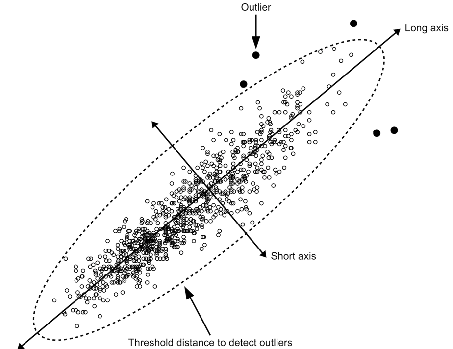

# Using scatterplots to identify outliers

We can expect anthropometric variables in children to be strongly and
positively associated with each other. This is because children tend to
gain both weight and height as they grow. This allows us to use
graphical and numeric methods to identify outliers (i.e. observations
that are distant from most other observations) that may be due to
errors.

It is important to note that anthropometric surveys often use a method
of comparing observed values against reference values using a process
known as “flagging” to identify and censor outliers. The methods
outlined in this section are intended to complement rather than replace
the “flagging”

## Identifying outliers by observation

We will use the dataset `sp.ex01`:

``` r
svy <- sp.ex01
head(svy)
#>   age sex weight height muac oedema
#> 1  54   1   20.5  111.5  180      2
#> 2  53   1   19.3  108.0  167      2
#> 3  51   2   19.3  106.0  163      2
#> 4  44   1   18.9  111.0  163      2
#> 5  47   1   18.8  103.0  173      2
#> 6  48   2   18.6   95.3  171      1
```

The dataset `sp.ex01` contains anthropometric data from a SMART survey
from the Democratic Republic of Congo.

We will look at the relationship between height and weight in this
dataset:

``` r
plot(svy$height, svy$weight)
```

The resulting plot is shown below.


There is a clear positive linear relationship between height and weight
(i.e. weight increases with increasing height along a straight line). We
can assess the strength of this relationship using the Pearson
correlation coefficient:

``` r
cor(svy$height, svy$weight, method = "pearson", use = "complete.obs")
```

which returns:

    #> [1] 0.9204116

This is very close to one, which indicates a perfect positive
association. There are, however a few points that lie outside of the
bulk of the plotted points. These outliers may be due to errors in the
data.

The presence of oedema can be associated with increased weight. This is
a particular issue with severe oedema. An outlier with a high value of
weight for a given height could be due to oedema. We can check this:

``` r
plot(svy$height, svy$weight, pch = ifelse(svy$oedema == 1, 19, 1))
```

The `pch = ifelse(svy$oedema == 1, 19, 1)` tells the
[`plot()`](https://rdrr.io/r/graphics/plot.default.html) function to
plot filled circles for oedema cases and open circles for children
without oedema. The resulting plot is shown below.


A single high weight for height outlier appears to be due to the
presence of oedema.

The other filled circles that are located in the main mass of plotted
points show that children with oedema may have a body weight within the
normal range for their height. These children may not be not wasted but
they are suffering from a form of severe acute malnutrition (SAM) known
as *kwashiorkor*.

Outliers can be identified by eye. The
[`identify()`](https://rdrr.io/r/graphics/identify.html) function can
help with this:

``` r
plot(svy$height, svy$weight, pch = ifelse(svy$oedema == 1, 19, 1))
identify(svy$height, svy$weight)
```

Clicking on any point will cause the record (row) number associated with
each point to be displayed on the plot (as shown below).


Right-clicking on the plot or pressing the “escape” key will stop
[`identify()`](https://rdrr.io/r/graphics/identify.html).

The behaviour of the
[`identify()`](https://rdrr.io/r/graphics/identify.html) function may be
different when you use an alternative user interface for R such as
*RStudio* or *RAnalyticFlow*.

The [`identify()`](https://rdrr.io/r/graphics/identify.html) function
will, by default, display record (row) numbers for identified points.
This is usually what is needed. Alternative labels can be displayed. For
example:

``` r
plot(svy$height, svy$weight, pch = ifelse(svy$oedema == 1, 19, 1)) 
identify(svy$height, svy$weight, 
         labels = paste(svy$height, svy$weight, sep = ";"), 
         cex = 0.75)
```

displays the height and weight values at selected points.

The ability to display custom labels is useful if there is a variable
(column) in a dataset that contains unique record identifiers.

It is useful to be able to store the record (row) numbers of identified
points:

``` r
plot(svy$height, svy$weight, pch = ifelse(svy$oedema == 1, 19, 1)) 
stored <- identify(svy$height, svy$weight)
```

If the same points shown in the previous figure are clicked to identify
them then:

``` r
stored
```

will return:

    #> [1] "1"  "6"  "16" "62" "66"

We can examine the data for the identified points:

``` r
svy[stored, ]
```

This returns:

    #>    age sex weight height muac oedema
    #> 1   54   1   20.5  111.5  180      2
    #> 6   48   2   18.6   95.3  171      1
    #> 16  30   1   16.9   92.5  188      2
    #> 62  55   1   15.1  118.0  156      2
    #> 66  56   1   15.0  115.0  148      2

The **oedema** data is coded **1** for present and **2** for absent.

Data can be checked and edited if needed. Note that record **6** is an
oedema case and should probably be left alone.

If your dataset has many variables (columns) then you may specify only
the variables (columns) of interest:

``` r
svy[stored, c("weight", "height", "oedema")]
```

This returns:

    #>    weight height oedema
    #> 1    20.5  111.5      2
    #> 6    18.6   95.3      1
    #> 16   16.9   92.5      2
    #> 62   15.1  118.0      2
    #> 66   15.0  115.0      2

## Identifying outliers using statistical distance

A more formal method of identifying outliers is to use a measure of the
statistical distance. A common measure of *statistical distance* that is
applied to scatterplot data is the *Mahalanobis distance*. This treats
the bivariate probability distribution as an ellipsoid. The Mahalanobis
distance is the distance of a point from the centre of mass of the
distribution divided by width of the ellipsoid in the direction of the
point:



In directions in which the ellipsoid has a short axis the test point
must be close to the centre of mass of the distribution. In directions
in which the ellipsoid has a long axis the test point may be more
distant from the centre of mass of the distribution.

The NiPN data quality toolkit provides an *R* language function
[`outliersMD()`](https://nutriverse.io/nipnTK/dev/reference/outliersMD.md)
that uses the Mahalanobis distance to identify outliers in the same
dataset:

``` r
svy[outliersMD(svy$height, svy$weight), ]
```

This returns the same set of records that was identified by eye:

    #>    age sex weight height muac oedema
    #> 1   54   1   20.5  111.5  180      2
    #> 6   48   2   18.6   95.3  171      1
    #> 16  30   1   16.9   92.5  188      2
    #> 62  55   1   15.1  118.0  156      2
    #> 66  56   1   15.0  115.0  148      2

Data can be checked and edited if needed. Note that record **6** is an
oedema case and should probably be left alone.

We can use the
[`outliersMD()`](https://nutriverse.io/nipnTK/dev/reference/outliersMD.md)
to identify and display outliers on a scatterplot:

``` r
plot(svy$height, svy$weight,
pch = ifelse(outliersMD(svy$height, svy$weight), 19, 1))
```


The
[`outliersMD()`](https://nutriverse.io/nipnTK/dev/reference/outliersMD.md)
function has an **alpha** parameter. The default value for the **alpha**
parameter is `alpha = 0.001`. This value is used automatically unless
another value is specified.

When we use `alpha = 0.001` we are looking for records with values so
extreme that we would expect to find them with a probability of 0.001
when there are no problems with the data.

We can calculate the number of outliers that we expect to see by chance
with `alpha = 0.001` using:

``` r
round(nrow(svy) * 0.001)
```

This returns:

    #> [1] 1

We found five potential outliers. The difference between the number that
we expected and the number that we observed (i.e. one expected vs. five
observed) suggests that some of the identified outliers are true
outliers or due to data errors.

Another way of looking at the **alpha** parameter is that it alters the
sensitivity of the `outlierMD()` function for detecting outliers by
altering the threshold distance that is used to define outliers. This
can be useful when using the `outlierMD()` function with some, but not
all, curvilinear relationships (see below).

Larger values of **alpha** will tend to detect more potential outliers.
For example:

``` r
plot(svy$height, svy$weight,
     pch = ifelse(outliersMD(svy$height, svy$weight, alpha = 0.01), 19, 1))
```


and:

``` r
svy[outliersMD(svy$height,svy$weight, alpha = 0.01), ]
#>     age sex weight height muac oedema
#> 1    54   1   20.5  111.5  180      2
#> 2    53   1   19.3  108.0  167      2
#> 3    51   2   19.3  106.0  163      2
#> 4    44   1   18.9  111.0  163      2
#> 5    47   1   18.8  103.0  173      2
#> 6    48   2   18.6   95.3  171      1
#> 16   30   1   16.9   92.5  188      2
#> 32   43   1   16.2   92.6  166      2
#> 61   26   1   15.1   87.6  168      2
#> 62   55   1   15.1  118.0  156      2
#> 66   56   1   15.0  115.0  148      2
#> 477  38   2   10.3   94.6  160      2
#> 487  32   2   10.2   93.0  150      2
#> 722  17   2    8.6   63.3  136      2
```

In almost all cases the default **alpha = 0.001** will be appropriate.

The techniques outlined above can be used to examine the relationships
between other pairs of anthropometric variables (e.g. **weight** and
**muac**) and to identify outliers. All sensible pairings of variables
should be examined.

## Anthropometric measurements and age

We also expect anthropometric variables to be associated with age. This
relationship is particularly strong in children. It will be less strong
in adults and may be weak or even reversed in older people.

We can explore the relationship between an anthropometric variable and
age using the techniques described above. For example:

``` r
plot(svy$age, svy$height, pch = ifelse(outliersMD(svy$age, svy$height), 19, 1)) 
svy[outliersMD(svy$age, svy$height), ]
```


    #>    age sex weight height muac oedema
    #> 4   44   1   18.9    111  163      2
    #> 62  55   1   15.1    118  156      2

There are some problems with this approach. Age is often reported and
recorded with considerable age heaping. Age is unlikely to be
approximately normally distributed, which is an assumption of the
Mahalanobis distance method. The relationship between anthropometric
variables and age usually follows a “growth curve” rather than a
straight line.

The combination of age heaping, non-normality, and a curvilinear
relationship may reduce the effectiveness of the Mahalanobis distance
method for detecting outliers. It may be useful, in such cases, to
increase the value of the **alpha** parameter. For example:

``` r
plot(svy$age, svy$height, pch = ifelse(outliersMD(svy$age, svy$height, alpha = 0.025), 19, 1))
```


Outliers can be listed using the same value for **alpha**:

``` r
svy[outliersMD(svy$age, svy$height, alpha = 0.025), ]
#>     age sex weight height muac oedema
#> 1    54   1   20.5  111.5  180      2
#> 4    44   1   18.9  111.0  163      2
#> 7    55   1   18.6  109.3  156      2
#> 14   48   1   17.0  109.0  175      2
#> 27   56   2   16.4  110.0  149      2
#> 62   55   1   15.1  118.0  156      2
#> 66   56   1   15.0  115.0  148      2
#> 113  58   1   14.2   92.0  148      2
#> 129  23   2   14.0   95.0  161      2
#> 190  15   2   13.0   90.5  150      2
#> 212  21   2   12.8   93.0  152      2
#> 378  51   2   11.2   83.0  141      2
#> 453  49   1   10.6   83.0  139      2
#> 461  54   2   10.5   86.8  132      2
#> 551  41   2    9.8   78.0  139      2
#> 599  50   1    9.5   84.7  123      2
#> 660  49   1    9.1   79.5  129      2
#> 722  17   2    8.6   63.3  136      2
#> 809  41   2    7.9   75.7  120      2
#> 881  30   1    6.5   69.6  103      2
#> 893  18   2    5.8   63.2  106      2
```

The Mahalanobis distance method is usually robust enough to deal with
age data provided an appropriate value for **alpha** is used.

## Difficult relationships for the Mahalanobis distance method

The Mahalanobis distance method works well with pairs of variables as
long as the relationship between the two variables is *monotonic*
(i.e. one variables always increases or always decreases in value as the
other variable increases in value). This is usually the case with
anthropometric data.

We will explore the use of the Mahalanobis distance method with data
that is not monotonic using generated data:

``` r
x <- c(4, 8, 16, 17, 22, 27, 38, 40, 47, 48, 53, 55, 63, 71, 76, 85, 92, 96) 
y <- c(6, 22, 34, 42, 51, 59, 64, 69, 70, 20, 70, 63, 63, 55, 46, 33, 19, 6)
plot(x, y)
```


There is a clear relationship between **x** and **y** but it is **not**
a monotonic relationship (i.e. it is not always increasing or
decreasing). There is a single obvious outlier. The Mahalanobis distance
method will **not** work well with this data. This:

``` r
plot(x, y, pch = ifelse(outliersMD(x, y), 19, 1))
```


fails to detect the outlier. Relaxing the alpha parameter:

``` r
plot(x, y, pch = ifelse(outliersMD(x, y, alpha = 0.025), 19, 1))
```

does not help. Relaxing the alpha parameter further:

``` r
plot(x, y, pch = ifelse(outliersMD(x, y, alpha = 0.1), 19, 1))
```


results in false positive results but fails to identify the clear
outlier.

Although Mahalanobis distance cannot be used directly to identify
outliers in non-monotonic relationships, it can be applied to residuals
from fitted non-linear models. This technique is unlikely to be required
with anthropometric data and is not covered in this toolkit.

It is very unlikely that you will see non-monotonic relationships with
anthropometric data. You are likely to see “growth curves” that look
like this:

``` r
set.seed(0)
x <- 0:100
y <- 1 - exp(-x / 50) + rnorm(101, 0, 0.05) 
plot(x, y)
lines(x, 1 - exp(-x / 50), lty = 2)
```


This is a monotonic relationship. The Mahalanobis distance method should
work well with this data. If we add a clear outlier:

``` r
y[50] <- 0.3
plot(x, y)
```


this can be detected using the Mahalanobis distance method using a
slightly relaxed alpha value:

``` r
plot(x, y, pch = ifelse(outliersMD(x, y, alpha = 0.005), 19, 1))
```


## Working with data from older children

We will now look at using scatterplots and Mahalanobis distance methods
with data from older children.

We will use the `sp.ex02` dataset:

``` r
svy <- sp.ex02
head(svy)
#>   region school ageMonths sex weight height   haz   waz   baz
#> 1      1      1        64   1   13.9   97.7 -3.12 -2.56 -0.56
#> 2      1      1        72   1   21.1  118.7  0.56  0.21 -0.25
#> 3      1      1        75   2   15.6  103.7 -2.47 -2.02 -0.53
#> 4      1      1        75   2   16.0  102.7 -2.66 -1.82 -0.08
#> 5      1      1        75   2   17.5  108.7 -1.51 -1.16 -0.31
#> 6      1      1        79   1   15.0  101.0 -3.57 -2.99 -0.53
```

The dataset `sp.ex02` contains anthropometric data from a survey of
school-age (i.e. between 5 and 15 years) children from Pakistan.

We can summarise the dataset using:

``` r
summary(svy)
```

This returns:

    #>      region          school        ageMonths          sex       
    #>  Min.   :1.000   Min.   : 1.00   Min.   : 60.0   Min.   :1.000  
    #>  1st Qu.:3.000   1st Qu.: 8.00   1st Qu.: 83.0   1st Qu.:1.000  
    #>  Median :4.000   Median :15.00   Median : 98.0   Median :1.000  
    #>  Mean   :4.491   Mean   :15.51   Mean   :104.8   Mean   :1.397  
    #>  3rd Qu.:7.000   3rd Qu.:23.00   3rd Qu.:124.0   3rd Qu.:2.000  
    #>  Max.   :8.000   Max.   :30.00   Max.   :178.0   Max.   :2.000  
    #>                                                                 
    #>      weight          height           haz              waz        
    #>  Min.   :10.30   Min.   : 86.2   Min.   :-5.730   Min.   :-5.350  
    #>  1st Qu.:17.20   1st Qu.:108.7   1st Qu.:-2.640   1st Qu.:-2.380  
    #>  Median :21.30   Median :120.9   Median :-1.790   Median :-1.615  
    #>  Mean   :22.62   Mean   :121.2   Mean   :-1.705   Mean   :-1.581  
    #>  3rd Qu.:27.00   3rd Qu.:132.6   3rd Qu.:-0.790   3rd Qu.:-0.805  
    #>  Max.   :51.90   Max.   :164.2   Max.   : 3.550   Max.   : 3.010  
    #>                                                   NA's   :267     
    #>       baz         
    #>  Min.   :-4.7000  
    #>  1st Qu.:-1.2900  
    #>  Median :-0.7600  
    #>  Mean   :-0.7758  
    #>  3rd Qu.:-0.2100  
    #>  Max.   : 1.9900  
    #>  NA's   :8

The **baz** variable contains the BMI-for-age z-score calculated from
the **ageMonths**, **sex**, **weight**, and **height** variables using
the WHO growth reference. A key thing to notice in the summary is the
large number of missing values in the **waz** variable. This is because
the weight-for-age z-score is not calculated for children aged older
than 120 months. You can check this using:

``` r
by(svy$ageMonths, is.na(svy$waz), summary)
```

This gives:

    #> is.na(svy$waz): FALSE
    #>    Min. 1st Qu.  Median    Mean 3rd Qu.    Max. 
    #>   60.00   76.00   88.00   88.24   99.00  120.00 
    #> ------------------------------------------------------------ 
    #> is.na(svy$waz): TRUE
    #>    Min. 1st Qu.  Median    Mean 3rd Qu.    Max. 
    #>   121.0   125.5   141.0   140.8   151.0   178.0

There appears to be nothing odd about the large number of missing values
in the **waz** variable.

We should investigate the missing values in the **baz** variable:

``` r
svy[is.na(svy$baz), ]
```

This returns:

    #>     region school ageMonths sex weight height   haz   waz baz
    #> 83       1      3       143   2   14.0  125.9 -3.64    NA  NA
    #> 158      2      6        96   1   12.3  118.4 -1.57 -5.26  NA
    #> 275      3     10        77   1   10.3  113.9 -0.88 -5.35  NA
    #> 415      4     15        75   1   33.0  108.3 -1.90  3.01  NA
    #> 508      5     19        85   2   11.1  111.5 -1.78 -4.84  NA
    #> 529      6     20        78   1   12.1  111.9 -1.37 -4.45  NA
    #> 761      8     28        62   1   13.3  115.4  0.99 -2.70  NA
    #> 806      8     29       100   1   13.2  121.2 -1.36 -5.01  NA

The data required to calculate the BMI-for-age z-score are present.
Given the extreme values in the **waz** variable it is likely that the
BMI-for-age z-scores in these records were calculated, found to be
outside of the upper and lower flagging criteria, and the value for
**baz** set to missing. We should check this and recalculate the
BMI-for-age z-scores.

We can use scatterplots to examine the relationship between
**ageMonths**, **weight**, and **height**:

``` r
plot(svy$ageMonths, svy$weight) 
```


``` r
plot(svy$ageMonths, svy$height) 
```


``` r
plot(svy$height, svy$weight)
```


These relationships are not as simple as in younger children:

Variability in **weight** appears to increase with increasing
**ageMonths**.

The relationship between **height** and **ageMonths** may not be
entirely linear.

The relationship between **weight** and **height** is clearly
non-linear.

All of these relationships are monotonic so we should still be able to
use the Mahalanobis distance method to identify outliers:

``` r
plot(svy$ageMonths, svy$weight,
     pch = ifelse(outliersMD(svy$ageMonths, svy$weight), 19, 1))
```


``` r

plot(svy$ageMonths, svy$height,
     pch = ifelse(outliersMD(svy$ageMonths, svy$height), 19, 1))
```


``` r

plot(svy$height, svy$weight,
     pch = ifelse(outliersMD(svy$height, svy$weight), 19, 1))
```


You may want to experiment with different values of the **alpha**
parameter of the
[`outliersMD()`](https://nutriverse.io/nipnTK/dev/reference/outliersMD.md)
function as described above. Records containing values identified as
outliers can be listed:

``` r
svy[outliersMD(svy$ageMonths, svy$weight), ] 
#>     region school ageMonths sex weight height   haz  waz   baz
#> 57       1      2       161   1   47.0  158.7 -0.05   NA  0.05
#> 83       1      3       143   2   14.0  125.9 -3.64   NA    NA
#> 139      2      5       123   2   46.5  144.9  0.64   NA  1.82
#> 319      3     11       143   1   45.2  156.0  1.06   NA  0.50
#> 407      4     14       132   1   46.2  155.3  1.73   NA  0.97
#> 415      4     15        75   1   33.0  108.3 -1.90 3.01    NA
#> 672      7     24       175   1   50.5  163.5 -0.42   NA -0.25
#> 727      7     26       147   1   46.1  162.7  1.67   NA -0.14
#> 731      7     26       173   1   51.9  164.2 -0.21   NA -0.03
svy[outliersMD(svy$ageMonths, svy$height), ] 
#>     region school ageMonths sex weight height  haz  waz   baz
#> 457      5     17       110   1   37.5    155 3.55 1.62 -0.32
svy[outliersMD(svy$weight, svy$height), ]
#>     region school ageMonths sex weight height   haz   waz   baz
#> 57       1      2       161   1   47.0  158.7 -0.05    NA  0.05
#> 83       1      3       143   2   14.0  125.9 -3.64    NA    NA
#> 139      2      5       123   2   46.5  144.9  0.64    NA  1.82
#> 275      3     10        77   1   10.3  113.9 -0.88 -5.35    NA
#> 319      3     11       143   1   45.2  156.0  1.06    NA  0.50
#> 322      3     11       155   2   39.0  135.5 -3.01    NA  0.84
#> 369      4     13       118   2   35.5  129.7 -1.32  0.66  1.66
#> 407      4     14       132   1   46.2  155.3  1.73    NA  0.97
#> 415      4     15        75   1   33.0  108.3 -1.90  3.01    NA
#> 438      4     15       163   2   39.0  138.3 -2.92    NA  0.41
#> 611      6     22       148   1   41.9  146.5 -0.66    NA  0.75
#> 672      7     24       175   1   50.5  163.5 -0.42    NA -0.25
#> 731      7     26       173   1   51.9  164.2 -0.21    NA -0.03
#> 806      8     29       100   1   13.2  121.2 -1.36 -5.01    NA
```

These records can be checked, edited (if required), and anthropometric
indices recalculated.
